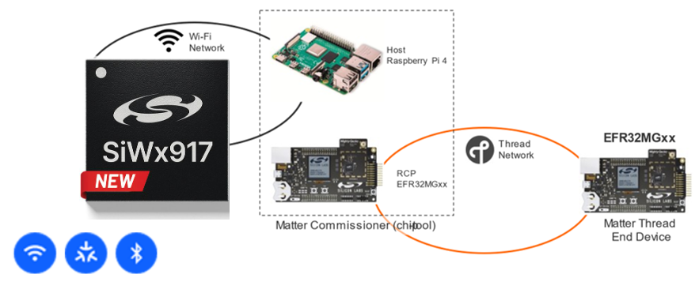

# Silicon Labs Matter

Welcome to the Silicon Labs Matter Github repo. Matter is an application layer
that provides a standardized interface between protocols and devices. With
Matter, it is transparent to the underlying device whether the interaction is
from a Thread application or a Wi-Fi application. For more information on Matter
in general see the main
[Matter Overview](https://www.silabs.com/wireless/matter) page. This repo is the
starting point for all Silicon Labs-related Matter development. Silicon Labs
supports Matter on both 802.15.4 (Thread) and 802.11 (Wi-Fi) transport
protocols.

>**Note: Silicon Labs Matter GitHub is being phased out in favor of using the [Matter GSDK Extension](https://docs.silabs.com/matter/latest/matter-start/) that is available thru Studio and standalone via SLC-CLI.**

_To see release notes containing list of features and knowns issues go to
[SiliconLabs/matter/releases](https://github.com/SiliconLabs/matter/releases)
and find the corresponding notes for the release you are using._

As seen below, Silicon Labs supports Matter on several different hardware platforms including the EFR32, RS9116, WF200 and the new SiWx917 which is a Wi-Fi System-on-Chip (SoC).

Device: EFR32+RS9116

Device: SiWx917 SoC

This repo contains documentation, demos, examples and all the code needed for Matter Accessory Device development on both Thread and Wi-Fi. The Thread development use cases differs from Wi-Fi because the Thread protocol requires the use of an Open Thread Border Router (OTBR).  

-   To get started with the Thread demo and development see
    [Matter Thread](https://siliconlabs.github.io/matter/2.3.0-1.3-alpha.2/thread/DEMO_OVERVIEW.html)
-   To get started with the Wi-Fi demo and development see
    [Matter Wi-Fi](https://siliconlabs.github.io/matter/2.3.0-1.3-alpha.2/wifi/DEMO_OVERVIEW.html)

The full documentation set starts here:
[Silicon Labs Matter GitHub Documentation](https://siliconlabs.github.io/matter/2.3.0-1.3-alpha.2)

---

**Builds**

**Tests**

**Tools**

# Directory Structure

The Matter repository is structured as follows:

| File/Folder        | Content                                                                                                                                               |
| ------------------ | ----------------------------------------------------------------------------------------------------------------------------------------------------- |
| build              | Build system support content and built output directories                                                                                             |
| build_overrides    | Build system parameter customization for different platforms                                                                                          |
| config             | Project configurations                                                                                                                                |
| credentials        | Development and test credentials                                                                                                                      |
| docs               | Documentation, including guides. Visit the [Matter SDK documentation page](https://project-chip.github.io/connectedhomeip-doc/index.html) to read it. |
| examples           | Example firmware applications that demonstrate use of Matter                                                                                          |
| integrations       | 3rd party integrations                                                                                                                                |
| scripts            | Scripts needed to work with the Matter repository                                                                                                     |
| src                | Implementation of Matter                                                                                                                              |
| third_party        | 3rd party code used by Matter                                                                                                                         |
| zzz_generated      | ZAP generated template code - Revolving around cluster information                                                                                    |
| BUILD.gn           | Build file for the GN build system                                                                                                                    |
| CODE_OF_CONDUCT.md | Code of conduct for Matter and contribution to it                                                                                                     |
| CONTRIBUTING.md    | Guidelines for contributing to Matter                                                                                                                 |
| LICENSE            | Matter license file                                                                                                                                   |
| REVIEWERS.md       | PR reviewers                                                                                                                                          |
| gn_build.sh        | Build script for specific projects such as Android, EFR32, etc.                                                                                       |
| README.md          | This file                                                                                                                                             |

# License

Matter is released under the [Apache 2.0 license](./LICENSE).
