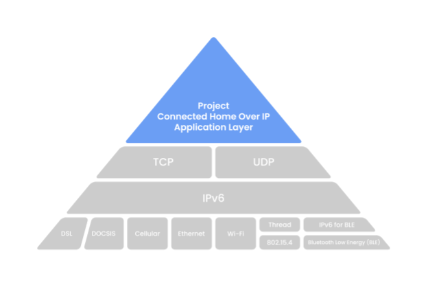
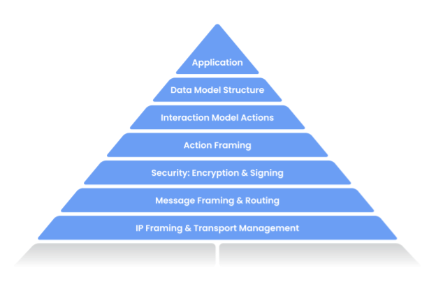

# Connected Home over IP

# What is Project Connected Home over IP?

Project Connected Home over IP is a new Working Group within the Zigbee
Alliance. This Working Group plans to develop and promote the adoption of a new,
royalty-free connectivity standard to increase compatibility among smart home
products, with security as a fundamental design tenet.

The goal of the Connected Home over IP project is to simplify development for
manufacturers and increase compatibility for consumers. The project is built
around a shared belief that smart home devices should be secure, reliable, and
seamless to use. By building upon Internet Protocol (IP), the project aims to
enable communication across smart home devices, mobile apps, and cloud services
and to define a specific set of IP-based networking technologies for device
certification.

The Zigbee Alliance officially opened the Project Connected Home over IP
(Project CHIP) Working Group on January 17, 2020 and is in the process of
drafting the specification.

Visit [buildwithmatter.com](https://buildwithmatter.com) to learn more and read
the latest news and updates about the project.

# Project Overview

## Development Goals

Project Connected Home over IP is developed with the following goals and
principles in mind:

**Unifying:** Project CHIP will produce a new specification, building with and
on top of market-tested, existing technologies.

**Interoperable:** The specification permits communication between any Project
CHIP-certified device, subject to users’ permission.

**Secure:** The specification leverages modern security practices and protocols.

**User Control:** The end user is in control of authorization for interaction
with devices.

**Federated:** No single entity serves as a throttle or a
single-point-of-failure for root of trust.

**Robust:** The set of protocols specify a complete lifecycle of a device —
starting with the seamless out-of-box experience, through operational protocols,
to device and system management specifications required for proper function in
the presence of change.

**Low Overhead:** The protocols are practically implementable on low
compute-resource devices, such as MCUs.

**Pervasive:** The protocols are broadly deployable and accessible, thanks to
leveraging IP and being implementable on low-capability devices.

**Ecosystem-Flexible:** The protocol must be flexible enough to accommodate
deployment in ecosystems with differing policies.

**Easy to Use:** The protocol should aim to provide smooth, cohesive, integrated
provisioning and out-of-box experience.

**Open:** The Project’s design and technical processes should be open and
transparent to the general public, including to non-members wherever possible.

## Architecture Overview

The Project, as illustrated above, defines the application layer that will be
deployed on devices and controllers as well as the supported IPv6-based networks
to help achieve our interoperability architectural goal. Project CHIP will
initially support Wi-Fi and Thread for core, operational communications and
Bluetooth Low Energy (BLE) to simplify device commissioning and setup.

The Application Layer can be further broken down seven main components:

1. **Application:** High order business logic of a device. For example, an
   application that is focused on lighting might contain logic to handle turning
   on/off the bulb as well its color characteristics.

2. **Data Model:** Data primitives that help describe the various
   functionalities of the devices. The Application operates on these data
   structures when there is intent to interact with the device.

3. **Interaction Model:** Represents a set of actions that can be performed on
   the devices to interact with it. For example, reading or writing attributes
   on a device would correspond to interactions with the devices. These actions
   operate on the structures defined by the data model.

4. **Action Framing:** Once an action is constructed using the Interaction
   Model, it is framed into a prescriptive packed binary format to enable being
   well represented on the “wire”.

5. **Security:** An encoded action frame is then sent down to the Security Layer
   to encrypt and sign the payload to ensure that data is secured and
   authenticated by both sender and receiver of a packet.

6. **Message Framing & Routing:** With an interaction encrypted and signed, the
   Message Layer constructs the payload format with required and optional header
   fields; which specify properties of the message as well some routing
   information.

7. **IP Framing & Transport Management:** After the final payload has been
   constructed, it is sent to the underlying transport protocol for IP
   management of the data.

# Current Status of Project Connected Home over IP

The Project’s design and technical processes are intended to be open and
transparent to the general public, including to Work Group non-members wherever
possible. The availability of this GitHub repository and its source code under
an Apache v2 license is an important and demonstrable step to achieving this
commitment.

The Project endeavors to bring together the best aspects of market-tested
technologies and to redeploy them as a unified and cohesive whole-system
solution. The overall goal of this approach is to bring the benefits of the
Project to consumers and manufacturers as quickly as possible. As a result, what
you observe in this repository is an implementation-first approach to the
technical specification, vetting integrations in practice.

The Project repository is growing and evolving to implement the overall
architecture. The repository currently contains the security foundations,
message framing and dispatch, an implementation of the interaction model and
data model. The code examples show simple interactions, and are supported on
multiple transports -- Wi-Fi and Thread -- starting with resource-constrained
(i.e., memory, processing) silicon platforms to help ensure the Project’s
scalability.

# How to Contribute

We welcome your contributions to Project Connected Home over IP. Read our
contribution guidelines [here](./CONTRIBUTING.md).

# Building and Developing in Project

Instructions about how to build Project Connected Home over IP can be found
[here](./docs/README.md).

# Directory Structure

The Connected Home over IP repository is structured as follows:

| File / Folder                        | Contents                                                                                 |
| ------------------------------------ | ---------------------------------------------------------------------------------------- |
| `build/`                             | Build system support content and build output directories                                |
| [BUILDING.md](./docs/BUILDING.md)    | More detailed information on configuring and building Project CHIP for different targets |
| `CODE_OF_CONDUCT.md`                 | Code of Conduct for Project CHIP, and contributions to it                                |
| [CONTRIBUTING.md](./CONTRIBUTING.md) | Guidelines for contributing to Project CHIP                                              |
| `docs/`                              | Documentation                                                                            |
| `examples/`                          | Example firmware applications that demonstrate use of Project CHIP technology            |
| `integrations/`                      | Third party integrations related to this project                                         |
| `integrations/docker/`               | Docker scripts and Dockerfiles                                                           |
| `LICENSE`                            | Project CHIP [License file](./LICENSE) (Apache 2.0)                                      |
| `BUILD.gn`                           | Top level GN build file                                                                  |
| `README.md`                          | This file                                                                                |
| `src/`                               | Implementation of Project CHIP                                                           |
| `third_party/`                       | Third-party code used by Project CHIP                                                    |
| `scripts/`                           | Scripts needed to work with the Project CHIP repo                                        |

# License

Project CHIP is released under the [Apache 2.0 license](./LICENSE).
