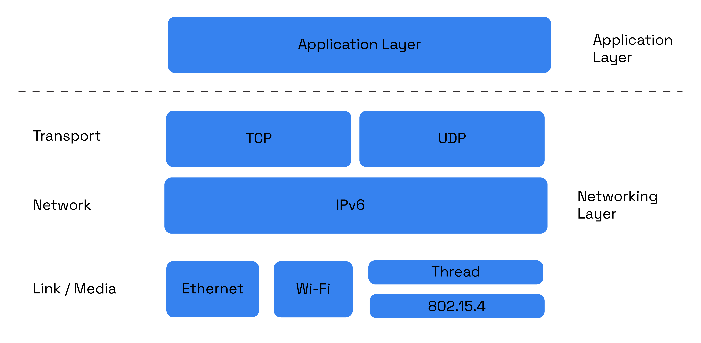
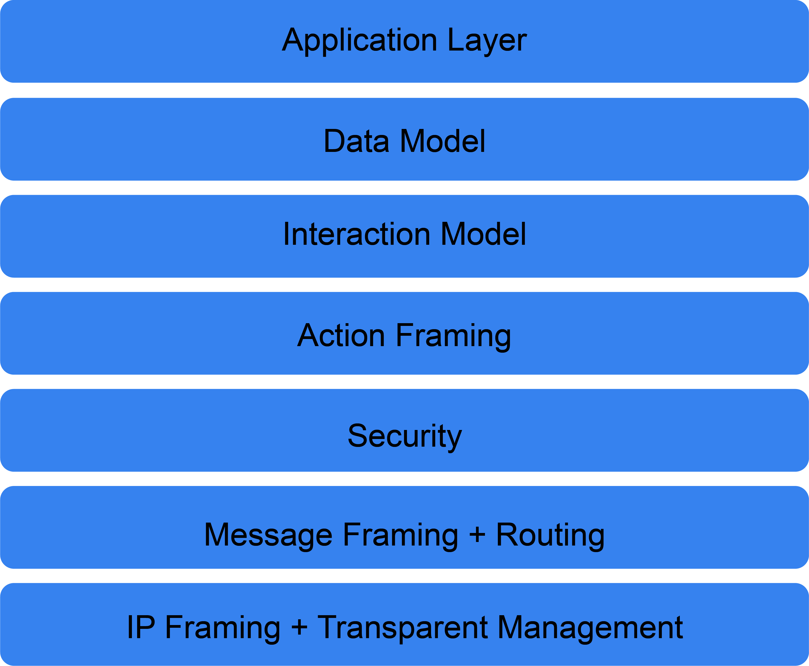

# Matter

# About

Matter (formerly Project CHIP) creates more connections between more objects,
simplifying development for manufacturers and increasing compatibility for
consumers, guided by the Connectivity Standards Alliance.

# What is Matter?

Matter is a unified, open-source application-layer connectivity standard built
to enable developers and device manufacturers to connect and build reliable, and
secure ecosystems and increase compatibility among connected home devices. It is
built with market-proven technologies using Internet Protocol (IP) and is
compatible with Thread and Wi-Fi network transports. Matter was developed by a
Working Group within the Connectivity Standards Alliance (Alliance). This
Working Group develops and promotes the adoption of the Matter standard, a
royalty-free connectivity standard to increase compatibility among smart home
products, with security as a fundamental design tenet. The vision that led major
industry players to come together to build Matter is that smart connectivity
should be simple, reliable, and interoperable.

Matter simplifies development for manufacturers and increases compatibility for
consumers.

The standard was built around a shared belief that smart home devices should be
secure, reliable, and seamless to use. By building upon Internet Protocol (IP),
Matter enables communication across smart home devices, mobile apps, and cloud
services and defines a specific set of IP-based networking technologies for
device certification.

The Matter specification details everything necessary to implement a Matter
application and transport layer stack. It is intended to be used by implementers
as a complete specification.

The Alliance officially opened the Matter Working Group on January 17, 2020, and
the specification is
[available](https://csa-iot.org/developer-resource/specifications-download-request/)
for adoption now.

Visit [buildwithmatter.com](https://buildwithmatter.com) to learn more and read
the latest news and updates about the project.

# Project Overview

## Development Goals

Matter is developed with the following goals and principles in mind:

**Unifying:** Matter is built with and on top of market-tested, existing
technologies.

**Interoperable:** The specification permits communication between any
Matter-certified device, subject to users’ permission.

**Secure:** The specification leverages modern security practices and protocols.

**User Control:** The end user controls authorization for interaction with
devices.

**Federated:** No single entity serves as a throttle or a single point of
failure for root of trust.

**Robust:** The set of protocols specifies a complete lifecycle of a device —
starting with the seamless out-of-box experience, through operational protocols,
to device and system management specifications required for proper function in
the presence of change.

**Low Overhead:** The protocols are practically implementable on low
compute-resource devices, such as MCUs.

**Pervasive:** The protocols are broadly deployable and accessible, by
leveraging IP and being implementable on low-capability devices.

**Ecosystem-Flexible:** The protocol is flexible enough to accommodate
deployment in ecosystems with differing policies.

**Easy to Use:** The protocol provides smooth, cohesive, integrated provisioning
and out-of-box experience.

**Open:** The Project’s design and technical processes are open and transparent
to the general public, including non-members wherever possible.

## Architecture Overview

Matter aims to build a universal IPv6-based communication protocol for smart
home devices. The protocol defines the application layer that will be deployed
on devices and the different link layers to help maintain interoperability. The
following diagram illustrates the normal operational mode of the stack:

The architecture is divided into layers to help separate the different
responsibilities and introduce a good level of encapsulation among the various
pieces of the protocol stack. The vast majority of interactions flow through the
stack captured in the following Figure:

1. **Application:** High-order business logic of a device. For example, an
   application that is focused on lighting might contain logic to handle turning
   on/off the bulb as well as its color characteristics.

2) **Data Model:** The data layer corresponds to the data and verb elements that
   help support the functionality of the application. The Application operates
   on these data structures when there is an intent to interact with the device.

3. **Interaction Model:** The Interaction Model layer defines a set of
   interactions that can be performed between a client and server device. For
   example, reading or writing attributes on a server device would correspond to
   application behavior on the device. These interactions operate on the
   elements defined at the data model layer.

4) **Action Framing:** Once an action is constructed using the Interaction
   Model, it is serialized into a prescribed packed binary format to encode for
   network transmission. Security: An encoded action frame is then processed by
   the Security Layer: the message is encrypted and appended with a message
   authentication code. These actions ensure the data remain confidential and
   authentic between sender and receiver of the message.

5. **Security:** An encoded action frame is then sent down to the Security Layer
   to encrypt and sign the payload to ensure that data is secured and
   authenticated by both sender and receiver of a packet.

6. **Message Framing & Routing:** With an interaction encrypted and signed, the
   Message Layer constructs the payload format with required and optional header
   fields; which specify the message's properties and some routing information.

7) **IP Framing & Transport Management:** After the final payload has been
   constructed, it is sent to the underlying transport protocol for IP
   management of the data.

# Current Status of Matter

Matter’s design and technical processes are intended to be open and transparent
to the general public, including to Working Group non-members wherever possible.
The availability of this GitHub repository and its source code under an Apache
v2 license is an important and demonstrable step to achieving this commitment.
Matter endeavors to bring together the best aspects of market-tested
technologies and redeploy them as a unified and cohesive whole-system solution.
The overall goal of this approach is to bring the benefits of Matter to
consumers and manufacturers as quickly as possible. As a result, what you
observe in this repository is an implementation-first approach to the technical
specification, vetting integrations in practice. The Matter repository is
growing and evolving to implement the overall architecture. The repository
currently contains the security foundations, message framing and dispatch, and
an implementation of the interaction model and data model. The code examples
show simple interactions, and are supported on multiple transports -- Wi-Fi and
Thread -- starting with resource-constrained (i.e., memory, processing) silicon
platforms to help ensure Matter’s scalability.

# How to Contribute

We welcome your contributions to Matter. Read our contribution guidelines
[here](./CONTRIBUTING.md).

# Building and Developing in Matter

Instructions about how to build Matter can be found [here](./docs/README.md).

# Directory Structure

The Matter repository is structured as follows:

| File/Folder        | Content                                                            |
| ------------------ | ------------------------------------------------------------------ |
| build              | Build system support content and built output directories          |
| build_overrides    | Build system parameter customization for different platforms       |
| config             | Project configurations                                             |
| credentials        | Development and test credentials                                   |
| docs               | Documentation, including guides                                    |
| examples           | Example firmware applications that demonstrate use of Matter       |
| integrations       | 3rd Party integrations                                             |
| scripts            | Scripts needed to work with the Matter repository                  |
| src                | Implementation of Matter                                           |
| third_party        | 3rd party code used by Matter                                      |
| zzz_generated      | zap generated template code - Revolving around cluster information |
| BUILD.gn           | Build file for the gn build system                                 |
| CODE_OF_CONDUCT.md | Code of conduct for Matter and contribution to it                  |
| CONTRIBUTING.md    | Guidelines for contributing to Matter                              |
| LICENSE            | Matter license file                                                |
| REVIEWERS.md       | PR reviewers                                                       |
| gn_build.sh        | Build script for specific projects such as Android, EFR32, etc.    |
| README.md          | This File                                                          |

# License

Matter is released under the [Apache 2.0 license](./LICENSE).
