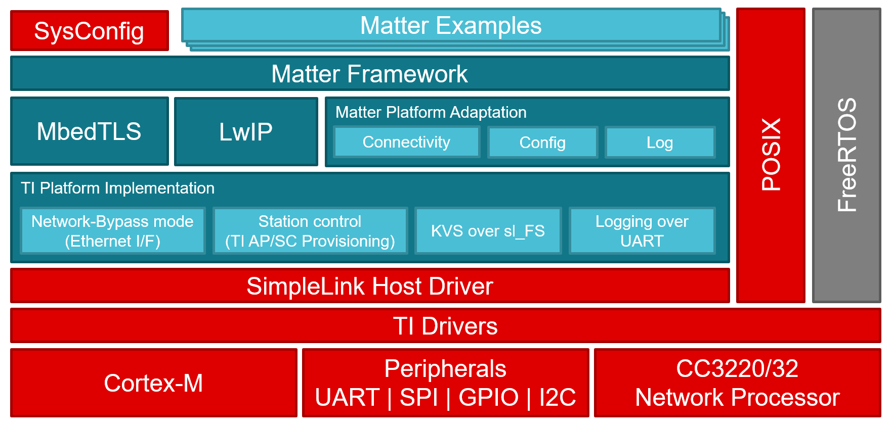

# Texas Instruments Matter over Wi-Fi Overview

The following diagram is a simplified representation of a Matter application
which is built on the TI SimpleLink Platform.

## LwIP stack

The Lightweight IP stack interfaces with the OpenThread stack to offer standard
IP connectivity protocols that OpenThread does not natively support. This offers
a standard socket-based interface to the Matter platform.

## MbedTLS

The MbedTLS library is used by OpenThread and Matter for a wide variety of
protocols. This ranges from basic AES and SHA to cryptographic protocols like
ECDSA and ECDH.

The MbedTLS library is hardware accelerated using the TI SimpleLink SDK drivers.
This is achieved through the usage of `_ALT` defines in the MbedTLS
configuration file.

## Matter integration

Matter interacts with LwIP, Mbed TLS, and the NWP to achieve the protocol and
application functionality. Through using LWIP though Ethernet I/F (SL in
Network-Bypass mode) enables provisioning and commission. Once the device is
provisioned the Matter IP messages are sent to the LwIP stack to be routed to
the Wi-Fi NWP for transmission.

Overall, applications generally only need to interface with the Cluster Library
from Matter. The transport of messages and configuration of the device is all
handled by the platform implementation files.

## Matter example applications

Sample Matter applications are provided for the TI SimpleLink platform. These
can be used as reference for your own application.

-   [lock-app](examples/lock-app/cc32xx/README.md)

## Getting Started

See the Matter lock-app on Wi-Fi to get started with Matter on SimpleLink Wi-Fi
devices.

[matter_e2e_guide]:
    https://e2e.ti.com/support/wireless-connectivity/wi-fi-group/wifi/f/wi-fi-forum/1122413/faq-cc3235sf-matter----getting-started-guide

## Build system

The TI platform uses GN to generate ninja build scripts. Build files have
already been written to build and link the TI specific code within the
SimpleLink SDK.

## Release Notes

The release notes containing the list of features, bug fixes and known issues is
located at [Release Notes](./RELEASE_NOTES.md).

## TI Support

For technical support, please consider creating a post on TI's E2E forum.
Additionally, we welcome any feedback.
