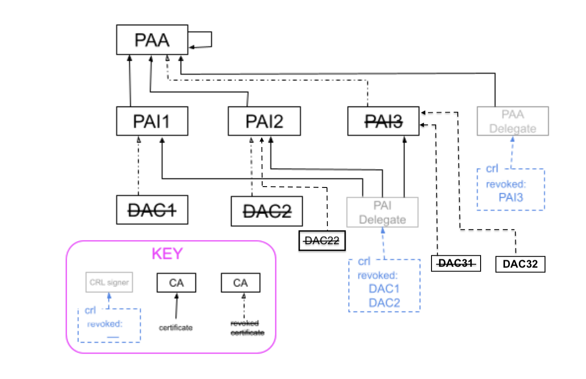

# Revoked Attestation Certificates

This directory contains test certificates, keys, and CRLs for device attestation
revocation testing scenarios. The test certificates and keys are intended to be
used for testing purposes only and should not be used in production
environments.

## Direct CRL Signing

In this approach, the CA directly signs the Certificate Revocation List (CRL).

### PAA Signed CRL

Process:

1. PAA issues the PAI
2. PAI issues the DAC
3. PAA revokes the PAI and updates the CRL

-   PAA: `Chip-Test-PAA-FFF1-Cert.[pem|der]`
-   CRL: `Chip-Test-PAA-FFF1-CRL.[der|pem]`
-   PAI(revoked): `Chip-Test-PAI-FFF1-noPID-Revoked-Cert.[pem|der]`
-   DAC(signed by revoked PAI):
    `Chip-Test-DAC-FFF1-8001-Signed-By-Revoked-PAI-Cert.[pem|der]`

### PAI Signed CRL

Process:

1. PAI issues the 3 DACs
2. PAI issues the DAC and updates the CRL

-   PAI: `Matter-Development-PAI-FFF1-noPID-Cert.[pem|der]`
-   CRL: `Matter-Development-PAI-FFF1-noPID-CRL.[pem|der]`
-   DACs(revoked):
    -   `Matter-Development-DAC-FFF1-8001-Revoked-01-Cert.[pem|der]`
    -   `Matter-Development-DAC-FFF1-8002-Revoked-02-Cert.[pem|der]`
    -   `Matter-Development-DAC-FFF1-8003-Revoked-03-Cert.[pem|der]`

## Indirect CRL Signing (delegated CRL signing)

In this approach, the CA delegates the CRL signing responsibility to a separate
entity.

Please take an example PKI .

-   PAA: `Chip-Test-PAA-FFF1-Cert.[pem|der]`
-   PAIs:
    -   `indirect/Chip-Test-PAI-FFF1-01-Cert.[pem|der]`
        -   DAC:
            `indirect/Chip-Test-DAC-FFF1-8001-Signed-By-Test-PAI-01-Cert.[pem|der]`
    -   `indirect/Chip-Test-PAI-FFF1-02-Cert.[pem|der]`
        -   DAC:
            `indirect/Chip-Test-DAC-FFF1-8001-Signed-By-Test-PAI-02-Cert.[pem|der]`
            `indirect/Chip-Test-DAC-02-FFF1-8001-Signed-By-Test-PAI-02-Cert.[pem|der]`
    -   `indirect/Chip-Test-PAI-FFF1-03-Cert.[pem|der]`
-   PAA Delegate: `indirect/Chip-Test-PAA-Delegate-FFF1-Cert.[pem|der]`
-   PAA Delegated CRL: `indirect/Chip-Test-PAA-FFF1-Delegated-CRL.[pem|der]`

-   PAI Delegate Key for all PAIs:
    `indirect/Chip-Test-PAI-Delegate-FFF1-Key.pem`
-   PAI Delegates:

    -   `indirect/Chip-Test-PAI-Delegate-FFF1-01-Cert.[pem|der]`
    -   `indirect/Chip-Test-PAI-Delegate-FFF1-02-Cert.[pem|der]`
    -   `indirect/Chip-Test-PAI-Delegate-FFF1-03-Cert.[pem|der]`

-   PAI Delegated CRL: `indirect/Chip-Test-PAI-FFF1-Delegated-CRL.[pem|der]`
-   PAI Delegated CRL with Certificate Issuer CRL entry extension, only first
    entry has the extension:
    `indirect/Chip-Test-PAI-FFF1-Delegated-CRL-With-Cert-Issuer-Extension.[pem|der]`
