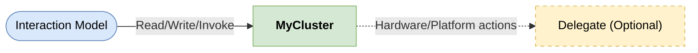
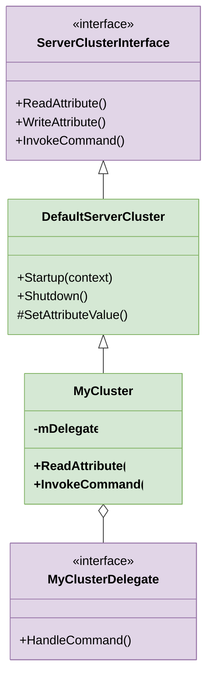

# Designing Clusters for Testing and Portability

## Recommended Unit Testable Cluster Design

When designing new clusters, we recommend a **Combined Implementation** pattern
for optimal flash and RAM usage while maintaining full unit-testability.

-   **Combined Implementation (Recommended):**
    -   The cluster's logic, data storage, and `ServerClusterInterface`
        implementation are contained within a single class, typically deriving
        from `DefaultServerCluster`.
    -   This minimizes boilerplate and virtual function overhead.
-   **Modular Implementation / `ClusterLogic` (Discouraged):**
    -   Separating logic into a `ClusterLogic` class adds noticeable flash and
        RAM overhead and is discouraged for new clusters.
-   **Separate Platform-Specific Code (when needed):**
    -   If the cluster needs to trigger platform- or hardware-specific actions,
        use a **Delegate** (or **Driver**) interface injected via the
        constructor.
    -   This keeps the cluster portable and allows the delegate to be mocked in
        tests.
    -   Simple reporting clusters (e.g., sensor readings) often need no delegate
        at all — the application calls setters directly instead.

### General approach


```mermaid
flowchart LR
    IM(["Interaction Model"]):::stack
    MC["<b>MyCluster</b>"]:::cluster
    MCD["Delegate (Optional)"]:::delegate

    IM -->|"Read/Write/Invoke"| MC
    MC -.->|"Hardware/Platform actions"| MCD

    classDef stack    fill:#dae8fc,stroke:#6c8ebf,color:#000
    classDef cluster  fill:#d5e8d4,stroke:#82b366,color:#000,font-weight:bold
    classDef delegate fill:#fff2cc,stroke:#d6b656,color:#000,stroke-dasharray:5 5
```

### Class structure


```mermaid
classDiagram
    direction TB
    class ServerClusterInterface {
        <<interface>>
        +ReadAttribute()
        +WriteAttribute()
        +InvokeCommand()
    }
    class DefaultServerCluster {
        +Startup(context)
        +Shutdown()
        #SetAttributeValue()
    }
    class MyCluster {
        +ReadAttribute()
        +InvokeCommand()
        -mDelegate
    }
    class MyClusterDelegate {
        <<interface>>
        +HandleCommand()
    }

    ServerClusterInterface <|-- DefaultServerCluster
    DefaultServerCluster <|-- MyCluster
    MyCluster o-- MyClusterDelegate

    style ServerClusterInterface  fill:#e1d5e7,stroke:#9673a6,color:#000
    style DefaultServerCluster    fill:#d5e8d4,stroke:#82b366,color:#000
    style MyCluster               fill:#d5e8d4,stroke:#82b366,color:#000,font-weight:bold
    style MyClusterDelegate       fill:#e1d5e7,stroke:#9673a6,color:#000
```

### Combined Cluster Implementation

The cluster class inherits from `DefaultServerCluster`, which provides a
spec-compliant base for implementing `ServerClusterInterface`. It handles:

-   Data version management.
-   Path management (single endpoint/cluster pair).
-   Default status responses for attributes and commands that are not handled.
-   Integration with `ServerClusterContext`.

An example implementation:

```cpp
DataModel::ActionReturnStatus DiscoBallCluster::ReadAttribute(const DataModel::ReadAttributeRequest & request,
                                                              AttributeValueEncoder & encoder)
{
    switch (request.path.mAttributeId)
    {
    case Attributes::ClusterRevision::Id:
        return encoder.Encode(kRevision);
    case Attributes::Run::Id:
        return encoder.Encode(mRun);
    // ...
    }
    return Protocols::InteractionModel::Status::UnsupportedAttribute;
}
```

### Delegate / Driver Interface

A delegate is optional. Use one only when the cluster needs to trigger platform-
or hardware-specific actions (e.g., spinning a motor, adjusting brightness on a
real device). Simple reporting clusters — such as sensor measurements — can skip
the delegate entirely and let the application push state via setters directly.

When a delegate is used, inject it via the constructor so it can be mocked in
unit tests. The cluster remains responsible for all spec-defined validations
(e.g., range checks) before calling the delegate.

```cpp
class DiscoBallDelegate {
public:
    virtual ~DiscoBallDelegate() = default;
    virtual void OnRunChanged(bool run) = 0;
};
```

## Unit Testing Code-Driven Clusters

Unit tests should focus on behavioral correctness and spec compliance.

### ClusterTester Helper Class

The `ClusterTester` helper class (in
`src/app/server-cluster/testing/ClusterTester.h`) is mandatory for testing
code-driven clusters. It abstracts TLV handling, memory management for views,
and fabric context.

The unit test instantiates the cluster, provides a mock delegate, and uses
`ClusterTester` to interact with it.

### Important tests to consider:

-   **Initialization**: Initial attribute values are correct after `Startup`.
-   **Range Checking**: Errors (e.g., `ConstraintError`) for out-of-range values
    in setters and command handlers.
-   **Boundary Cases**: Behavior at minimum, maximum, and with null values for
    nullable attributes.
-   **Spec Compliance**: All spec-defined error conditions are handled
    correctly.
-   **Side Effects**: Event generation and dirty attribute marking for state
    changes.
-   **Delegate Interaction**: Proper calls out to the delegate and handling of
    delegate-reported errors.
-   **Fabric Isolation**: Correct behavior for fabric-scoped attributes and
    commands.

For detailed API usage and examples, please see the
[ClusterTester Helper Class Guide](cluster_tester.md).

## Unit testing existing clusters

-   **Option 1: Refactor**
    -   Refactor the cluster to use `DefaultServerCluster` and `ClusterTester`.
        This is the preferred path for long-term maintainability.
-   **Option 2: Test at Interface Boundary**
    -   Instantiate the cluster and use `ClusterTester` to interact with it via
        the `ServerClusterInterface` boundary. This is useful for existing
        implementations that cannot yet be fully refactored.
