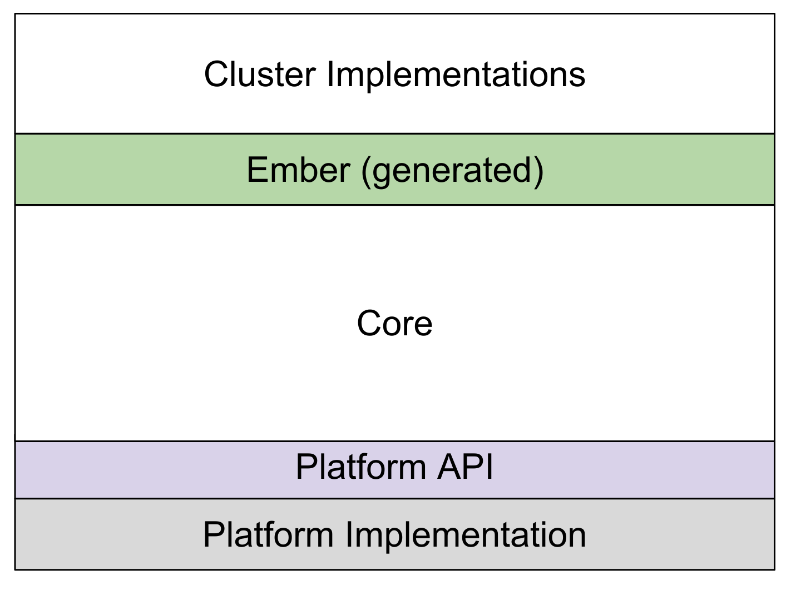

# SDK Basics

## Getting Started

-   SDK Location:
    [https://github\.com/project\-chip/connectedhomeip](https://github.com/project-chip/connectedhomeip)\_
-   email _[help@csa\-iot\.org](mailto:help@csa-iot.org)_ to get access to the
    other repos and to be added to project\-chip org

## Basic SDK Architecture

### Platform Layer

Platform layer implements the connection to the network stack and the base OS.
Messages flow off the wire into the platform layer, where they are routed into
the platform API for processing by the Matter stack.

### Platform API

The platform API defines a common layer to interact with the core.

### Core

Core encompasses a huge part of the spec, including all of the the underlying
communication protocols. The goal of the core code is to deliver valid messages
to the ember layer indicating the cluster request and associated endpoint
information.

### Ember

The ember layer is a generated layer that implements the composition of ONE
SPECIFIC device. It looks at each message and determines if the device has
implemented the selected attribute or command on the cluster on the selected
endpoint, and then blocks or routes accordingly, based on the implementation and
the access control.

Valid requests are forwarded on to the cluster implementations to handle and
invalid requests get sent back with an error. Ember layer is the piece that
makes your device your device. Most are generated statically using zap.

### Cluster implementations

The cluster implementations are the logic that back the cluster. The cluster
implementation code receives messages from the ember layer to request data model
operations on the cluster (reads / writes / command invokes). They are also
responsible for event generation and attribute change reporting. Simple cluster
logic can be written in the ember callback functions, but more complex cluster
logic is handled in the run-time installed interface layers.

## SDK Organization (some key bits)

-   docs
    -   [docs/guides/BUILDING\.md](https://github.com/project-chip/connectedhomeip/blob/master/docs/guides/BUILDING.md) -
        follow this first
    -   [docs/guides/chip_tool_guide.md](https://github.com/project-chip/connectedhomeip/blob/master/docs/guides/chip_tool_guide.md)
-   examples
    -   [examples/chip-tool](https://github.com/project-chip/connectedhomeip/blob/master/examples/chip-tool) -
        main controller example
    -   [examples/all-clusters-app](https://github.com/project-chip/connectedhomeip/blob/master/examples/all-clusters-app) -
        QA app
    -   [examples/\<others\>](https://github.com/project-chip/connectedhomeip/blob/master/examples) -
        Specific Device examples
-   scripts
    -   [bootstrap.sh](https://github.com/project-chip/connectedhomeip/blob/master/scripts/bootstrap.sh)
        &
        [activate.sh](https://github.com/project-chip/connectedhomeip/blob/master/scripts/activate.sh) -
        environment setup
    -   [build/build_examples.py](https://github.com/project-chip/connectedhomeip/blob/master/scripts/build/build_examples.py) -
        build example code
    -   [tools/zap/run_zaptool.sh](https://github.com/project-chip/connectedhomeip/blob/master/scripts/tools/zap/run_zaptool.sh) -
        start zap tool
    -   [tools/zap_regen_all.py](https://github.com/project-chip/connectedhomeip/blob/master/scripts/tools/zap_regen_all.py) -
        .zap -> .matter
-   src
    -   [controller](https://github.com/project-chip/connectedhomeip/blob/master/src/controller/) -
        client side code including python implementation
    -   [app](https://github.com/project-chip/connectedhomeip/blob/master/src/app) -
        base server side code
    -   [app/clusters](https://github.com/project-chip/connectedhomeip/blob/master/src/app/clusters) -
        cluster implementations (.cpp)
    -   [app/zap-templates/zcl/data-model/chip/](https://github.com/project-chip/connectedhomeip/blob/master/src/app/zap-templates/zcl/data-model/chip/) -
        cluster definitions (.xml)
    -   [app/tests/suites/certification](https://github.com/project-chip/connectedhomeip/blob/master/src/app/tests/suites/certification) -
        yaml cert test automation scripts
    -   [lib/support/](https://github.com/project-chip/connectedhomeip/blob/master/src/lib/support/) -
        Embedded versions of common utilities
    -   [platform](https://github.com/project-chip/connectedhomeip/blob/master/src/platform) -
        platform delegate APIs / implementations
    -   [include/platform](https://github.com/project-chip/connectedhomeip/blob/master/src/include/platform) -
        platform delegate APIs / implementations
    -   [python_testing](https://github.com/project-chip/connectedhomeip/blob/master/src/python_testing) -
        python cert test automation scripts
-   zzz_generated/app-common/app-common/zap-generated/\*
    -   all the generated cluster logic / namespaces
-   data_model
    -   These files are generated and are used to check conformance against the
        spec. They should not be manually changed.
