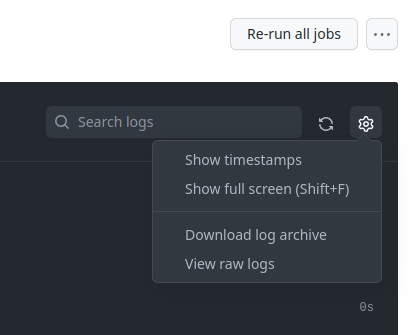

# Getting the code

-   Create your own Fork (once) (in web ui)
-   Clone your fork locally
    -   git clone https://github.com/\<your_id>/connectedhomeip.git
-   Add the Upstream as a Remote
    -   git remote add upstream https://github.com/project-chip/connectedhomeip

# Updating

-   git pull upstream / git fetch upstream
-   We use submodules with submodules
    -   git submodule update -f --init --recursive
-   May need to occasionally sync
    -   git submodule sync --recursive

# Pull Requests and CI

## Pull Request process

-   make changes locally, push to a branch on your fork
    -   git push origin $(git branch --show-current)
-   open a pull request (PR) from your fork to master (web UI)
-   Add reviewers as required
    -   if you’re having trouble getting reviews, try slack
-   Need 2 approvals and passing tests / linter (CI)
-   see
    [CONTRIBUTING.md](https://github.com/project-chip/connectedhomeip/blob/master/CONTRIBUTING.md)\_
    for more info
-   We use fast-forward merge, so you do NOT need to update your branch to
    master before merging if the merge is clean

## Continuous integration tests (CI)

-   All CI tests need to be passing before merge
    -   “Checks” tab at the top of the PR or in the bottom of the “Conversation”
        tab
-   Debugging failing tests
    -   click into the details, all the steps to run the test locally are there,
        but buried, and sometimes there are a lot
    -   logs are available, top right gear for raw
    -   “act” can be used to run CI through github
    -   If you suspect a test failure might be a flake, you can re-run it using
        the re-run button in the top right corner.

giant logs? try this and use glogg/klogg
