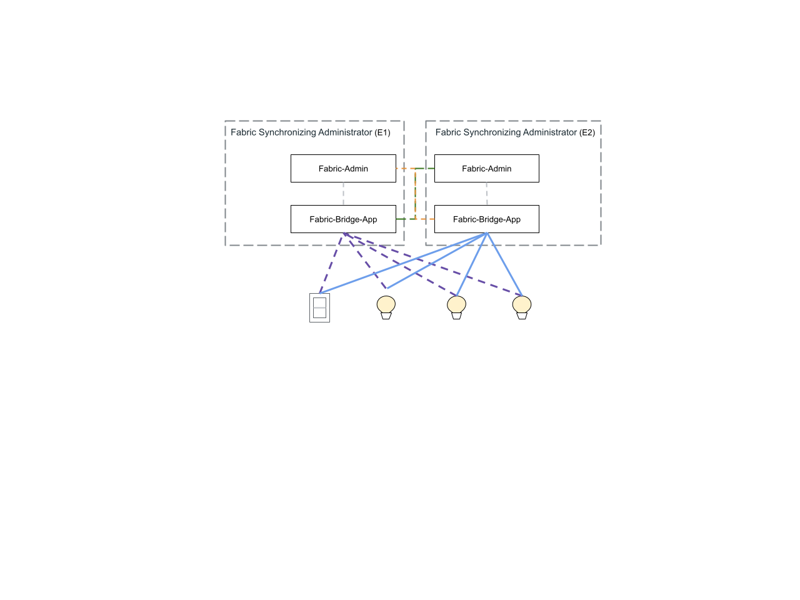

# Fabric Synchronization Guide

-   [Fabric Synchronization Guide](#fabric-synchronization-guide)
    -   [Fabric Sync Example Applications](#fabric-sync-example-applications)
    -   [Bootstrap Fabric Sync Demo on Linux](#bootstrap-fabric-sync-demo-on-linux)
    -   [Bootstrap Fabric Sync Demo on RP4](#bootstrap-fabric-sync-demo-on-rp4)
    -   [Run Fabric Sync Demo](#run-fabric-sync-demo)

## Fabric Sync Example Applications

Fabric-Admin and Fabric-Bridge example applications are provided to demonstrate
Fabric Synchronization feature. You can find them in the examples.



Fabric-Admin example app implements the Fabric Administrator role and
communicates with the Fabric-Bridge-App on the other side, facilitating the
Fabric Synchronization process.

Fabric-Bridge-App example app implements the Aggregator device type with Fabric
Synchronization condition met and demonstrates the end-to-end Fabric
Synchronization feature using dynamic endpoints.

The Fabric-Admin and Fabric-Bridge-App example applications must be executed on
the same physical device and communicate with each other using RPC.

Fabric Synchronization can be triggered from either side. The initiator of the
Fabric Synchronization process, who shares their devices, takes on the
Commissioner role. The recipient of the Fabric Synchronization request, who
receives the shared devices, assumes the Commissionee role. This flexibility
enables a seamless and efficient synchronization process.

### Building the Example Application

-   Building the Fabric-Admin Application

    [Fabric-Admin](https://github.com/project-chip/connectedhomeip/tree/master/examples/fabric-admin/README.md)

*   Building the Fabric-Bridge Application

    [Fabric-Bridge](https://github.com/project-chip/connectedhomeip/tree/master/examples/fabric-bridge-app/linux/README.md)

## Bootstrap Fabric Sync Demo on Linux

### Start Fabric Synchronization on Ecosystem 1

Run the Fabric Synchronization script:

```
./examples/fabric-admin/scripts/run_fabric_sync.sh
```

### Start Fabric Synchronization on Ecosystem 2

Run the Fabric Synchronization script:

```
./examples/fabric-admin/scripts/run_fabric_sync.sh
```

## Bootstrap Fabric Sync Demo on RP4

### Start Fabric Synchronization on Ecosystem 1

Connect to the Ecosystem 1 server:

```
ssh ubuntu@xxx.xxx.xxx.xxx
```

Password: <password>

Run the Fabric Synchronization script:

```
./run_fabric_sync.sh
```

### Start Fabric Synchronization on Ecosystem 2

Connect to the Ecosystem 2 server:

```
ssh ubuntu@xxx.xxx.xxx.xxx
```

Password: <password>

Run the Fabric Synchronization script:

```
./run_fabric_sync.sh
```

## Run Fabric Sync Demo

### Fabric Sync Setup

Fabric Sync Setup is the process of enabling two ecosystems that support the
Fabric Synchronization feature to commission each other's Fabric Bridge nodes
into their respective private fabrics.

In Ecosystem 1 Fabric-Admin console:

Pair the local bridge of Ecosystem 1 with node ID 1:

```
fabricsync add-local-bridge 1
```

Pair the Ecosystem 2 bridge to Ecosystem 1 with node ID 2:

```
fabricsync add-bridge 2 <setup-pin-code> <e2-fabric-bridge-ip> <e2-fabric-bridge-port>
```

This command will initiate the reverse commissioning process. After a few
seconds, you should see the following message, indicating that the local bridge
of Ecosystem 1 has successfully paired with Ecosystem 2 on Endpoint 2:

```
>>> A new device is added on Endpoint 2.
```

Note: We only need to add the local bridge to the ecosystem to trigger the
Fabric Sync Setup process. In the example above, the Fabric Sync Setup process
is initiated by the command 'add-bridge' from Ecosystem 1. Adding the local
bridge on the other side is optional.

### Pair Light Example to Ecosystem 2

Since Fabric-Bridge also functions as a Matter server, running it alongside the
Light Example app on the same machine would cause conflicts. Therefore, you need
to run the Matter Light Example app on a separate physical machine from the one
hosting Fabric-Admin and Fabric-Bridge. You can then commission the Matter Light
Example app using Fabric-Admin on the source side.

There is a workaround to avoid conflicts when running multiple Matter server
applications on the same machine, you can use different ports and unique
Key-Value Store (KVS) paths for each app. Here's an example of how to launch a
Light App with custom settings:

Light App with yet another set of different discriminator/passcode, ports and
KVS

```
./out/linux-x64-light-clang/chip-lighting-app --discriminator 3843 --passcode 20202023 --secured-device-port 5543 --unsecured-commissioner-port 5553 --KVS /tmp/chip_kvs_lighting_app
```

Pair the Light Example with node ID 3 using its payload number:

```
pairing already-discovered 3 20202021 <ip> 5543
```

After the device is successfully added, you will observe the following message
on Ecosystem 2 with the newly assigned Node ID:

```
>>> New device with Node ID: 0x3 has been successfully added.
```

Additionally, you should also get notified when a new device is added to
Ecosystem 2 from the Ecosystem 1:

```
>>> A new device is added on Endpoint 3.
```

### Synchronize Light Example to Ecosystem 1

After the Light Example is successfully paired in Ecosystem 2, we can start to
synchronize the light device to Ecosystem 1 using the new assigned dynamic
endpointid on Ecosystem 2.

```
fabricsync sync-device <endpointid>
```

Toggle the Light Example:

From Ecosystem 1:

```
onoff on <node-id> 1
onoff off <node-id> 1
```

From Ecosystem 2: (Use the node ID assigned)

```
onoff on x 1
onoff off x 1
```

### Remove Light Example from Ecosystem

Unpair the Light Example:

```
pairing unpair <node-id>
```

### Pair Commercial Switch to Fabric-Source

Pair the switch using its payload number:

In Fabric-Source console:

```
pairing code-wifi <node-id> <ssid> <passwd> <payload>
```

### Synchronize Switch to Ecosystem 1

After the switch is successfully paired in Ecosystem 2, we can start to
synchronize it to Ecosystem 1 using the new assigned dynamic endpointid on
Ecosystem 2..

```
fabricsync sync-device <endpointid>
```

Toggle the switch:

From Ecosystem 1:

```
onoff on <node-id> 1
onoff off <node-id> 1
```

From Ecosystem 2: (Use the node ID assigned)

```
onoff on <node-id> 1
onoff off <node-id> 1
```

### Remove Switch from Ecosystem

Unpair the switch:

```
pairing unpair <node-id>
```
