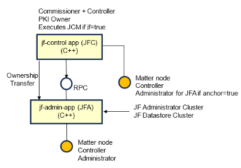

# Joint Fabric Guide

-   [Joint Fabric Guide](#joint-fabric-guide)
    -   [Joint Fabric Example Applications](#joint-fabric-example-applications)
        -   [Bootstrap Joint Fabric Demo on Linux](#bootstrap-joint-fabric-demo-on-linux)
        -   [Run Joint Fabric Demo](#run-joint-fabric-demo)

## Joint Fabric Example Applications

jf-control-app and jf-admin-app example applications are provided to demonstrate
the Joint Fabric feature. You can find them in the examples folder.



jf-control-app acts as a commissioner and control plane for jf-admin-app. It
also acts as a PKI provider. jf-admin-app acts as an administrator and it holds
an instance of the JF Administrator Cluster and of the JF Datastore Cluster.

First app commissioned by jf-control-app has to be the jf-admin-app (`--anchor`
parameter set to `true` has to be used in the `pairing` command). jf-control-app
will set the `CaseAdminSubject` field of the `AddNOC()` commands to its
Administrator CAT (initial version for this CAT is configurable from
CHIPProjectAppConfig.h). There is only one exception to this rule and that is
when the `jf` parameter is used in the `pairing` command; in this case the
`CaseAdminSubject` field is set to the `Anchor CAT` of the jf-admin-app (for
more details, please refer to the Matter specification, Joint Commissioning
Method (JCM) chapter).

When jf-admin-app is commissioned for the first time by the jf-control-app it is
issued a NOC containing the Administrator CAT and the Anchor CAT. Initial
version of these CATs is configurable (see CHIPProjectAppConfig.h)

Once the jf-admin-app has been commissioned, following `pairing` commands on
jf-control-app will execute only the commissioning subset of steps (e.g.:
through NOC issuance), then the ownership is transferred through RPC to the
jf-admin-app that finalizes the commissioning.

### Building the Example Application

-   Building the Joint Fabric Control Application

    [jf-control-app](https://github.com/project-chip/connectedhomeip/tree/master/examples/jf-control-app/README.md)

-   Building the Joint Fabric Admin Application

    [jf-admin-app](https://github.com/project-chip/connectedhomeip/tree/master/examples/jf-admin-app/linux/README.md)

## Bootstrap Joint Fabric Demo on Linux

Before following the steps below, cleanup temporary chip files:

```
$ rm -rf /tmp/chip_*
```

### Initialize Ecosystem A (Vendor ID = 0xFFF1)

-   Start jf-admin-app

```
$ cd ~/connectedhomeip/examples/jf-admin-app/linux/out/debug
$ rm -rf jfa_a_kvs && touch jfa_a_kvs
$ ./jfa-app --capabilities 0x4 --passcode 110220033 --secured-device-port 5533 --rpc-server-port 33033 --KVS jfa_a_kvs
```

-   Start jf-control-app

```
$ cd ~/connectedhomeip/examples/jf-control-app/out/debug
$ rm -rf jfc_a_storage_directory && mkdir jfc_a_storage_directory
$ ./jfc-app --rpc-server-port 33033 --storage-directory jfc_a_storage_directory --commissioner-vendor-id 0xFFF1
```

-   Commission jf-admin-app

```
>>> pairing onnetwork 1 110220033 --anchor true
```

Check for the following logs on the jf-control-app side:

```
>>> [JF] Anchor Administrator commissioned with sucess
```

Make sure that the NOC issued to jf-admin-app contains an Anchor CAT and an
Administrator CAT:

```
>>> operationalcredentials read nocs 1 0
>>> NOCs: 1 entries
$ [TOO]   NOCs: 1 entries
$ [TOO]     [1]: {
$ [[TOO]       Noc: noc_bytes
$ [TOO]       Icac: icac_bytes
$ [TOO]       FabricIndex: 1
$ [TOO]      }
```

Use
[chip-cert](https://github.com/project-chip/connectedhomeip/tree/master/src/tools/chip-cert/README.md)
for decoding noc_bytes:

```
$ chip-cert convert-cert --x509-pem  noc_bytes - | openssl x509 -inform pem -noout -text
```

Check for the Anchor CAT and Administrator CAT in the Subject Field of the NOC:

```
$ Subject: ..., 1.3.6.1.4.1.37244.1.6 = FFFF0001, 1.3.6.1.4.1.37244.1.6 = FFFE0001
```

Check for the "jf-anchor-icac" inside the Subject Field of the ICAC:

```
$ chip-cert convert-cert --x509-pem  icac_bytes - | openssl x509 -inform pem -noout -text
....
Subject: 1.3.6.1.4.1.37244.1.3 = 0000000000000003, OU = jf-anchor-icac
...
```

-   Start the
    [lighting-app](https://github.com/project-chip/connectedhomeip/tree/master/examples/lighting-app/linux/README.md)

```
$ cd ~/connectedhomeip/examples/lighting-app/linux/out/debug
$ rm -rf light_a_kvs && touch light_a_kvs
$ ./chip-lighting-app --capabilities 0x4 --passcode 110220044 --KVS light_a_kvs
```

-   Commission lighting-app

```
>>> pairing onnetwork 2 110220044
```

Check that a Fabric having `AdminVendorID` set to 0xFFF1 has been installed:

```
>>> operationalcredentials read fabrics 2 0
```

Check that an ACL with Subjects field set to the Administrator CAT of
jf-admin-app has been installed:

```
>>> accesscontrol read acl 2 0
```

A `Subjects` field equal to `18446744065119551489` (`FFFFFFFDFFFF0001` in hex)
should be found.

### Initialize Ecosystem B (Vendor ID = 0xFFF2)

-   Start jf-admin-app

```
$ cd ~/connectedhomeip/examples/jf-admin-app/linux/out/debug
$ rm -rf jfa_b_kvs && touch jfa_b_kvs
$ ./jfa-app --capabilities 0x4 --passcode 110220055 --secured-device-port 5555 --rpc-server-port 33055 --KVS jfa_b_kvs
```

-   Start jf-control-app

```
$ cd ~/connectedhomeip/examples/jf-control-app/out/debug
$ rm -rf jfc_b_storage_directory && mkdir jfc_b_storage_directory
$ ./jfc-app --rpc-server-port 33055 --storage-directory jfc_b_storage_directory --commissioner-vendor-id 0xFFF2
```

-   Commission jf-admin-app

```
>>> pairing onnetwork 11 110220055 --anchor true
```

Check for the following logs on the jf-control-app side:

```
>>> [JF] Anchor Administrator commissioned with sucess
```

Make sure that the NOC issued to jf-admin-app contains an Anchor CAT and an
Administrator CAT:

```
>>> operationalcredentials read nocs 11 0
>>> NOCs: 1 entries
$ [TOO]   NOCs: 1 entries
$ [TOO]     [1]: {
$ [[TOO]       Noc: noc_bytes
$ [TOO]       Icac: icac_bytes
$ [TOO]       FabricIndex: 1
$ [TOO]      }
```

Use
[chip-cert](https://github.com/project-chip/connectedhomeip/tree/master/src/tools/chip-cert/README.md)
for decoding noc_bytes:

```
$ chip-cert convert-cert --x509-pem  noc_bytes - | openssl x509 -inform pem -noout -text
```

Check for the Anchor CAT and Administrator CAT inside the Subject Field of the
NOC:

```
$ Subject: ..., 1.3.6.1.4.1.37244.1.6 = FFFF0001, 1.3.6.1.4.1.37244.1.6 = FFFE0001
```

Check for the "jf-anchor-icac" inside the Subject Field of the ICAC:

```
$ chip-cert convert-cert --x509-pem  icac_bytes - | openssl x509 -inform pem -noout -text
....
Subject: 1.3.6.1.4.1.37244.1.3 = 0000000000000003, OU = jf-anchor-icac
...
```

-   Start the
    [lighting-app](https://github.com/project-chip/connectedhomeip/tree/master/examples/lighting-app/linux/README.md)

```
$ cd ~/connectedhomeip/examples/lighting-app/linux/out/debug
$ rm -rf light_b_kvs && touch light_b_kvs
$ ./chip-lighting-app --capabilities 0x4 --passcode 110220066 --KVS light_b_kvs
```

-   Commission lighting-app

```
>>> pairing onnetwork 22 110220066
```

Check that a Fabric having `AdminVendorID` set to 0xFFF2 has been installed:

```
>>> operationalcredentials read fabrics 22 0
```

Check that an ACL with Subjects field set to the Administrator CAT of
jf-admin-app has been installed:

```
>>> accesscontrol read acl 22 0
```

A `Subjects` field equal to `18446744065119551489` (`FFFFFFFDFFFF0001` in hex)
should be found.

## Run Joint Fabric Demo
