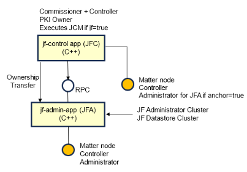

# Joint Fabric Guide

-   [Joint Fabric Guide](#joint-fabric-guide)
    -   [Joint Fabric Example Applications](#joint-fabric-example-applications)
        -   [Bootstrap Joint Fabric Demo on Linux](#bootstrap-joint-fabric-demo-on-linux)
        -   [Run Joint Fabric Demo](#run-joint-fabric-demo)

## Joint Fabric Example Applications

jf-control-app and jf-admin-app example applications are provided to demonstrate
Joint Fabric feature. You can find them in the examples folder.

jf-control-app acts as a commissioner and control plane for jf-admin-app. It
also acts as a PKI provider. jf-admin-app acts as an administrator and it holds
an instance of the JF Administrator Cluster and of the JF Datastore Cluster.

First app commissioned by jf-control-app has to be the jf-admin-app (`--anchor`
parameter set to `true` has to be used in the `pairing` command). jf-control-app
will set the `CaseAdminSubject` field of the `AddNOC()` commands to its
Administrator CAT (initial version for this CAT is configurable from
CHIPProjectAppConfig.h).

When jf-admin-app is commissioned for the first time by the jf-control-app it is
issued a NOC containing the Administrator CAT and the Anchor CAT. Initial
version of these CATs is configurable (see CHIPProjectAppConfig.h)

Once the jf-admin-app has been commissioned, following `pairing` commands on
jf-control-app will execute only the commissioning subset of steps (e.g.:
through NOC issuance), then the ownership is transferred through RPC to the
jf-admin-app that finalizes the commissioning.

### Building the Example Application

-   Building the Joint Fabric Control Application

    [jf-control-app](https://github.com/project-chip/connectedhomeip/tree/master/examples/jf-control-app/README.md)

*   Building the Joint Fabric Admin Application

    [jf-admin-app](https://github.com/project-chip/connectedhomeip/tree/master/examples/jf-admin-app/linux/README.md)

## Bootstrap Joint Fabric Demo on Linux

## Run Joint Fabric Demo
