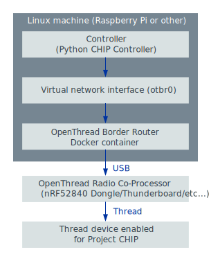

# Configuring Thread network on a Linux machine

You can use a Project CHIP controller such as
[Python CHIP Controller](../../src/controller/python/README.md) to control
Thread devices enabled for Project CHIP from a Linux host.

For this purpose, you must equip the host with a Thread radio device, create a
new Thread network, and ensure that packets addressed to devices within the
network are routed through the radio device.

-   [Overview](#overview)
-   [Requirements](#requirements)
-   [Configuration](#configuration)
-   [Preparing OpenThread Radio Co-Processor device](#preparing-openthread-radio-co-processor)
-   [Configuring OpenThread Border Router](#configuring-openthread-border-router)
-   [Testing](#testing)

## Overview

The following figure shows the setup created as a result of configuring Thread
network on a Linux machine.

In this setup, the connectivity between Python CHIP Controller and Thread
devices is ensured in the following way:

-   CHIP messages generated by the Project CHIP controller are routed through a
    virtual network interface **otbr0** to
    [OpenThread Border Router container](https://openthread.io/guides/border-router/docker)
    in Docker.
-   The OpenThread Border Router container uses a device with the
    [OpenThread Radio Co-Processor](https://openthread.io/platforms/co-processor)
    firmware to transmit Project CHIP messages to the Thread network.
-   CHIP-enabled Thread devices connected to the same Thread network receive and
    consume Project CHIP messages.

## Requirements

You need the following hardware and software for this configuration:

-   OpenThread Radio Co-Processor device (for example,
    [nRF52840 Dongle](https://www.nordicsemi.com/Software-and-tools/Development-Kits/nRF52840-Dongle))
-   Linux machine with Ubuntu v20.04 or later

## Configuration

The configuration process is composed of the following steps:

-   Preparing OpenThread Radio Co-Processor (RCP) device
-   Configuring OpenThread Border Router container in Docker

### Configuring OpenThread Radio Co-Processor

Read
[Configuring OpenThread Radio Co-processor on nRF52840 Dongle](openthread_rcp_nrf_dongle.md)
to learn how to configure Nordic Semiconductor's
[nRF52840 Dongle](https://www.nordicsemi.com/Software-and-tools/Development-Kits/nRF52840-Dongle)
as OpenThread Radio Co-Processor.

You can replace the nRF52840 Dongle with a variety of development boards from
different vendors. If you are using a Raspberry Pi as your testing platform, you
can execute this step on a more powerful Linux machine to shorten the firmware
build time.

### Configuring OpenThread Border Router

To configure OpenThread Border Router, complete the following steps:

1.  Install Docker daemon:

        $ sudo apt update && sudo apt install docker.io

2.  Start the Docker daemon:

        $ sudo systemctl start docker

3.  Create an IPv6 network for the OpenThread Border Router container in Docker:

        $ sudo docker network create --ipv6 --subnet fd11:db8:1::/64 -o com.docker.network.bridge.name=otbr0 otbr

4.  Start the OpenThread Border Router container using the following command (in
    the last line, replace _/dev/ttyACM0_ with the device node name of the
    OpenThread Radio Co-processor):

        $ sudo docker run -it --rm --privileged --network otbr -p 8080:80 -e NAT64=0 -e DNS64=0 \
                --sysctl "net.ipv6.conf.all.disable_ipv6=0 net.ipv4.conf.all.forwarding=1 net.ipv6.conf.all.forwarding=1" \
                --volume /dev/ttyACM0:/dev/radio openthread/otbr --radio-url spinel+hdlc+uart:///dev/radio

5.  Open the `http://localhost:8080/` address in a web browser. If you are using
    a Raspberry Pi without a screen, but you have a different device in the same
    network, you can start a web browser on that device and use the address of
    the Raspberry Pi instead of `localhost`.
6.  Click **Form** in the menu to the left. The network forming creator window
    appears.
7.  Make sure that the On-Mesh Prefix is set to `fd11:22::`. This value is used
    later to configure the IPv6 packet routing.
8.  Click the **Form** button at the bottom of the window to form a new Thread
    network using the default settings.
9.  To ensure that packets addressed to devices in the Thread network are routed
    through the OpenThread Border Router container in Docker, run the following
    command with the On-Mesh Prefix that you set earlier:

        $ sudo ip -6 route add fd11:22::/64 dev otbr0 via fd11:db8:1::2

## Testing

After Open Thread Border Router has been configured, complete the steps
described in the
[Python CHIP Controller README](../../src/controller/python/README.md) to
commission a Thread device into the network and control it using the Project
CHIP protocol.
