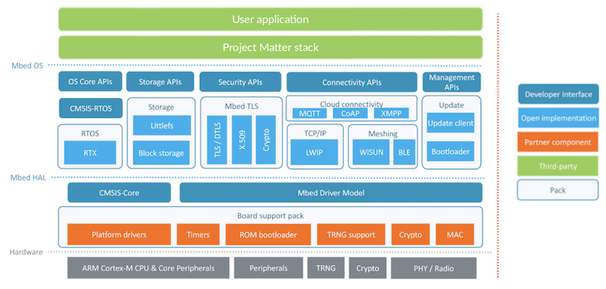

# Mbed-OS platform overview

The Mbed-OS platform is a
[Matter](https://github.com/project-chip/connectedhomeip) platform that uses Arm
Mbed-OS 6.

The following diagram shows a simplified structure of a Matter application which
runs on the top of the Mbed-OS.

# ARM Mbed-OS

Arm Mbed OS is an open source embedded operating system designed specifically
for the "things" in the Internet of Things. It includes all the features you
need to develop a connected product based on an Arm Cortex-M microcontroller,
including security, connectivity, an RTOS and drivers for sensors and I/O
devices.

Mbed OS provides an abstraction layer for the microcontrollers it runs on, so
that developers can focus on writing C/C++ applications that call functionality
available on a range of hardware. That means Mbed OS applications can be reused
on any Mbed-compatible platform.

Mbed OS uses a hardware abstraction layer (HAL) to support the most common parts
of a microcontroller, such as timers. This foundation facilitates writing
applications against a common set of application programming interfaces (APIs);
device automatically includes necessary libraries and driver support for
standard MCU peripherals, such as I2C, serial and SPI.

Mbed OS has an RTOS core, so it supports deterministic, multithreaded, real-time
software execution. The RTOS primitives are always available, allowing drivers
and applications to rely on threads, semaphores, mutexes and other RTOS
features.

The structure of Mbed OS enables matching applications and storage systems. In
other words, where the block level storage options vary and are application
dependent, The file system that best fits the IoT device can be chosen. The FAT
file system - backed by an SD card - provides compatibility with other operating
systems, such as Windows, Mac OS or Linux. When high reliability and recovery
from power failure are important, it makes sense to use our embedded file
system, backed with a (Q)SPI NOR flash chip.

Finally, Mbed OS implements the retargeting layer and boot process integration
of each supported toolchain, so application development feels similar to C or
C++ development for any other operating system.

# Bluetooth and IP stacks

In the Mbed-oS platform applications, the Bluetooth LE interface is used to
perform pairing and Wi-Fi network provisioning operations between the Matter
device and the Matter controller. Afterwards, the fully provisioned device is
able to communicate with other devices inside the Wi-Fi network.

For the Bluetooth LE communication purposes, the Mbed-OS platform application is
using
[ARM Mbed BLE](https://os.mbed.com/docs/mbed-os/latest/apis/bluetooth-apis.html)
(also called BLE_API) - Bluetooth Low Energy software solution which interfaces
with the BLE controller on the hardware target. Arm Mbed BLE hides the BLE
stack’s complexity behind C++ abstractions and is compatible with all
BLE-enabled Mbed board. The Mbed OS BLE_API automatically configuring the
clocks, timers and other hardware peripherals to work at their lowest power
consumption.

For Wi-FI communication purposes, the Mbed-OS application is using the internal
Mbed LWIP stack and Mbed Socket API together. To integrate it with Matter
network layer, special glue socket layer has been introduced to take care of
adapting the Mbed socket to BSD interface which is used inside the Matter
endpoints implementation.

## Matter integration

The Bluetooth LE and Wi-Fi used stacks provided by the Mbed-OS have been
integrated with the Matter stack using a special intermediate layer.

This layer contains platform-specific implementations of abstract manager
interfaces defined in the Matter stack. The application is able to use Matter's
platform agnostic interfaces and no additional platform-related actions are
needed to perform communication through the Matter stack.

# Matter example applications

Sample Matter applications are provided for the Mbed OS platform. They can be
used to speed up development:

-   [shell](../../examples/shell/mbed)
-   [all-clusters-app](../../examples/all-clusters-app/mbed)
-   [lock-app](../../examples/lock-app/mbed/README.md)
-   [lighting-app](../../examples/lighting-app/mbed/README.md)
-   [pigweed-app](../../examples/pigweed-app/mbed/README.md)

## Example configuration

Each of the supporting examples contains the `config.in` file which allows you
to configure the application in a proper way. You can define/disable/enable
application settings. Then they are propagated through Mbed-OS and Matter stack
build systems.

## Matter stack configuration

In each of supported examples, the Matter stack can be configured by modifying
`CHIPProjectConfig.h` file which is placed inside the project directory.

## Mbed-OS configuration

Mbed-OS gives possibility to tweak its parameters by using the
[Mbed-OS configuration system](https://os.mbed.com/docs/mbed-os/latest/program-setup/advanced-configuration.html).
The same configuration system can be used to change default hardware target
setup used in application. Additionally, it is the first place for adding
support of the new hardware target support into the application. Mbed-OS
configuration system can be accessed by modifying the `mbed_app.json` file which
exists in each sample project directory.

## Build system

The Mbed-OS platform makes use of the following build systems to generate ninja
build scripts:

-   GN - Used by the Matter project in majority of cases.
-   CMake (+ mbed-tools) - Used by the Mbed-OS user application and other
    components within Mbed ecosystem.

Matter's stack and platform modules are built with GN and output a library file.
The application, Mbed-OS and target specific libraries are built with CMake and
the Matter library file is imported during the compilation process.

## Build profiles

Arm Mbed OS defines three collections of toolchain flags used during the build:

-   develop
-   release
-   debug

Build profiles can be easy selected when building example application using
either vscode task or its associated build script directly
([mbed_examples.sh](../../scripts/examples/mbed_example.sh)).

For more details about each of this profiles, please visit official
[ARM Mbed documentation](https://os.mbed.com/docs/mbed-os/latest/program-setup/build-profiles-and-rules.html).
