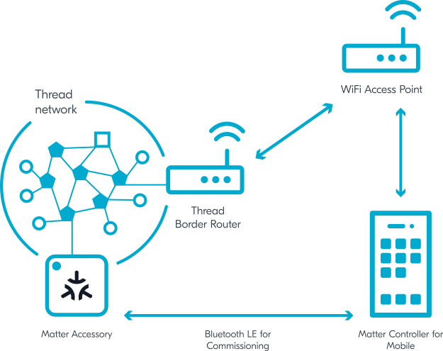
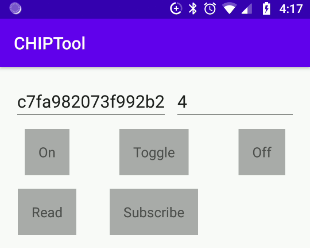

# Commissioning nRF Connect Accessory using Android CHIPTool

You can use [CHIPTool](android_building.md) for Android smartphones to
commission a Nordic Semiconductor's development kit programmed with a Matter
example for the nRF Connect platform into a Matter fabric.

This guide references the nRF52840 DK and Matter nRF Connect Lighting Example
Application that communicates with other nodes over a Thread network, but the
instructions can be adapted to other platforms and applications. For instance,
some sections of this guide include steps for testing a Wi-Fi device, which are
adapted from the original Thread-based procedure.

<hr>

-   [Overview](#overview)
-   [Requirements](#requirements)
-   [Setting up Thread Border Router](#setting-up-thread-border-router)
-   [Building and programming nRF Connect Example Application](#building-and-programming-nrf-connect-example-application)
-   [Building and installing Android CHIPTool](#building-and-installing-android-chiptool)
-   [Preparing accessory device](#preparing-accessory-device)
-   [Commissioning accessory device](#commissioning-accessory-device)
-   [Sending Matter commands](#sending-matter-commands)

<hr>

## Overview

The commissioning process is composed of the following main stages:

1.  CHIPTool discovers a Matter accessory device over Bluetooth LE.
2.  CHIPTool establishes a secure channel to the device over Bluetooth LE, and
    sends Matter operational credentials and Thread or Wi-Fi credentials.
3.  The accessory device joins the operational IPv6 network.

CHIPTool uses both Bluetooth LE and the IPv6 connectivity. Bluetooth LE is used
only during the commissioning phase. Afterwards, only the IPv6 connectivity
between the smartphone and the accessory device is needed to send operational
messages. The IPv6 address of the device is not exchanged during the
commissioning process and CHIPTool must use DNS Service Discovery (DNS-SD) to
learn or refresh the address before the controller initiates the IPv6-based
communication.

Since a typical smartphone does not have a Thread radio built-in, preparing the
fully-fledged testing environment for Matter over Thread requires a Thread
Border Router configured on a Raspberry Pi.

The following diagram shows the connectivity between network components required
to allow communication between devices running CHIPTool and Matter nRF Connect
Lighting Example Application:



<hr>

## Requirements

You need the following hardware and software for commissioning the nRF Connect
accessory using Android CHIPTool:

-   1x smartphone with Android 8+
-   1x Wi-Fi Access Point supporting IPv6 (without the IPv6 Router Advertisement
    Guard enabled on the router)
-   1x nRF52840 DK (PCA10056) for running the example application. You can
    replace this DK with another compatible device, such as the nRF5340 DK or
    nRF7002 DK. nRF52840 DK and nRF5340 DK can be used to test Matter over
    Thread, and nRF7002 DK can be used to test Matter over Wi-Fi.

-   1x nRF52840 DK for running the
    [OpenThread Radio Co-Processor](https://openthread.io/platforms/co-processor)
    firmware. You can replace this DK with another compatible device, such as
    the nRF52840 Dongle.

    > _Note:_ This piece of hardware is only needed if you're testing a Thread
    > device. Skip it if the tested device operates in a Wi-Fi network.

-   1x Raspberry Pi Model 3B+ or newer (along with an SD card with at least 8 GB
    of memory)

    > _Note:_ This piece of hardware is only needed if you're testing a Thread
    > device. Skip it if the tested device operates in a Wi-Fi network.

<hr>

## Setting up Thread Border Router

> _Note:_ This step is only needed if you're testing a Thread device. Skip it if
> the tested device operates in a Wi-Fi network.

Follow the [OpenThread Border Router](openthread_border_router_pi.md) article to
set up OpenThread Border Router on the Raspberry Pi, with either the nRF52840 DK
or the nRF52840 Dongle acting as the
[OpenThread Radio Co-Processor](https://openthread.io/platforms/co-processor).
During the setup, make sure that the Raspberry Pi is connected to your Wi-Fi
Access Point.

<hr>

## Building and programming nRF Connect Example Application

Build and program the example application onto your compatible device.

For this guide, see the documentation of Matter nRF Connect Lighting Example
Application to learn how to build and program the example onto an nRF52840 DK.

<hr>

## Building and installing Android CHIPTool

To build the CHIPTool application for your smartphone, read the
[Building Android](android_building.md) guide.

After building, install the application by completing the following steps:

1.  Install the Android Debug Bridge (adb) package by running the following
    command:

        ```
        sudo apt install android-tools-adb
        ```

2.  Enable **USB debugging** on the smartphone. See the
    [Configure on-device developer options](https://developer.android.com/studio/debug/dev-options)
    guide on the Android Studio hub for detailed information.
3.  If the **Install via USB** option is supported for your Android version,
    turn it on.
4.  Plug the smartphone into a USB port on your PC.
5.  Run the following command to install the application, with _chip-dir_
    replaced with the path to the Matter source directory:

        ```
        adb install -r chip-dir/examples/android/CHIPTool/app/build/outputs/apk/debug/app-debug.apk
        ```

6.  Navigate to settings on your smartphone and grant **Camera** and
    **Location** permissions to CHIPTool.

CHIPTool is now ready to be used for commissioning.

<hr>

## Preparing accessory device

To prepare the accessory device for commissioning, complete the following steps:

1.  Use a terminal emulator to connect to the UART console of the accessory
    device. For details, see the
    [Using CLI in nRF Connect examples](nrfconnect_examples_cli.md) guide. This
    will grant you access to the application logs.
2.  Hold the appropriate button on the accessory device for more than 6 s to
    trigger the factory reset of the device. See the user interface section in
    the example documentation to check the button number.
3.  Find a message similar to the following one in the application logs:

        I: 615 [SVR]Copy/paste the below URL in a browser to see the QR Code:
        I: 621 [SVR]https://project-chip.github.io/connectedhomeip/qrcode.html?data=MT%3AW0GU2OTB00KA0648G00

4.  Open the URL in a web browser to have the commissioning QR code generated.
5.  Press the appropriate button on the device to start the Bluetooth LE
    advertising. See the user interface section in the example documentation to
    check the button number.

<hr>

## Commissioning accessory device

To commission the accessory device into the Matter fabric, complete the
following steps:

1.  Enable **Bluetooth** and **Location** services on your smartphone.
2.  Connect the smartphone to your Wi-Fi Access Point.
3.  Open the CHIPTool application on your smartphone.
4.  Depending on your testing scenario, tap one of the following buttons and
    scan the commissioning QR code:

    -   **PROVISION CHIP DEVICE WITH THREAD** for Matter over Thread
    -   **PROVISION CHIP DEVICE WITH WI-FI** for Matter over Wi-Fi

    The network credentials screen appears.

5.  In the network credentials screen, specify parameters of network and tap the
    **SAVE NETWORK** button. Several notifications appear, informing you of the
    progress of scanning, connecting, and pairing with the device. At the end of
    this process, the application returns to the main menu.

<hr>

## Sending Matter commands

Once the device is commissioned, the main application screen appears.

Check the IPv6 connectivity with the device using the following steps:

1. Tap **LIGHT ON/OFF & LEVEL CLUSTER**. The following screen appears:

    

    The two textboxes at the top contain **Fabric ID** and **Node ID** of the
    last commissioned device.

2. Tap the following buttons to change the lighting state of the Matter nRF
   Connect Lighting Example Application referenced in this guide:

    - **ON** and **OFF** buttons turn on and off the light, respectively.
    - **TOGGLE** changes the lighting state to the opposite.

The **LED 2** on the device turns on or off based on the changes of the lighting
state.
