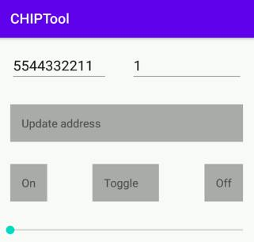

# Commissioning nRF Connect Accessory using Android CHIPTool

You can use [CHIPTool](android_chiptool_building.md) for Android smartphones to
commission a Nordic Semiconductor device running an nRF Connect platform example
onto a CHIP-enabled Thread network.

This guide references the nRF52840 DK and the door lock example application
based on the nRF Connect platform, but the instructions are also valid for the
nRF Connect lighting example application and can be adapted to other platforms
and applications as well.

-   [Overview](#overview)
-   [Requirements](#requirements)
-   [Setting up Thread Border Router](#setting-up-thread-border-router)
-   [Building and programming nRF Connect Example Application](#building-example)
-   [Building and installing Android CHIPTool](#building-chiptool)
-   [Preparing accessory device](#preparing-accessory)
-   [Commissioning accessory device](#commissioning-accessory)
-   [Sending CHIP commands](#sending-chip-commands)

## Overview

The commissioning process is composed of the following main stages:

1.  CHIPTool discovers a CHIP accessory device over Bluetooth LE.
2.  CHIPTool establishes a secure channel to the device over Bluetooth LE, and
    sends CHIP operational credentials and Thread provisioning data.
3.  The accessory device joins a CHIP-enabled Thread network.

CHIPTool uses both Bluetooth LE and the IPv6 connectivity. Bluetooth LE is used
only during the commissioning phase. Afterwards, only the IPv6 connectivity
between the smartphone and the accessory device is needed to send operational
messages. The IPv6 address of the device is not exchanged during the
commissioning process and CHIPTool must use DNS Service Discovery (DNS-SD) to
learn or refresh the address before the controller initiates the IPv6-based
communication.

Since a typical smartphone does not have a Thread radio built-in, extra effort
is needed to prepare the fully-fledged testing environment that includes a
Thread Border Router configured on a Raspberry Pi.

The following diagram shows the connectivity between network components required
to allow communication between devices running the CHIPTool and Lock
applications:

## Requirements

You need the following hardware and software for commissioning the nRF Connect
accessory using Android CHIPTool:

-   Two nRF52840 DK (PCA10056)

    -   One nRF52840 DK is needed for running the
        [OpenThread Radio Co-Processor](https://openthread.io/platforms/co-processor)
        firmware. You can replace this DK with another compatible device, such
        as the nRF52840 Dongle.
    -   One nRF52840 DK is needed for running the example application. You can
        replace this DK with another compatible device, such as the nRF5340 DK.

-   Smartphone compatible with Android 8.0 or later
-   Raspberry Pi Model 3B+ or newer (along with an SD card with at least 8 GB of
    memory)
-   Wi-Fi Access Point supporting IPv6 (without the IPv6 Router Advertisement
    Guard enabled on the router)

## Setting up Thread Border Router

Follow the [OpenThread Border Router](openthread_border_router_pi.md) article to
set up OpenThread Border Router on the Raspberry Pi, with either the nRF52840 DK
or the nRF52840 Dongle acting as the
[OpenThread Radio Co-Processor](https://openthread.io/platforms/co-processor).

## Building and programming nRF Connect Example Application

Build and program the example application onto your compatible device.

For this guide, see the documentation for the door lock example application to
learn how to build and program the example onto an nRF52840 DK.

## Building and installing Android CHIPTool

To build the CHIPTool application for your smartphone, read the
[Building Android CHIPTool](android_chiptool_building.md) guide.

After building, install the application by completing the following steps:

1.  Install the Android Debug Bridge (adb) package by running the following
    command:

        $ sudo apt install android-tools-adb

2.  Enable **USB debugging** on the smartphone. See the
    [Configure on-device developer options](https://developer.android.com/studio/debug/dev-options)
    guide on the Android Studio hub for detailed information.
3.  If the **Install via USB** option is supported for your Android version,
    turn it on.
4.  Plug the smartphone into a USB port on your PC.
5.  Run the following command to install the application, with _chip-dir_
    replaced with the path to the CHIP source directory:

        $ adb install -r chip-dir/src/android/CHIPTool/app/build/outputs/apk/debug/app-debug.apk

6.  Navigate to settings on your smartphone and grant **Camera** and
    **Location** permissions to CHIPTool.

CHIPTool is now ready to be used for commissioning.

## Preparing accessory device

To prepare the accessory device for commissioning, complete the following steps:

1.  Use a terminal emulator to connect to the UART console of the accessory
    device. For details, see the
    [Using CLI in nRF Connect examples](nrfconnect_examples_cli.md) guide. This
    will grant you access to the application logs.
2.  Hold the appropriate button on the accessory device for more than 6 s to
    trigger the factory reset of the device. See the user interface section in
    the example documentation to check the button number.
3.  Find a message similar to the following one in the application logs:

        I: 615 [SVR]Copy/paste the below URL in a browser to see the QR Code:
        I: 621 [SVR]https://dhrishi.github.io/connectedhomeip/qrcode.html?data=MT%3AW0GU2OTB00KA0648G00

4.  Open the URL in a web browser to have the commissioning QR code generated.
5.  Press the appropriate button on the device to start the Bluetooth LE
    advertising. See the user interface section in the example documentation to
    check the button number.

## Commissioning accessory device

To commission the accessory device onto the Thread network created in the
[Setting up Thread Border Router](#setting-up-thread-border-router) section,
complete the following steps:

1. Enable **Bluetooth** and **Location** services on your smartphone.
2. Connect the smartphone to the same Wi-Fi network as the Raspberry Pi which
   runs OpenThread Border Router.
3. Open the CHIPTool application on your smartphone.
4. Tap the **PROVISION CHIP DEVICE WITH THREAD** button and scan the
   commissioning QR code. Several notifications will appear, informing you of
   commissioning progress with scanning, connection, and pairing. At the end of
   this process, the Thread network settings screen appears.
5. In the Thread network settings screen, use the default settings and tap the
   **SAVE NETWORK** button to send a Thread provisioning message to the
   accessory device.

You will see the "Network provisioning completed" message when the accessory
device successfully joins the Thread network.

## Sending CHIP commands

Once the device is commissioned, the main application screen appears.

Check the IPv6 connectivity with the device using the following steps:

1. Tap **LIGHT ON/OFF & LEVEL CLUSTER**. The following screen appears:

    

    The two textboxes at the top contain **Fabric ID** and **Node ID** of the
    last commissioned device.

2. Tap **UPDATE ADDRESS** to learn or refresh the IPv6 address of the device.
   CHIPTool will use a built-in DNS-SD client to resolve **Fabric ID** and
   **Node ID** of the device to its IPv6 address. The result of the operation,
   be it the address or an error message, will be displayed at the bottom of the
   screen.
3. Tap the following buttons to change the lock state of the nRF Connect door
   lock example application referenced in this guide:

    - **ON** and **OFF** buttons lock and unlock the door, respectively.
    - **TOGGLE** changes the lock state to the opposite.

The **LED 2** on the device turns on or off based on the changes of the lock
state.
