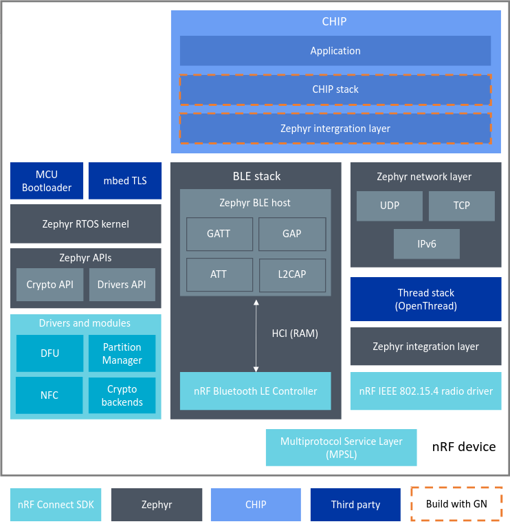

# nRF Connect Platform Overview

The nRF Connect platform is a [CHIP](https://github.com/project-chip/connectedhomeip) platform using Nordic Semiconductor's [nRF Connect SDK](https://developer.nordicsemi.com/nRF_Connect_SDK/doc/latest/nrf/index.html) and [Zephyr RTOS](https://zephyrproject.org/).

The nRF Connect SDK allows to build a range of cellular IoT (LTE-M and NB-IoT), Bluetooth Low Energy, Thread, Zigbee, and Bluetooth Mesh applications. It containes samples, libraries and full set of drivers for Nordic Semiconductor [nRF9160](https://www.nordicsemi.com/Products/Low-power-cellular-IoT/nRF9160), [nRF5340](https://www.nordicsemi.com/Software-and-tools/Development-Kits/nRF5340-PDK) and [nRF52 Series](https://www.nordicsemi.com/Products/Low-power-short-range-wireless) devices.

The nRF Connect SDK is based around Zephyr RTOS, which is scalable real-time operating system, dedicated for the connected, resource constrained devices. Zephyr supports multiple hardware platforms, provides hardware drivers, application protocols, protocol stacks and even more. Besides of the Zephyr, nRF Connect SDK also intergrates other projects like crypto library mbed TLS, MCU Bootloader or Thread stack implementation [OpenThread](https://openthread.io/).

The diagram presented below, shows simplified structure of the CHIP application running on the nRF Connect platform and using BLE and Thread stacks for communication purposes: 

> **Note**: The diagram doesn't show all projects components, but only the most important for the typical CHIP application, because of the readability reasons.

### BLE and Thread stacks

In the nRF Connect platform applications BLE interface is used to perform pairing and Thread network provisioning operations between CHIP device and CHIP controller. After that fully provisioned device is able to communicate with other devices inside of the Thread network.

For the BLE communication purposes application is using BLE stack, in which BLE host part is provided by the Zephyr RTOS and the BLE controller is implemented in the nRF Connect SDK's driver.

For the Thread communication purposes application is using Thread stack, consisting of few layers implemented in different projects. The core of the Thread stack is OpenThread, but it also requires IEEE 802.15.4 radio driver provided by the nRF Connect SDK and network layer functionalities provided by the Zephyr.

The nRF Connect SDK Multiprotocol Service Layer (MPSL) driver allows running BLE and Thread concurrently in the same radio chip.

### CHIP integration

CHIP is located on the top application layer of the presented model, looking from the networking point of view. BLE and Thread stacks provided by the nRF Connect SDK and Zephyr have to be integrated with the CHIP stack using special intermediate layer. In practice this layer contains platform specific implementations of abstract managers interfaces (e.g. BLE Manager or Thread Stack Manager) defined in the CHIP stack. User's application is able to use CHIP's platform agnostic interfaces and no additional platform related actions are needed to perform communication through the CHIP stack.

### Build system

The nRF Connect platform makes use of CMake and GN build systems to generate ninja build scripts. The reason of such approach is that project CHIP in the majority of cases is using GN build system and other components related with the nRF Connect platform like nRF Connect SDK or Zephyr are using CMake build system. In effect CHIP's stack and platform modules are build with GN (see on the previously presented diagram) and the results are used to generate the library file. User's application, nRF Connect SDK and Zephyr are build with CMake and the CHIP library file is imported in the compilation process.
