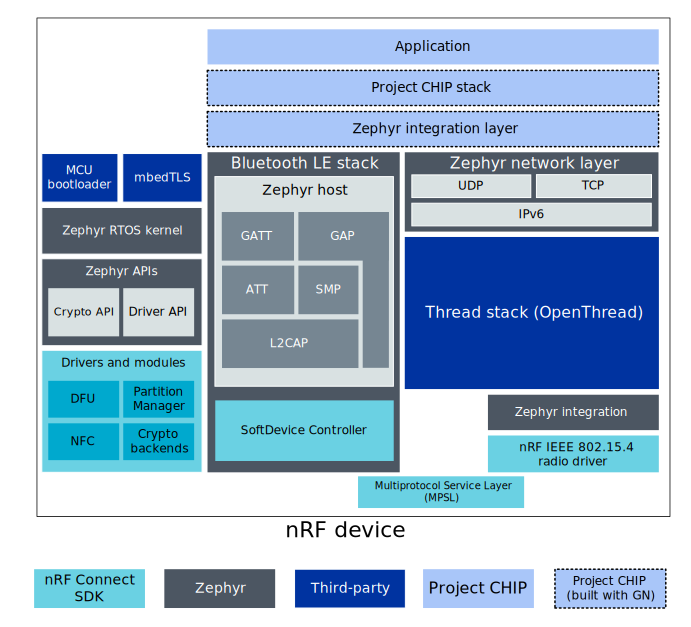

# nRF Connect platform overview

The nRF Connect platform is a
[Matter](https://github.com/project-chip/connectedhomeip) platform that uses
Nordic Semiconductor's nRF Connect SDK.

The following diagram shows a simplified structure of a Matter application that
runs on the nRF Connect platform and uses BLE and Thread stacks for
communication purposes:

> **Note**: For readability, the diagram does not show all projects components,
> only the most important ones for a typical Matter application.

## nRF Connect SDK

Nordic Semiconductor's
[nRF Connect SDK](https://developer.nordicsemi.com/nRF_Connect_SDK/doc/latest/nrf/index.html)
allows to build a range of applications, including cellular IoT (LTE-M and
NB-IoT), Bluetooth Low Energy, Thread, Zigbee, and Bluetooth mesh. The SDK
contains samples, libraries and a full set of drivers for Nordic Semiconductor's
[nRF9160](https://www.nordicsemi.com/Products/Low-power-cellular-IoT/nRF9160),
[nRF5340](https://www.nordicsemi.com/Software-and-tools/Development-Kits/nRF5340-PDK),
and
[nRF52 Series](https://www.nordicsemi.com/Products/Low-power-short-range-wireless)
devices.

The nRF Connect SDK is based around [Zephyr RTOS](https://zephyrproject.org/),
which is a scalable real-time operating system dedicated for the connected,
resource-constrained devices. Zephyr supports multiple hardware platforms and
provides hardware drivers, application protocols, protocol stacks, and more.
Besides Zephyr, the nRF Connect SDK also integrates other projects like crypto
library mbedTLS, MCU bootloader or the [OpenThread](https://openthread.io/)
implementation of the Thread stack.

## Bluetooth LE and Thread stacks

In the nRF Connect platform applications, the Bluetooth LE interface is used to
perform pairing and Thread network provisioning operations between the Matter
device and the Matter controller. Afterwards, the fully provisioned device is
able to communicate with other devices inside the Thread network.

For the Bluetooth LE communication purposes, the nRF Connect platform
application is using the Bluetooth LE stack, in which the Bluetooth LE Host part
is provided by the Zephyr RTOS and the
[SoftDevice Controller](https://developer.nordicsemi.com/nRF_Connect_SDK/doc/latest/nrfxlib/softdevice_controller/README.html)
is implemented in the nRF Connect SDK's driver.

For the Thread communication purposes, the nRF Connect platform application is
using the Thread stack, which consists of several layers implemented in
different projects. The core of the Thread stack is OpenThread, but it also
requires the IEEE 802.15.4 radio driver provided by the nRF Connect SDK and the
network layer functionalities provided by the Zephyr.

The nRF Connect SDK's Multiprotocol Service Layer (MPSL) driver allows running
Bluetooth LE and Thread concurrently on the same radio chip.

## Matter integration

Matter is located on the top application layer of the presented model, looking
from the networking point of view. The Bluetooth LE and Thread stacks provided
by the nRF Connect SDK and Zephyr must be integrated with the Matter stack using
a special intermediate layer.

In practice, this layer contains platform-specific implementations of abstract
manager interfaces (such as Bluetooth LE Manager or Thread Stack Manager)
defined in the Matter stack. The application is able to use Matter's platform
agnostic interfaces and no additional platform-related actions are needed to
perform communication through the Matter stack.

## Build system

The nRF Connect platform makes use of the following build systems to generate
ninja build scripts:

-   GN - Used by the Matter project in majority of cases.
-   CMake - Used by other components related with the nRF Connect platform,
    namely nRF Connect SDK and Zephyr.

As a result, Matter's stack and platform modules are built with GN (see the
overview diagram) and the output is used to generate the library file. The
application, nRF Connect SDK, and Zephyr are built with CMake and the Matter
library file is imported during the compilation process.
