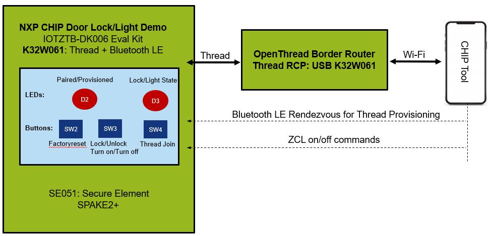
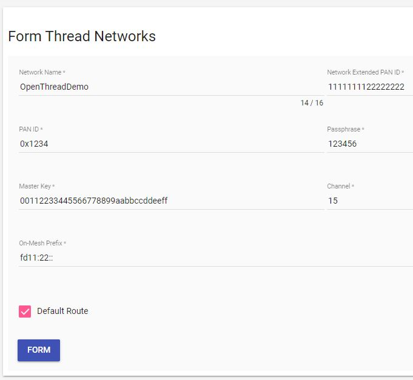
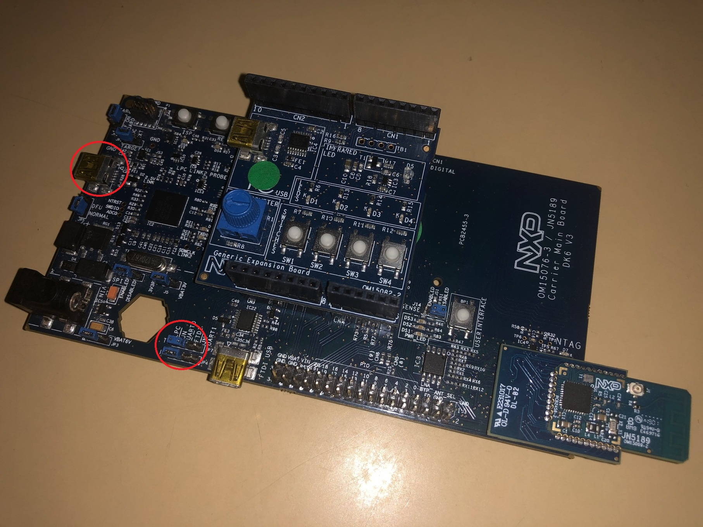
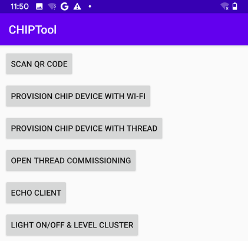
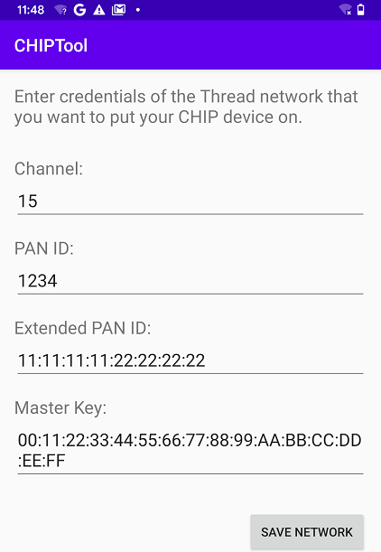
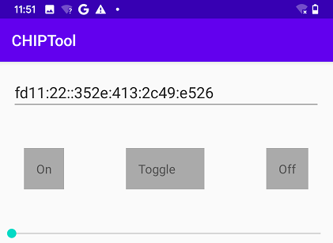

# Commissioning NXP K32W using Android CHIPTool

This article describes how to use
[CHIPTool](../../examples/android/CHIPTool/README.md) for Android smartphones to
commission an NXP K32W061 DK6 running
[NXP K32W Light Example Application](#building-and-programming-nxp-k32w-light-example-application)
onto a CHIP-enabled Thread network.

<hr>

-   [Overview](#overview)
-   [Requirements](#requirements)
-   [Building and programming OpenThread RCP firmware](#building-and-programming-openthread-rcp-firmware)
-   [Configuring PC as Thread Border Router](#configuring-pc-as-a-thread-border-router)
-   [Building and programming NXP K32W Light Example Application](#building-and-programming-nxp-k32w-light-example-application)
-   [Building and installing Android CHIPTool](#building-and-installing-android-chiptool)
-   [Forming a Thread network on the Border Router](#forming-a-thread-network-on-the-border-router)
-   [Preparing accessory device](#preparing-accessory-device)
-   [Commissioning accessory device](#commissioning-accessory-device)
-   [Sending CHIP commands](#sending-chip-commands)

<hr>

## Overview

The commissioning process is composed of the following main stages:

-   K32W061 (CHIP accessory) device is put in BLE advertisement mode by pressing
    the USERINTERFACE button;
-   CHIPTool discovers the CHIP accessory over BLE;
-   CHIPTool establishes a secure channel with the accessory using a SPAKE2+
    handshake;
-   CHIP tool sends Thread provisioning data over the secure channel;
-   The accessory device joins a CHIP-enabled Thread network using the provided
    Thread credentials.

Bluetooth LE is only used during the commissioning phase. Afterwards, only the
IP connectivity between the smartphone and the accessory device is needed to
send operational messages. Since a typical smartphone does not have a Thread
radio built-in, extra effort is needed to prepare a fully-fledged testing
environment. This page describes how to build a Thread Border Router using a PC
with a spare Wi-Fi card and an
[OpenThread Radio Co-Processor](https://openthread.io/platforms/co-processor)
device.

The following diagram shows the connectivity between network components required
to allow communication between devices running the CHIPTool and Light
applications:



<hr>

## Requirements

You need the following hardware and software to build a Thread Border Router:

-   2 K32W061 DK6 boards

    -   One K32W061 DK6 is needed to run
        [OpenThread Radio Co-Processor](https://openthread.io/platforms/co-processor)
        firmware and can be replaced with another compatible device like K32W061
        Dongle.

-   Smartphone compatible with Android 8.0 or later
-   PC with the following characteristics:

    -   Software: Ubuntu 20.04
    -   Hardware: A spare Wi-Fi card (WiFi driver needs to support AP mode).

While this page references Ubuntu 20.04, all the procedures can be completed
using other popular operating systems.

<hr>

## Building and programming OpenThread RCP firmware

OpenThread RCP firmware is required to allow the PC to communicate with Thread
devices. Run the commands mentioned in the following steps to build and program
the RCP firmware onto an K32W061 DK6:

1.  Clone the OpenThread repository into the current directory (we recommend
    using commit ced158e65a00dd5394c04548b7b187d3a3f11eef):

        ```
        git clone https://github.com/openthread/openthread.git
        ```

2.  Enter the _openthread_ directory:

        ```
        cd openthread
        ```

3.  Install OpenThread dependencies:

        ```
        ./script/bootstrap
        ```

4.  Set up the build environment:

        ```
        ./bootstrap
        ```

5.  Build OpenThread for the K32W061 DK6:

         $ make -f examples/Makefile-k32w061

    This creates an RCP image in the `bin/ot-rcp` directory.

6.  Program the RCP firmware using the official
    [OpenThread Flash Instructions](https://github.com/openthread/openthread/blob/master/examples/platforms/k32w/k32w061/README.md#flash-binaries).

7.  Plug-in the K32W061 DK6 to the PC.

<hr>

## Configuring PC as a Thread Border Router

To make your PC work as a Thread Border Router, complete the following tasks:

1.  Set up Thread Border Router package by following steps
    [3,4,5](https://openthread.io/guides/border-router/build) from the official
    documentation. Use NETWORK_MANAGER=0 as the Wi-Fi AP will be set manually at
    the next step. Also, we recommend using commit
    83babaf236cad8471be28185d8d4351d37564919 for ot-br-posix repository.
2.  Configure the Wi-Fi AP

    -   Install the required package:

              ```
              sudo apt-get install hostapd
              ```

    -   Configure hostapd (create new file and add content):

              ```
              $ sudo vim /etc/hostapd/hostapd.conf

              interface=wlan0
              driver=nl80211
              ssid=OT-BR
              hw_mode=g
              channel=7
              wmm_enabled=0
              macaddr_acl=0
              auth_algs=1
              ignore_broadcast_ssid=0
              wpa=2
              wpa_passphrase=12345678
              wpa_key_mgmt=WPA-PSK
              wpa_pairwise=TKIP
              rsn_pairwise=CCMP
              ```

    -   We need to tell hostapd to use our config file by editing the main
        hostapd configuration file. Change the line that starts with
        #DAEMON_CONF (remember to remove #):

              ```
              $ sudo vim /etc/default/hostapd

              DAEMON_CONF="/etc/hostapd/hostapd.conf"
              ```

    -   Start hostapd:

              ```
              sudo systemctl unmask hostapd
              sudo systemctl enable hostapd
              ```

3.  Configure Dnsmasq

    -   Install the required package:

              ```
              sudo apt-get install dnsmasq
              ```

    -   Make a backup of the default config file:

              ```
              sudo cp /etc/dnsmasq.conf /etc/dnsmasq.conf.org
              ```

    -   Set the DHCP range:

              ```
              $ sudo vim /etc/dnsmasq.conf

              interface=wlan0
              dhcp-range=192.168.4.2,192.168.4.20,255.255.255.0,24h
              ```

    -   On System startup, dnsmasq will not wait for wlan0 interface to
        initialize and will fail. We need to tell systemd to launch it after
        networks get ready, so we will modify dnsmasq service file by specifying
        the initialization order under the _After=_ and _Wants=_ sections:

              ```
              $ sudo vim /lib/systemd/system/dnsmasq.service

              [Unit]
              ...
              After=... network-online.target
              Wants=... network-online.target
              ```

    -   Force systemd to avoid using port 53 (used by dnsmasqd service):

              ```
              $ sudo vim /etc/systemd/resolved.conf

              DNSStubListener=no
              ```

4.  Configure static IP for the Wi-Fi AP interface

    -   Modify the cloud-init file and add content to it (use spaces, not tabs,
        USE THE ):

            ```
            $ sudo vim /etc/netplan/50-cloud-init.yaml

            wlan0:
                dhcp4: false
                addresses:
                - 192.168.4.1/24
            ```

    -   The final configuration file should like like this (pay attention to the
        spacing used):

              ```
              network:
                  version: 2
                  ethernets:
                      eth0:
                           dhcp4: true
                           optional: true
                      wlan0:
                           dhcp4: false
                           addresses:
                           - 192.168.4.1/24
              ```

5)  Set up RADVD

    -   Install required package:

        ```
        sudo apt-get install radvd
        ```

    -   Configure RADVD for distributing the prefix `_fd11:33_::/64` to the
        devices connected to the AP, while announcing them that is also has a
        route to `_fd11:22::/64_`

        ```
         $ sudo vim /etc/radvd.conf

              interface wlan0 {
                 AdvManagedFlag on;
                 AdvSendAdvert on;
                 MinRtrAdvInterval 30;
                 MaxRtrAdvInterval 60;
                 prefix fd11:33::1/64 {
                    AdvOnLink on;
                    AdvAutonomous on;
                    AdvRouterAddr on;
                 };
                 route fd11:22::/64 {
                 };
              };
        ```


    -   Enable radvd service:

        ```
        sudo chmod u=rw,g=r,o=r /etc/radvd.conf
        sudo systemctl enable radvd.service
        ```

6.  Configure routing:

    -   Create a configuration file for setting the routing behavior (forward
        between Thread and Wi-Fi AP interfaces):

              ```
              $ sudo vim configurations.sh

              #!/bin/bash
              sudo iptables -A FORWARD -i wlan0 -o wpan0 -j ACCEPT
              sudo iptables -A FORWARD -i wpan0 -o wlan0 -j ACCEPT
              ```


    -   Set the executable bit for the above file:

              ```
              sudo chmod +x configurations.sh
              ```

    -   Configure the above script to be run each time the PC is restarted using
        a systemd service configuration (change the path for _ExecStart_):

              ```
              $ sudo vim /etc/systemd/system/br.service

              [Unit]
              Description=Job

              [Service]
              ExecStart=/home/replace_with_real_path/configurations.sh
              Type=oneshot
              RemainAfterExit=yes

              [Install]
              WantedBy=multi-user.target
              ```

    -   Then run:

              ```
              sudo systemctl daemon-reload
              sudo systemctl enable br.service
              ```

7.  As a quick checkpoint, restart the PC and make sure that the mobile phone
    can connect to the _OT-BR_ AP (password: 12345678). Also, check that it gets
    assigned an IPv4 address in the range _192.168.4.0/24_ and an IPV6 address
    with the prefix _fd11:33::/64_. Commands for debugging possible issues with
    the services:

        ```
        sudo service hostapd status
        sudo service dnsmasq status
        sudo service radvd status
        sudo service br status
        ```

<hr>

## Building and programming NXP K32W Light Example Application

See
[NXP K32W Light Example Application README](../../examples/lighting-app/nxp/k32w/k32w0/README.md)
to learn how to build and program the light example onto an K32W061 DK6.

<hr>

## Building and installing Android CHIPTool

To build the CHIPTool application for your smartphone, read
[Android CHIPTool README](../../examples/android/CHIPTool/README.md).

After building, install the application by completing the following steps:

1.  Install the Android Debug Bridge (adb) package by running the following
    command:

        ```
        sudo apt install android-tools-adb
        ```

2.  Enable _USB debugging_ on the smartphone. See the
    [Configure on-device developer options](https://developer.android.com/studio/debug/dev-options)
    guide on the Android Studio hub for detailed information.
3.  If the _Install via USB_ option is supported for your Android version, turn
    it on.
4.  Plug the smartphone into an USB port on your PC.
5.  Run the following command to install the application, with _chip-dir_
    replaced with the path to the CHIP source directory:

        ```
        adb install -r chip-dir/examples/android/CHIPTool/app/build/outputs/apk/debug/app-debug.apk
        ```

6.  Navigate to settings on your smartphone and grant _Camera_ and _Location_
    permissions to CHIPTool.

CHIPTool is now ready to be used for commissioning.

<hr>

## Forming a Thread network on the Border Router

1.  On the mobile phone connect to the _OT-BR_ Wi-Fi network.

2.  Open a browser and type the IP address 192.168.4.1. The Thread Border Router
    Web Management page will open.

3.  Navigate to the _Form_ tab then push the _Form_ button using the default
    parameters:
    

4.  The message _Form operation is successful_ should be display after a few
    seconds.

5.  In case you ever want to reset these parameters issue this command from the
    border router shell:

        ```
        sudo ot-ctl factoryreset
        ```

6.  Info: For debugging the Border Router, _ot-ctl_ offers an entry point to
    [Thread CLI Commands](https://github.com/openthread/openthread/blob/master/src/cli/README.md).

7.  In case there is any issue with the Web GUI check the logs on the Border
    Router side / restart the daemon:

        ```
        sudo service otbr-web status
        ```

    In case the status is not _leader_ then restart the service:

        ```
        sudo service otbr-web restart
        ```

## Preparing accessory device

To prepare the accessory device for commissioning, complete the following steps:

1.  Make sure that JP4 and JP7 jumpers are in leftmost position and a mini-USB
    cable is connected between the LPC connector and PC
    

2.  Use a terminal emulator (e.g.: Putty) to connect to the UART console of the
    accessory device. Use a baudrate of 115200.

    This will grant you access to the application logs.

3.  Push _Button SW2_ on the accessory device and wait 6s for factory reset of
    the device.
4.  Find a message similar to the following one in the application logs:

        ```
        I: 666[SVR] Copy/paste the below URL in a browser to see the QR Code:
                https://project-chip.github.io/connectedhomeip/qrcode.html?data=CH%3AI34DV%2A-00%200C9SS0
        ```

5.  Open the URL in a web browser to have the commissioning QR code generated.

<hr>

## Commissioning accessory device

To commission the accessory device onto the Thread network created in the
[Forming Thread network](#forming-a-thread-network-on-the-border-router)
section, complete the following steps:

1. Enable _Bluetooth_ and _Location_ services on your smartphone;
2. Connect the smartphone to _OT-BR_ WiFi network;
3. Open the CHIPTool application on your smartphone;
4. Push the USERINTERFACE button on the K32W board. This will start the BLE
   advertising process;
5. Tap the _PROVISION CHIP DEVICE WITH THREAD_ button and scan the commissioning
   QR code. Several notifications will appear, informing you of commissioning
   progress with scanning, connection, and pairing. At the end of this process,
   the Thread network settings screen appears.

    

6. In the Thread network settings screen, use the default settings and tap the
   _SAVE NETWORK_ button to send a Thread provisioning message to the accessory
   device. You will see the "Network provisioning completed" message when the
   accessory device successfully joins the Thread network.

    

<hr>

## Sending CHIP commands

1. Once the device is commissioned, the below screen appears. This means that
   the provisioning is completed successfully and you are connected to the
   device.

    

2. Verify that the text box on the screen is not empty and contains the IPv6
   address of the accessory device.
3. Tap the following buttons to change the light state:

    - _ON_ and _OFF_ buttons turn on and turn off the light bulb, respectively.
    - _TOGGLE_ changes the light state to the opposite.

The _LED D3_ on the device turns on or off based on the changes of the light
state.
