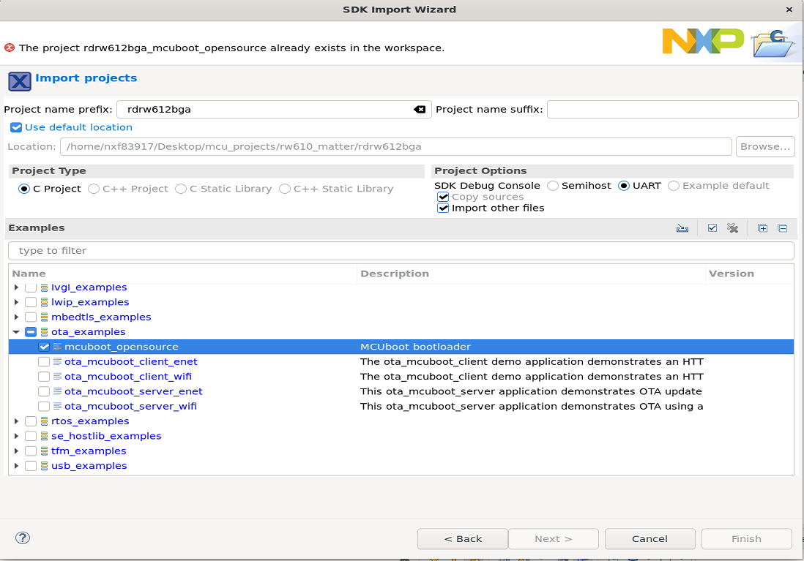

# Matter Over-The-Air Software Update with NXP RW61x example applications

## Overview

The OTA Requestor feature enables the device to be informed of, download and
apply a software update from an OTA Provider.

This section explains how to perform an OTA Software Update with NXP RW61x
example applications. Throughout this guide, the all-clusters application is
used as an example.

In general, the Over-The-Air Software Update process consists of the following
steps :

-   The OTA Requestor queries an update image from the OTA Provider which
    responds according to its availability.
-   The update image is received in blocks and stored in the external flash of
    the device.
-   Once the update image is fully downloaded, the bootloader is notified and
    the device resets applying the update in test-mode.
-   If the test is successful, the update is applied permanently. Otherwise, the
    bootloader reverts back to the primary application, preventing any
    downgrade.

### Flash Memory Layout

The RW61x Flash is divided into different regions as follow :

-   Bootloader : MCUBoot resides at the base of the flash and occupies 0x20000
    (128 kB).
-   Primary application partition : The example application which would be run
    by the bootloader (active application). The size reserved for this partition
    is 4.4 MB.
-   Secondary application partition : Update image received with the OTA
    (candidate application). The size reserved for the partition is 4.4 MB.

Notes :

-   The CPU1/CPU2 firmware are embedded in the CPU3 example application.
-   The sizes of the primary and secondary applications are provided as an
    example (currently 4.4 MB is reserved for each partition). The size can be
    changed by modifying the `m_app_max_sectors` value in the linker script of
    the application (`RW610_flash.ld`).

### MCUBoot Bootloader

MCUBoot is an open-source secure bootloader used by RW61x to apply the
self-upgrade. For more details, please refer to the
[MCUBoot documentation](https://github.com/mcu-tools/mcuboot/blob/main/docs/design.md).

In our use case, the bootloader runs the application residing in the primary
partition. In order to run the OTA update image, the bootloader will swap the
content of the primary and the secondary partitions. This type of upgrade is
called swap-move and is the default upgrade configured by MCUBoot.

## OTA Software Update process for RW61x example application

### Flashing the bootloader

In order for the device to perform the software update, the MCUBoot bootloader
must be flashed first at the base of the flash. A step-by-step guide is given
below.

-   It is recommended to start with erasing the external flash of the device,
    for this JLink from Segger can be used. It can be downloaded and installed
    from https://www.segger.com/products/debug-probes/j-link. Once installed,
    JLink can be run using the command line :

```
$ JLink
```

Run the following commands :

```
J-Link > connect
Device> ? # you will be presented with a dialog -> select `RW612`
Please specify target interface:
J) JTAG (Default)
S) SWD
T) cJTAG
TIF> S
Specify target interface speed [kHz]. <Default>: 4000 kHz
Speed> # <enter>
J-Link > exec EnableEraseAllFlashBanks
J-Link > erase 0x8000000, 0x88a0000
```

-   Using MCUXPresso, import the `mcuboot_opensource` demo example from the SDK
    previously downloaded. The example can be found under the `ota_examples`
    folder.
    
-   Before building the demo example, it should be specified that the
    application to be run by the bootloader is monolithic. As a result, only one
    image will be upgraded by the bootloader. This can be done by defining
    `MONOLITHIC_APP` as 1 in the settings of the `mcuboot_opensource` project :

```
Right click on the Project -> Properties -> C/C++ Build -> Settings -> Tool Settings -> MCU C Compiler -> Preprocessor -> Add "MONOLITHIC_APP=1" in the Defined Symbols
```


-   Build the demo example project.

```
Right click on the Project -> Build Project
```

-   Program the demo example to the target board.

```
Right click on the Project -> Debug -> As->SEGGER JLink probes -> OK -> Select elf file
```

Note : The mcuboot binary is loaded in flash at address 0x8000000.

-   To run the flashed demo, either press the reset button of the device or use
    the debugger IDE of MCUXpresso. If it runs successfully, the following logs
    will be displayed on the terminal :

```
hello sbl.
Bootloader Version 1.9.0
Primary image: magic=unset, swap_type=0x1, copy_done=0x3, image_ok=0x3
Secondary image: magic=unset, swap_type=0x1, copy_done=0x3, image_ok=0x3
Boot source: none
Swap type: none
erasing trailer; fa_id=2
Unable to find bootable image
```

Note : By default, mcuboot application considers the primary and secondary
partitions to be the size of 4.4 MB. If the size is to be changed, the partition
addresses should be modified in the flash_partitioning.h accordingly. For more
information about the flash partitioning with mcuboot, please refer to the
dedicated readme.txt located in
"`SDK_RW612/boards/rdrw612bga/ota_examples/mcuboot_opensource/`".

### Generating and flashing the signed application image

After flashing the bootloader, the application can be programmed to the board.
The image must have the following format :

-   Header : contains general information about the image (version, size,
    magic...)
-   Code of the application : generated binary
-   Trailer : contains metadata needed by the bootloader such as the image
    signature, the upgrade type, the swap status...

The all-clusters application can be generated using the instructions from the
[README.md 'Building'](../../examples/all-clusters-app/nxp/rt/rw61x/README.md#building)
section. The application is automatically linked to be executed from the primary
image partition, taking into consideration the offset imposed by mcuboot.

The resulting executable file found in out/debug/chip-rw61x-all-cluster-example
needs to be converted into raw binary format as shown below.

```
arm-none-eabi-objcopy -R .flash_config -R .NVM -O binary chip-rw61x-all-cluster-example chip-rw61x-all-cluster-example.bin
```

To sign the image and wrap the raw binary of the application with the header and
trailer, "`imgtool`" is provided in the SDK and can be found in
"`/middleware/mcuboot_opensource/scripts/`".

The following commands can be run (make sure to replace the /path/to/file/binary
with the adequate files):

```
user@ubuntu: cd ~/Desktop/SDK_RW612/middleware/mcuboot_opensource/scripts

user@ubuntu: python3 imgtool.py sign --key ~/Desktop/SDK_RW612/boards/rdrw612bga/ota_examples/mcuboot_opensource/keys/sign-rsa2048-priv.pem --align 4 --header-size 0x1000 --pad-header --slot-size 0x440000 --max-sectors 1088 --version "1.0" ~/Desktop/connectedhomeip/examples/all-clusters-app/nxp/rt/rw61x/out/debug/chip-rw61x-all-cluster-example.bin ~/Desktop/connectedhomeip/examples/all-clusters-app/nxp/rt/rw61x/out/debug/chip-rw61x-all-cluster-example_SIGNED.bin
```

Notes :

-   The arguments `slot-size` and `max-sectors` are aligned with the size of the
    partitions reserved for the primary and the secondary applications. (By
    default the size considered is 4.4 MB for each application). If the size of
    these partitions are modified, the `slot-size` and `max-sectors` should be
    adjusted accordingly.
-   In this example, the image is signed with the private key provided by the
    SDK as an example
    (`SDK_RW612/boards/rdrw612bga/ota_examples/mcuboot_opensource/keys/sign-rsa2048-priv.pem`),
    MCUBoot is built with its corresponding public key which would be used to
    verify the integrity of the image. It is possible to generate a new pair of
    keys using the following commands. This procedure should be done prior to
    building the mcuboot application.

-   To generate the private key :

```
user@ubuntu: python3 imgtool.py keygen -k priv_key.pem -t rsa-2048
```

-   To extract the public key :

```
user@ubuntu: python3 imgtool.py getpub -k priv_key.pem
```

-   The extracted public key can then be copied to the
    `SDK_RW612/boards/rdrw612bga/ota_examples/mcuboot_opensource/keys/sign-rsa2048-pub.c`,
    given as a value to the rsa_pub_key[] array.

The resulting output is the signed binary of the application version "1.0".

JLink can be used to flash the application at the address 0x8020000, using the
command :

```
J-Link > loadbin chip-rw61x-all-cluster-example_SIGNED.bin 0x8020000
```

The bootloader should then be able to jump directly to the start of the
application and run it.

### Generating the OTA Update Image

To generate the OTA update image the same procedure can be followed from the
[Generating and flashing the signed application image](#generating-and-flashing-the-signed-application-image)
sub-section, replacing the "--version "1.0"" argument with "--version "2.0""
(recent version of the update).

When the signed binary of the update is generated, the file should be converted
into OTA format. To do so, the ota_image_tool is provided in the repo and can be
used to convert a binary file into an .ota file.

```
user@ubuntu:~/connectedhomeip$ : ./src/app/ota_image_tool.py create -v 0xDEAD -p 0xBEEF -vn 2 -vs "2.0" -da sha256 chip-rw61x-all-cluster-example_SIGNED.bin chip-rw61x-all-cluster-example.ota
```

The generated OTA file can be used to perform the OTA Software Update. The
instructions below describe the procedure step-by-step.

### Performing the OTA Software Update

Setup example :

-   [Chip-tool](../../examples/chip-tool/README.md) application running on the
    RPi.
-   OTA Provider application built on the same RPi (as explained below).
-   RW61x board programmed with the example application (with the instructions
    above).

Before starting the OTA process, the Linux OTA Provider application can be built
on the RPi (if not already present in the pre-installed apps) :

```
user@ubuntu:~/connectedhomeip$ : ./scripts/examples/gn_build_example.sh examples/ota-provider-app/linux out/ota-provider-app chip_config_network_layer_ble=false

user@ubuntu:~/connectedhomeip$ : rm -rf /tmp/chip_*
user@ubuntu:~/connectedhomeip$ : ./out/ota-provider-app/chip-ota-provider-app -f chip-rw61x-all-cluster-example.ota
```

The OTA Provider should first be provisioned with chip-tool by assigning it the
node id 1, and then granted the ACL entries :

```
user@ubuntu:~/connectedhomeip$ : ./out/chip-tool-app/chip-tool pairing onnetwork 1 20202021
user@ubuntu:~/connectedhomeip$ : ./out/chip-tool-app/chip-tool accesscontrol write acl '[{"fabricIndex": 1, "privilege": 5, "authMode": 2, "subjects": [112233], "targets": null}, {"fabricIndex": 1, "privilege": 3, "authMode": 2, "subjects": null, "targets": null}]' 1 0
```

The second step is to provision the device with the node id 2 using ble-wifi or
ble-thread commissioning. For example :

```
user@ubuntu:~/connectedhomeip$ : ./out/chip-tool-app/chip-tool pairing ble-wifi 2 WIFI_SSID WIFI_PASSWORD 20202021 3840
```

Once commissioned, the OTA process can be initiated with the
"announce-ota-provider" command using chip-tool (the given numbers refer
respectively to [ProviderNodeId][vendorid] [AnnouncementReason][endpoint]
[node-id][endpoint-id]) :

```
user@ubuntu:~/connectedhomeip$ : ./out/chip-tool-app/chip-tool otasoftwareupdaterequestor announce-otaprovider 1 0 0 0 2 0
```

When the full update image is downloaded and stored, the bootloader will be
notified and the device will reboot with the update image.
