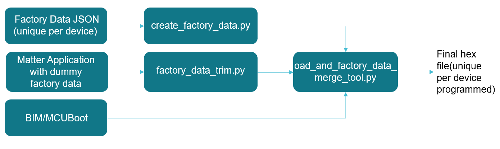

Texas Instruments Inc. Matter: Factory Data Programming User Guide

Introduction:

This document describes how to use Factory data programming feature for the
Matter example applications from Texas Instruments.

## Background

Matter specification lists various information elements that are programmed at
factory. These values do not change and some are unique per device. This feature
enables customers developing matter products on TI devices to program this data
and use this as a starting point towards developing their factory programming
infrastructure for their Matter devices.

## Solution Overview:

TI matter examples allow to use the factory data in the following two ways:

-   **Example Out of Box Factory Data** : Use TI example DAC values to get
    started. This is intended to be used when just starting with matter or
    during the development until customer or product specific data is not
    required.
-   **Custom factory data** : Allows to configure custom factory data via a JSON
    file. The custom values are then processed by a script provided by TI and
    merged with the matter application to create a binary that can be flashed on
    to the devices.

### Solution Block Diagram

Below is the high level description of each element

1. JSON: This file is located at src/platform/cc13xx_26xx/cc13x2_26x2. Developer
   would configure this per device. Elements in this file are from the
   specification.
2. Matter application hex with dummy factory data is any TI's matter example
   application
3. BIM is the Boot image manager that allows to write and read/program the OTA
   image received over the air for upgrade. This is built with the matter
   application. This does not require additional build steps from developers.
4. create_factory_data.py: processes JSON file and generates hex file with
   unique factory data values configured in the JSON file.
5. factory_data_trim.py: when using the custom factory data option, this script
   removes the dummy factory data which is required to be able to successfully
   compile the application.
6. oad_merge_tool.py: Merges the factory data hex, matter application without
   factory data and bim to generate a functional hex that can be programmed on
   to the device.

## Flash memory layout

## How to use

Out of box factory data location is configured to be on second last page on the
flash. The address starts at 0xAC000. This can be configured in the linker
command file.

To configure:

1. Linker command file: Set the start address for factory data in cc13x2x7_cc26x2x7_freertos_ota_factory_data.lds
   
   

2. create_factory_data.py: Set the address of the start of the factory data
   elements. Refer to the comments in the script.
   

3. In third_party/ti_simplelink_sdk/ti_simplelink_board.gni, set custom_factory_data to true       
               
4. In examples/platform/CC13X2_26X2DeviceAttestationCreds.cpp, change the location of the public key, private key, DAC and PAI arrays so that they are mapped to the factory data section. 
   
   
   
   
5. In the example's AppTask.h, include platform/cc13xx_26xx/FactoryDataProvider.h , and instantiate a FactoryDataProvider object.
   
   
   
6. In the example's AppTask.cpp, set the instantiated FactoryDataProvider object as the DeviceAttestationCredentialsProvider, and remove the include to examples/platform/cc13x2_26x2/CC13X2_26X2DeviceAttestationCreds.h
   
7. In src/platform/cc13xx_26xx/cc13x2_26x2/BUILD.gn, add FactoryDataProvider.cpp and FactoryDataProvider.h as source files in the cc13x2_26x2 static library
   
   

It is recommended to keep a dedicated page for factory data.

### Formatting certs and keys

To format the DAC, private key and PAI as hex strings as shown in the Factory
Data JSON file, use the chip-cert tool located at src/tools/chip-cert and run
the _convert-cert_ command, and list -X, or X.509 DER hex encoded format, as the
output format. These strings can then be copied into the JSON file.

The SPAKE parameters should be converted from base-64 to hex as well before being copied into the JSON file. 

### Creating images

The example application can be built using the instructions in the example's
README. The factory data from the JSON file will be formatted into a hex file
that will then be merged into the final executable. The final executable will be
named _{example-application}-bim.hex_, and the factory data that was inputted
into the JSON file will be named _{example-application}-factory-data.hex_.
