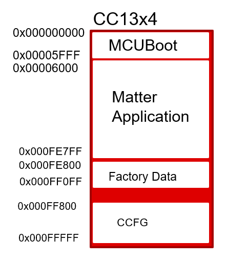

# Texas Instruments Matter Factory Data Programming User Guide

This document describes how to use the factory data programming feature for
Matter example applications from Texas Instruments.

## Background

The Matter specification lists various information elements that are programmed
at the factory. These values do not change and some are unique per device. This
feature enables customers developing Matter products on TI devices to program
this data and use this as a starting point towards developing their factory
programming infrastructure for their Matter devices.

## Solution Overview:

TI Matter examples allow the use of factory data in the following two ways:

-   **Example Out of Box Factory Data** : Use TI example DAC values to get
    started. This is intended to be used when just starting with Matter or
    during development until customer or product specific data is not required.
-   **Custom factory data** : Allows users to configure custom factory data via
    a JSON file. The custom values are then processed by a script provided by TI
    and merged with the Matter application to create a binary that can be
    flashed on to devices.

### Solution Block Diagram


Each element is described in more detail below:

1. Factory Data JSON: This file is located at src/platform/cc13xx_26xx.
   Developers can configure this per device. Elements in this file are from the
   specification.
2. Matter Application with dummy factory data: Any TI Matter example application
3. `BIM`/MCUBoot: Boot Image Manager/MCUBoot image used for OTA. This is built
   with the Matter application and does not require additional build steps from
   developers.
4. create_factory_data.py: Processes a factory data JSON file and generates a
   hex file with the unique factory data values configured in the JSON file.
5. factory_data_trim.py: When using the custom factory data option, this script
   removes the dummy factory data which is required to be able to successfully
   compile the application.
6. `oad`\_and_factory_data_merge_tool.py: Merges the factory data hex, Matter
   application without factory data and `BIM`/MCUBoot image to generate a
   functional hex that can be programmed onto the device.

## Flash memory layout




## How to use

Out of box factory data location is configured to be on second last page of
flash. For CC13x2, the starting address is `0xAC000`. For CC13x4, the starting
address is `0xFE800`. This can be configured in the linker file.

To configure:

1. Linker file: Set the start address for factory data in the linker file being
   used by the application

```
FLASH_FACTORY_DATA (R)  : ORIGIN = 0x000ac000, LENGTH = 0x00000900
```

```
/* Define base address for the DAC arrays and struct */
    PROVIDE (_factory_data_base_address =
        DEFINED(_factory_data_base_address) ? _factory_data_base_address : 0xAC000);
```

2. create_factory_data.py: Set the address of the start of the factory data
   elements. Refer to the comments in the script.

```
    # there are 17 elements, each element will need 8 bytes in the struct
    # 4 for length of the element, and 4 for the pointer to the element
    # factory data starts at 0xAC000 or 0xFE800, so the elements will
    # start 136 bytes after the start address
    factory_data_dict = json.load(args.factory_data_json_file[0])
    factory_data_schema = json.load(args.factory_data_schema[0])

    validate(factory_data_dict, factory_data_schema)
    factory_data = factory_data_dict['elements']

    struct_idx = 0
    values_idx = 0
    if device_family == 'cc13x2_26x2':
        value_address = 0xAC088
    else:
        value_address = 0xFE888
```

```
    if device_family == 'cc13x2_26x2':
        subprocess.call(['objcopy', 'temp.bin','--input-target','binary','--output-target', 'ihex', args.factory_data_hex_file, '--change-addresses=0xac000'])
    else:
        subprocess.call(['objcopy', 'temp.bin','--input-target','binary','--output-target', 'ihex', args.factory_data_hex_file, '--change-addresses=0xfe800'])
```

3. In the example's args.gni file, set 'custom_factory_data' to true

It is recommended to keep a dedicated page (2 pages for CC13x4) for factory
data.

### Formatting certs and keys for JSON file

To format the DAC, private key and PAI as hex strings as shown in the Factory
Data JSON file, use the chip-cert tool located at src/tools/chip-cert and run
the _convert-cert_ command, and list -X, or X.509 DER hex encoded format, as the
output format. These strings can then be copied into the JSON file.

The SPAKE parameters should be converted from base-64 to hex as well before
being copied into the JSON file.

### Creating images

The example application can be built using the instructions in the example's
README. The factory data from the JSON file will be formatted into a hex file
that will then be merged into the final executable. The final executable will be
named _{example-application}-`bim`.hex_ for CC13x2 and
_{example-application}-mcuboot.hex_ for CC13x4, and the factory data that was
inputted into the JSON file will be named
_{example-application}-factory-data.hex_.
