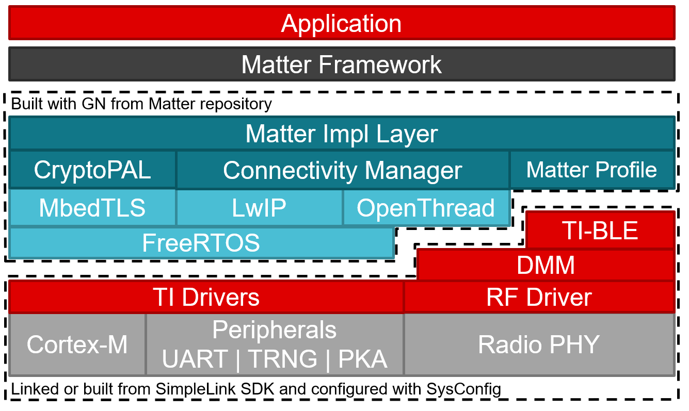

```{toctree}
:glob:
:maxdepth: 1

*
```

# Texas Instruments platform overview

The TI platform is a [Matter][matter_gh] platform based on the Texas Instruments
Incorporated SimpleLink SDK.

The following diagram is a simplified representation of a Matter application
which built on the TI Platform.



## Texas Instruments SimpleLink SDK

The SimpleLink™ CC13xx and CC26xx Software Development Kit (SDK) delivers
components that enable engineers to develop applications on the Texas
Instruments SimpleLink CC13xx and CC26xx family of wireless microcontrollers
(MCUs). This software toolkit provides a cohesive and consistent software
experience for all SimpleLink CC13xx and CC26xx wireless MCU users by packaging
essential software components, such as a Bluetooth® Low Energy (BLE) protocol
stack supporting Bluetooth 5.2, Bluetooth Mesh, Thread 1.1.1 networking stack
based on OpenThread, Zigbee 3.0 compliant protocol suite, RF-Proprietary
examples, TI’s 15.4 Stack as well as the TI-RTOS kernel and TI Drivers in one
easy-to-use software package along with example applications and documentation.
In addition, the Dynamic Multi-Protocol Manager (DMM) software component enables
multiprotocol development on a single SimpleLink wireless MCU through
time-division multiplexing.

The SimpleLink MCU portfolio offers a single development environment that
delivers flexible hardware, software, and tool options for customers developing
wired and wireless applications. With 100 percent code reuse across host MCUs,
Wi-Fi™, Bluetooth Low Energy, Sub-1GHz devices and more, choose the MCU or
connectivity standard that fits your design. A one-time investment with the
SimpleLink software development kit allows you to reuse often, opening the door
to create unlimited applications. For more information, visit
www.ti.com/simplelink.

<hr>

## BLE and Thread stacks

In the TI example applications the Bluetooth Low Energy protocol is used to
provision the Thread protocol to enable Matter communication. Then Thread is
used for IP communication with other Matter devices.

The TI applications leverage the Bluetooth Low Energy stack on the CC13X2 and
CC26X2 families. This BLE software is distributed in binary form within the TI
SimpleLink SDK. The BLE stack leverages code that is present in the device ROM
for certain common BLE operations.

These applications leverage the OpenThread stack available within the Matter
repository for Thread communication. Platform support source is built from the
SimpleLink SDK.

These connection protocols can be run concurrently by using the Texas
Instruments Dynamic Multi-protocol Manager.

<hr>

## LwIP stack

The Lightweight IP stack interfaces with the OpenThread stack to offer standard
IP connectivity protocols that OpenThread does not natively support. This offers
a standard socket based interface to the Matter platform.

<hr>

## MbedTLS

The MbedTLS library is used by OpenThread and Matter for a wide variety of
protocols. This ranges from basic AES and SHA to cryptographic protocols like
ECDSA and ECDH.

The MbedTLS library is hardware accelerated using the TI SimpleLink SDK drivers.
This is achieved through the usage of `_ALT` defines in the MbedTLS
configuration file.

<hr>

## Matter integration

Matter interacts with LwIP, OpenThread, and the TI BLE stack to achieve the
protocol and application functionality. A BLE profile is registered with the
TI-BLE stack to enable provisioning and configuration. Once the device is
provisioned Matter will configure the OpenThread interface to connect to an
existing Thread network or to start its own network. From there the Matter IP
messages are sent to the LwIP stack to be routed to the OpenThread stack for
transmission.

Overall, applications generally only need to interface with the Cluster Library
from Matter. The transport of messages and configuration of the device is all
handled by the platform implementation files.

<hr>

## Matter example applications

Sample Matter applications are provided for the TI platform. These can be used
as reference for your own application.

-   [lock-app](../../../examples/lock-app/cc13x2x7_26x2x7/README.md)
-   [pump-app](../../../examples/pump-app/cc13x2x7_26x2x7/README.md)
-   [pump-controller-app](../../../examples/pump-controller-app/cc13x2x7_26x2x7/README.md)

<hr>

### Build system

The TI platform uses GN to generate ninja build scripts. Build files have
already been written to build and link the TI specific code within the
SimpleLink SDK.

<hr>

## CC2674 Migration

For instructions on how to migrate the CC1354P10-6 examples to either the
CC2674P10 or the CC2674R10, please refer to the guide linked below.

-   [TI CC2674 Migration Guide](./matter_cc2674_migration.md)

<hr>

### TI Support

For technical support, please consider creating a post on TI's [E2E forum][e2e].
Additionally, we welcome any feedback.

[e2e]: https://e2e.ti.com/support/wireless-connectivity/zigbee-and-thread
[matter_gh]: https://github.com/project-chip/connectedhomeip
