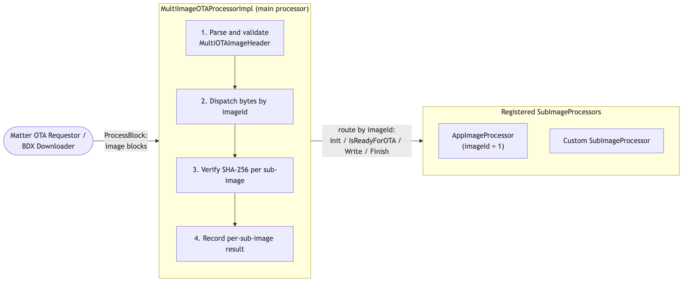

# Multi-Image OTA

Matter's OTA Requestor normally downloads a single binary per OTA session and
hands every byte to one image processor. Multi-image OTA lets a device update
**several component firmware images in one OTA session** — for example a radio
co-processor or a peripheral MCU alongside the ESP32 application firmware — by
bundling every binary into a single `.ota` file with a structured header. The
device downloads the bundle once, routes each binary's bytes to the component
that owns it, and skips binaries that are absent or already up to date.

Multi-image OTA reuses the existing OTA Requestor, OTA Provider, and BDX layers
unchanged.

The implementation lives in `src/platform/ESP32/multi_ota/`.

## Enabling Multi-Image OTA

Multi-image OTA requires the OTA Requestor and is disabled by default. Enabling
it selects `MultiImageOTAProcessorImpl` in place of the single-image
`OTAImageProcessorImpl` (see `src/platform/ESP32/BUILD.gn`); exactly one image
processor is linked.

-   Enable the configuration options for OTA requestor and multi-image OTA:

    ```
    CONFIG_ENABLE_OTA_REQUESTOR=y
    CONFIG_ENABLE_MULTI_IMAGE_OTA=y
    ```

> For the passive-rollback safety net (an unconfirmed image rolls back on the
> next reboot), also build with `CONFIG_BOOTLOADER_APP_ROLLBACK_ENABLE=y`.

Currently `all-clusters-app`, `lighting-app`, and `ota-requestor-app` support
the OTA requestor functionality. Build and flash any supported app, and
commission it as usual.

## How It Works



-   **`MultiImageOTAProcessorImpl`** implements `OTAImageProcessorInterface`, so
    it is the single object the OTA Requestor drives. It parses and validates
    the bundle header, routes each binary's bytes to the right sub-processor,
    owns the per-sub-image SHA-256 integrity check, and keeps a per-sub-image
    result table. Sub-processors do not hash their own input.
-   **`SubImageProcessor`** is the interface an application implements per image
    ID. Registered instances are held in an intrusive singly-linked list of
    `ImageProcessorEntry` nodes, so the registry needs no heap allocation.
-   **`AppImageProcessor`** is the built-in sub-processor for the application
    image (`imageId = kAppImageProcessorTag = 1`). It writes the app binary to
    the inactive OTA partition and, on apply, sets it as the boot partition.

## OTA Bundle Image Format

The outer Matter OTA header (vendor ID, product ID, `softwareVersion`, payload
size, digest — produced by `ota_image_tool.py`) is unchanged. The **payload**
begins with a `MultiOTAImageHeader` describing every binary, followed by the
binaries at the offsets it records.

```text
+-------------------------------------------------------------+
| Matter OTA header (ota_image_tool format)                   |
|   vendor_id · product_id · softwareVersion · payloadSize    |
+-------------------------------------------------------------+  <- payload offset 0
| MultiOTAImageHeader                                         |
|   magic(4)  numImages(1)  reserved(3)                       |
|   SubImageHeader[0]    (48 bytes)                           |
|   SubImageHeader[1]    (48 bytes)                           |
|   ...                                                       |
|   SubImageHeader[N-1]  (48 bytes)                           |
+-------------------------------------------------------------+
| Binary 0     (co-processor / peripheral / ...)              |
+-------------------------------------------------------------+
| Binary 1     ...                                            |
+-------------------------------------------------------------+
| Binary N-1   -- ALWAYS the application image                |
+-------------------------------------------------------------+
```

All offsets are relative to the **start of the payload**, and all multi-byte
fields are **little-endian**.

**Fixed preamble (8 bytes):**

| Offset | Size | Field       | Semantics                                                    |
| ------ | ---- | ----------- | ------------------------------------------------------------ |
| 0      | 4    | `magic`     | Must equal `0x4D494F54` (`"MIOT"`).                          |
| 4      | 1    | `numImages` | Number of `SubImageHeader` entries (1–255; `0` is rejected). |
| 5      | 3    | `reserved`  | Must be zero.                                                |

**`SubImageHeader` (48 bytes each):**

| Offset | Size | Field     | Semantics                                          |
| ------ | ---- | --------- | -------------------------------------------------- |
| 0      | 4    | `imageId` | Selects the sub-image processor. Must be non-zero. |
| 4      | 4    | `version` | Expected installed version of this binary.         |
| 8      | 4    | `offset`  | Byte offset of the binary from payload start.      |
| 12     | 4    | `length`  | Exact byte count of the binary (must be > 0).      |
| 16     | 32   | `sha256`  | SHA-256 of the binary's on-wire bytes.             |

The header is `8 + numImages * 48` bytes on the wire.

### Bundle rules

`MultiImageOTAProcessorImpl` rejects a bundle before routing any byte unless
**all** of the following hold:

-   `magic == "MIOT"`, `reserved == {0, 0, 0}`, and `1 ≤ numImages ≤ 255`.
-   Every entry has `imageId != 0` and `length > 0`.
-   Entries are **contiguous**: entry 0 starts right after the header, and each
    subsequent `offset` equals the previous `offset + length`.
-   The offsets and lengths sum exactly to the outer header's `payloadSize`.
-   There is **exactly one** application image
    (`imageId = kAppImageProcessorTag`) and it is the **last** entry.

The application image is mandatory because the Matter `softwareVersion` is
compiled into it — without a new app image the device could never report the
target version, and confirmation would fail forever. It is placed last so that
the download always ends on a normal `Block`/`BlockEOF` rather than on a skip.

### Image ID space

Only two rules are enforced in code: `imageId` must be non-zero, and exactly one
entry must use `kAppImageProcessorTag` (`1`). The recommended convention for the
rest:

| Range                     | Owner        | Use                                                                                  |
| ------------------------- | ------------ | ------------------------------------------------------------------------------------ |
| `0x00000000`              | —            | Invalid; rejected at parse time.                                                     |
| `0x00000001`–`0x000000FF` | Platform     | Well-known platform images. `kAppImageProcessorTag = 1` is the application firmware. |
| `0x00000100`–`0xFFFFFFFF` | Manufacturer | Any value you choose; no central registry.                                           |

The `imageId`-to-meaning mapping is a stable ABI contract between the device
firmware and the tool that packages the bundle.

## Sub-Image Processor Interface

```cpp
class SubImageProcessor
{
    virtual CHIP_ERROR Init(const SubImageHeader & entry) = 0;
    virtual bool       IsInitialized()                    = 0;
    virtual CHIP_ERROR IsReadyForOTA(DeviceState & state) = 0;
    virtual CHIP_ERROR Write(ByteSpan & block)            = 0;
    virtual CHIP_ERROR Finish()      { return CHIP_NO_ERROR; }
    virtual void       Abort(AbortContext & context)      = 0;
    virtual CHIP_ERROR Apply()       { return CHIP_NO_ERROR; }
};
```

| Method                 | When it is called                                                       | Contract                                                                                                                                    |
| ---------------------- | ----------------------------------------------------------------------- | ------------------------------------------------------------------------------------------------------------------------------------------- |
| `Init(entry)`          | Once, when the dispatcher reaches this entry, before `IsReadyForOTA()`. | Light-weight. `entry` is valid only for the call. Defer heavy I/O to the first `Write()`.                                                   |
| `IsInitialized()`      | To decide whether to fan out `Abort()`/`Apply()`.                       | Return whether `Init()` ran.                                                                                                                |
| `IsReadyForOTA(state)` | Immediately after `Init()`.                                             | Set `state` from **cached** data; must return in milliseconds (no bus round-trips).                                                         |
| `Write(block)`         | Per chunk, only when `state == kReady`.                                 | Write the bytes handed in. Bytes arrive sequentially from byte 0, exactly `length` bytes total, raw binary only (headers already stripped). |
| `Finish()`             | Once, after all bytes are delivered **and** the SHA-256 is verified.    | Close/commit the staged image (e.g. `esp_ota_end`).                                                                                         |
| `Abort(context)`       | On any error or cancellation, for every `Init()`-ed processor.          | Discard partial state, release resources, do not block.                                                                                     |
| `Apply()`              | Once per `Init()`-ed processor during the apply phase.                  | Commit/activate the staged image (e.g. `esp_ota_set_boot_partition`).                                                                       |

`IsReadyForOTA()` reports one of the `DeviceState` values below. A missing
registration (no processor for the `imageId`) is treated as `kAlreadyUpToDate`.
A skip is permanent for the cycle — the Provider will not re-send skipped bytes.

| `DeviceState`      | Dispatcher action           | Recorded result                         |
| ------------------ | --------------------------- | --------------------------------------- |
| `kReady`           | Stream bytes via `Write()`. | `kWritten` (after verify + `Finish()`). |
| `kAlreadyUpToDate` | Skip the entry.             | `kSkippedUpToDate`                      |
| `kNotReady`        | Skip the entry.             | `kSkippedNotReady`                      |

## Download and Apply Flow

Every `OTAImageProcessorInterface` call schedules its real work onto the Matter
thread and posts an `OtaStateChanged` event as it progresses. On each BDX block
the processor strips the outer Matter OTA header, accumulates and validates the
`MultiOTAImageHeader`, then routes the block's bytes to the matching
sub-processors. A single block may contain bytes for more than one entry, so the
dispatcher consumes the whole block — writing to `kReady` entries and skipping
the rest — before requesting the next one. After the download, `Finalize()`
consults `ShouldApplyUpdate()` and, if approved, `Apply()` activates the staged
images.

For every `kReady` entry the dispatcher streams a SHA-256 over the on-wire bytes
and compares it against `SubImageHeader.sha256` once the entry is fully
delivered — before calling the sub-processor's `Finish()`. A mismatch ends the
download with `CHIP_ERROR_INTEGRITY_CHECK_FAILED`. Skipped bytes still count
toward progress, so `UpdateStateProgress` reaches 100 % regardless of skips.

> `sha256` provides **integrity, not authenticity**. The application image is
> additionally checked by the bootloader (secure-boot signature, when enabled);
> other binaries get no platform-level authenticity check. If a component is
> security-relevant, embed and verify a vendor signature inside its own binary.

## Application Hooks

`MultiImageOTAProcessorImpl` exposes two overridable hooks. The framework
persists nothing across a reboot; these are the application's control points.

### `ShouldApplyUpdate(Span<const SubImageResult>)`

Called on `Finalize()`, after a successful download and before the apply phase.
It receives one `SubImageResult { tag, version, status }` per entry. Return
`true` (the default) to apply, or `false` to veto: every initialized
sub-processor is aborted, the staged image is discarded, and the device stays on
the old firmware. Because the device still reports the old `softwareVersion`,
the next periodic `QueryImage` is offered the same bundle again.

```cpp
class MyProcessor : public MultiImageOTAProcessorImpl
{
    bool ShouldApplyUpdate(Span<const SubImageResult> results) override
    {
        for (const auto & r : results)
        {
            if (r.status == SubImageStatus::kSkippedNotReady)
            {
                return false; // all-or-nothing: don't apply if a component was not ready
            }
        }
        return true;
    }
};
```

### `ConfirmOTASuccess()`

-   `IsFirstImageRun()` returns `true` while the requestor state is `kApplying`
    — i.e. on the first boot of a freshly applied image.
-   `ConfirmCurrentImage()` delegates to the overridable `ConfirmOTASuccess()`,
    whose default compares the running `softwareVersion` against the requestor's
    target version and accepts the image only if they match.

Override `ConfirmOTASuccess()` to add custom health checks (network up,
components at their expected versions, self-test passed) before accepting the
new firmware. Returning an error rejects the image.

## Adding a Custom Sub-Image Processor

1.  **Pick an image ID** in `0x00000100`–`0xFFFFFFFF` and document it — it is a
    stable ABI contract with the packaging step.

2.  **Implement `SubImageProcessor`.** At minimum implement `Init`,
    `IsInitialized`, `IsReadyForOTA`, `Write`, and `Abort`; override `Finish`
    and `Apply` if the component needs a commit/activate step. Keep `Init` and
    `IsReadyForOTA` fast — decide readiness from cached state, never a live bus
    round-trip.

3.  **Register it before the requestor is initialized.** In the ESP32 example
    (`examples/platform/esp32/ota/OTAHelper.cpp`) the application sub-processor
    is registered automatically inside `OTAHelpers::InitOTARequestor()`:

    ```cpp
    MultiImageOTAProcessorImpl gImageProcessor;
    AppImageProcessor          gAppImageProcessor;
    ImageProcessorEntry        gAppImageEntry{ kAppImageProcessorTag, &gAppImageProcessor };

    // inside InitOTARequestor(), before gRequestorCore.Init(...)
    gImageProcessor.RegisterProcessor(gAppImageEntry);
    ```

    Register additional sub-processors the same way, each with a statically
    allocated `ImageProcessorEntry` and its own image ID
    (`OTAHelpers::RegisterSubImageProcessor(entry)`). `RegisterProcessor()`
    rejects a null processor, a zero tag, and a duplicate tag.

4.  **Add the binary to the bundle** before the application image, and set each
    `SubImageHeader.version` to match the version the firmware expects.

5.  If the component is external, implement a **boot-time consistency check**:
    compare each component's installed version against a constant compiled into
    the new firmware and re-flash from a known-good source on mismatch. The
    framework does not persist or reconcile component versions, and rolling back
    an already-flashed component is the application's responsibility.

## Building and Testing a Bundle

Build the bundle with the `create-multi` subcommand of
[`esp32_multi_ota_tool.py`](../../../scripts/tools/esp32/ota/esp32_multi_ota_tool.py),
which packs the component binaries listed in a CSV manifest behind the
multi-image header and wraps the result with the standard Matter OTA header. See
the [tool README](../../../scripts/tools/esp32/ota/README.md) for the manifest
format and full command reference.

The bundle's `softwareVersion` must be higher than what is deployed. Serve the
resulting `.ota` file from any Matter OTA Provider that supports
`BlockQueryWithSkip` (the SDK reference provider does), then trigger and verify
the update exactly as in [Matter OTA](ota.md):

```
./out/debug/chip-tool otasoftwareupdaterequestor announce-otaprovider <PROVIDER NODE ID> 0 0 0 <REQUESTOR NODE ID> 0
```

After the update completes and the device reboots, confirm the new version:

```
./out/debug/chip-tool basicinformation read software-version <REQUESTOR NODE ID> 0
```

## Behavior Notes

-   **No resume across disconnects.** A reboot mid-download restarts from
    byte 0.

-   **Header RAM.** `numImages` may be up to 255, but the header is buffered in
    RAM (`8 + numImages * 48` bytes); keep the count small on constrained
    devices.
