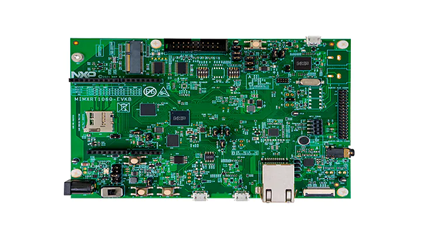
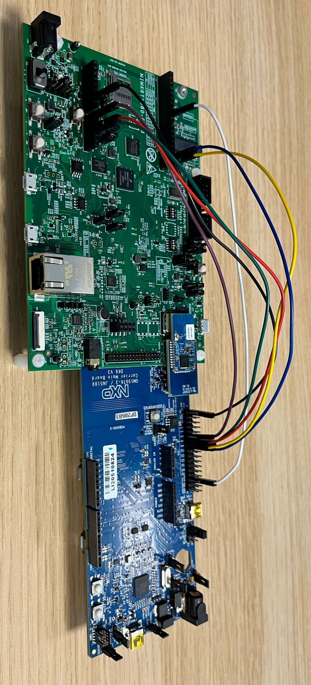

# MATTER NXP RT1060 Applications Guide

<hr>

-   [MATTER NXP RT1060 Applications Guide](#matter-nxp-rt1060-applications-guide)
    -   [Introduction](#introduction)
        -   [Supported configurations](#supported-configurations)
        -   [Hardware requirements RT1060 + transceiver](#hardware-requirements-rt1060--transceiver)
            -   [Hardware requirements RT1060+IW416](#hardware-requirements-rt1060iw416)
            -   [Hardware requirements RT1060+88W8801](#hardware-requirements-rt106088w8801)
            -   [Hardware requirements RT1060 + K32W0](#hardware-requirements-rt1060--k32w0)
            -   [Hardware requirements RT1060-EVK-C+IW612](#hardware-requirements-rt1060-evk-ciw612)
            -   [Hardware requirements RT1060 + 88W8801 + K32W0x1DK6](#hardware-requirements-rt1060--88w8801--k32w0x1dk6)
    -   [Building](#building)
        -   [CMake Build System](#cmake-build-system)
        -   [GN Build System](#gn-build-system)
            -   [Building with Matter over Wifi configuration on RT1060 + transceiver](#building-with-matter-over-wifi-configuration-on-rt1060--transceiver)
            -   [Build with Matter over Thread configuration on RT1060 + transceiver](#build-with-matter-over-thread-configuration-on-rt1060--transceiver)
                -   [Build with Matter over Thread configuration on RT1060 + K32W0](#build-with-matter-over-thread-configuration-on-rt1060--k32w0)
                -   [Build with Matter over Thread configuration on RT1060-EVK-C + IW612](#build-with-matter-over-thread-configuration-on-rt1060-evk-c--iw612)
                -   [Build with Matter over Wi-Fi + OpenThread Border Router configuration on RT1060-EVK-C + IW612](#build-with-matter-over-wi-fi--openthread-border-router-configuration-on-rt1060-evk-c--iw612)
                -   [Build with Matter over Wi-Fi + OpenThread Border Router configuration on RT1060 + 88W8801 + K32W0x1DK6](#build-with-matter-over-wi-fi--openthread-border-router-configuration-on-rt1060--88w8801--k32w0x1dk6)
            -   [General Information](#general-information)
    -   [Manufacturing data](#manufacturing-data)
    -   [Flashing and debugging](#flashing-and-debugging)
    -   [Testing the example](#testing-the-example)
        -   [UART details](#uart-details)
    -   [OTA Software Update](#ota-software-update)
    -   [Thread Border Router overview](#thread-border-router-overview)

<a name="intro"></a>

## Introduction



The RT1060 application provides a working demonstration of the RT1060 board
integration, built using the Project MATTER codebase and the NXP MCUX SDK.

The example targets the
[NXP MIMXRT1060-EVK-B](https://www.nxp.com/design/development-boards/i-mx-evaluation-and-development-boards/mimxrt1060-evk-i-mx-rt1060-evaluation-kit:MIMXRT1060-EVK)
board by default. It is also possible to use the older MIMXRT1060-EVK board,
build and board setup instructions differ in some steps.

### Supported configurations

Here are listed configurations supported on RT1060.

Matter over Wi-Fi :

-   RT1060 + IW416 (Wi-Fi + BLE)
-   RT1060 + 88W8801 (Wi-Fi)
-   RT1060-EVK-C + IW612 (Wi-Fi + 15.4 + BLE)

Matter over Thread :

-   RT1060 + K32W0 (15.4 + BLE)
-   RT1060-EVK-C + IW612 (Wi-Fi + 15.4 + BLE)

Matter over Wi-Fi with Openthread Border Router support :

-   RT1060 + 88W8801 + K32W0x1DK6
-   RT1060-EVK-C + IW612 (Wi-Fi + 15.4 + BLE)

### Hardware requirements RT1060 + transceiver

#### Hardware requirements RT1060+IW416

Host part:

-   1 MIMXRT1060-EVK-B or MIMXRT1060-EVK board
-   external 5V supply

Transceiver part:

-   1 AzureWave AW-AM510-uSD evaluation board

Jumper settings for MIMXRT1060-EVK-B (enables external 5V supply):

-   remove J40 5-6
-   connect J40 1-2
-   connect J45 with external power (controlled by SW6 - position 3)

Jumper settings for MIMXRT1060-EVK (enables external 5V supply):

-   remove J1 5-6
-   connect J1 1-2
-   connect J2 with external power (enabled by SW1 - position 3)

The hardware should be reworked according to the chapter _Hardware Rework Guide
for MIMXRT1060-EVK-B and AW-AM510-uSD_ or the chapter _Hardware Rework Guide for
MIMXRT1060-EVK and AW-AM510-uSD_ in the document
_`Hardware Rework Guide for EdgeFast BT PAL`_ which can be found in the NXP
RT1060 SDK (_docs/wireless/bluetooth/`edgefast_bluetooth`/Hardware Rework Guide
for EdgeFast BT PAL.pdf_):

-   Make sure resistors R368/R376/R347/R349/R365/R363/R193/R186 are removed.

Only the SDK package downloaded from https://mcuxpresso.nxp.com contains the PDF
document mentioned above, it is not present in the SDK downloaded from GitHub
using the west tool.

Jumper settings for AzureWave AW-AM510-uSD Module:

-   J4 1-2: `VIO` 1.8V (Voltage level of SD-IO pins is 1.8V)
-   J2 1-2: 3.3V `VIO_uSD` (Power Supply from uSD connector)
-   The pin 1 of J4 is not marked on the board. Please note that pin numbering
    of J4 is opposite to J2.

Plug AW-AM510-uSD into uSD connector J22 on MIMXRT1060-EVK-B or J39 on
MIMXRT1060-EVK.

Connect the following pins between RT1060 and AW-AM510-uSD to enable Bluetooth
HCI UART:

|  PIN NAME  | AW-AM510-uSD  | MIMXRT1060-EVK-B | MIMXRT1060-EVK | PIN NAME OF RT1060 | GPIO NAME OF RT1060 |
| :--------: | :-----------: | :--------------: | :------------: | :----------------: | :-----------------: |
| `UART_TXD` | `J10 (pin 4)` |  `J16 (pin 1)`   | `J22 (pin 1)`  |   `LPUART3_RXD`    |   `GPIO_AD_B1_07`   |
| `UART_RXD` | `J10 (pin 2)` |  `J16 (pin 2)`   | `J22 (pin 2)`  |   `LPUART3_TXD`    |   `GPIO_AD_B1_06`   |
| `UART_RTS` | `J10 (pin 6)` |  `J33 (pin 3)`   | `J23 (pin 3)`  |   `LPUART3_CTS`    |   `GPIO_AD_B1_04`   |
| `UART_CTS` | `J10 (pin 8)` |  `J33 (pin 4)`   | `J23 (pin 4)`  |   `LPUART3_RTS`    |   `GPIO_AD_B1_05`   |
|   `GND`    | `J6 (pin 7)`  |  `J32 (pin 7)`   | `J25 (pin 7)`  |       `GND`        |        `GND`        |

Attach external antenna into connector on AW-AM510-uSD.

Additional information about the AW-AM510-uSD can be found in the user manual
_UM11441 - Getting Started with NXP-based Wireless Modules and i.MX RT Platform
Running RTOS_, which can be found in the NXP RT1060 SDK
(docs/wireless/UM11441-Getting-Started-with-NXP-based-Wireless-Modules-and-i.MX-RT-Platform-Running-on-RTOS.pdf).
Only the SDK package downloaded from https://mcuxpresso.nxp.com contains the PDF
document, it is not present in the SDK downloaded from GitHub using the west
tool.

#### Hardware requirements RT1060+88W8801

Host part:

-   1 MIMXRT1060-EVK-B

Transceiver part :

-   1 88W8801 2DS M.2 Module (rev A)
-   1 Murata uSD-M.2 Adapter (rev B1)

The 88W8801 2DS M.2 Module should be inserted into the Murata uSD-M.2 Adapter
and inserted in the uSD slot J22 of MIMXRT1060-EVK-B. The Murata uSD-M.2 Adapter
can be powered up using uSD pins. For that, set the J1 jumper of Murata uSD-M.2
to position 2-3 (Position 2-3: `VBAT supply`, typical 3.1 ~ 3.3V, from microSD
connector).

Note: as the 88W8801 module supports only the 2.4 GHz Wi-Fi band, it is
mandatory to connect it to a Wi-Fi access point on the 2.4 GHz band.

#### Hardware requirements RT1060 + K32W0

Host part:

-   1 MIMXRT1060-EVK-B or MIMXRT1060-EVK board

Transceiver part:

-   1 OM15076-3 Carrier Board (DK6 board)
-   1 K32W0 Module to be plugged on the Carrier Board

**Board settings**

The below table explains pin settings (UART settings) to connect the
MIMXRT1060-EVK-B (host) to a k32w061 transceiver (rcp).

|     PIN NAME     | DK6 (K32W061) | MIMXRT1060-EVK-B | MIMXRT1060-EVK | PIN NAME OF RT1060 | GPIO NAME OF RT1060 |
| :--------------: | :-----------: | :--------------: | :------------: | :----------------: | :-----------------: |
|    `UART_TXD`    | `PIO, pin 8`  |   `J16, pin 1`   |  `J22, pin 1`  |   `LPUART3_RXD`    |   `GPIO_AD_B1_07`   |
|    `UART_RXD`    | `PIO, pin 9`  |   `J16, pin 2`   |  `J22, pin 2`  |   `LPUART3_TXD`    |   `GPIO_AD_B1_06`   |
|    `UART_RTS`    | `PIO, pin 6`  |   `J33, pin 3`   |  `J23, pin 3`  |   `LPUART3_CTS`    |   `GPIO_AD_B1_04`   |
|    `UART_CTS`    | `PIO, pin 7`  |   `J33, pin 4`   |  `J23, pin 4`  |   `LPUART3_RTS`    |   `GPIO_AD_B1_05`   |
|      `GND`       |  `J3, pin 1`  |   `J32, pin 7`   |  `J25, pin 7`  |        `XX`        |        `XX`         |
|     `RESET`      |    `RSTN`     |   `J33, pin 2`   |  `J23, pin 2`  |  `GPIO_AD_B1_11`   |   `GPIO_AD_B1_11`   |
| `DIO5/ISP Entry` | `PIO, pin 5`  |   `J33, pin 1`   |  `J23, pin 1`  |  `GPIO_AD_B1_10`   |   `GPIO_AD_B1_10`   |

The below picture shows pins connections for the MIMXRT1060-EVK.



#### Hardware requirements RT1060-EVK-C+IW612

Host part:

-   1 MIMXRT1060-EVK-C

    Hardware should be reworked as below:

    -   populate R93, R96, R2155, R2156, R2157, R2158, R2159 with 0Ohm resistors
    -   J76 and J107 jumpers in 2-3 position.
    -   J109 and J110 jumpers in 1-2 position.
    -   most of MIMXRT1060-EVK-C board would already have the re-work, but if
        not already done, the following modification is required: disconnect
        pin15 of component U9


Transceiver part :

-   1
    [2EL M2 A1 IW612 Secure Module](https://www.nxp.com/products/wireless/wi-fi-plus-bluetooth-plus-802-15-4/2-4-5-ghz-dual-band-1x1-wi-fi-6-802-11ax-plus-bluetooth-5-2-plus-802-15-4-tri-radio-solution:IW612)


#### Hardware requirements RT1060 + 88W8801 + K32W0x1DK6

-   i.MX RT1060 EVK-A or EVK-B board
-   88W8801 module (for Wi-Fi connection), for example 88W8801 2DS M.2 Module
    (rev A) and Murata uSD-M.2 Adapter (rev B1)
-   K32W0x1 mezzanine module (for Thread connection)
-   `IOT_ZTB-DK006` carrier board for the K32W0x1 module (referenced as DK6
    carrier board)

<a name="building"></a>

## Building

Make sure to follow shared build instructions from
[MATTER NXP Examples Guide for FreeRTOS platforms](./nxp_examples_freertos_platforms.md#set-up-the-build-environment)
to set-up your environment.

> In the following steps, the "all-clusters-app" is used as an example.

### CMake Build System

The example supports configuration and build with CMake build system. You can
find more information in
[CMake Build System](./nxp_examples_freertos_platforms.md#cmake-build-system)
section which explains how to further configure your application build.

In the `west build` command, the `board` option can be replaced with
`evkbmimxrt1060` for `MIMXRT1060-EVK-B`, or `evkcmimxrt1060` for
`MIMXRT1060-EVK-C` board.

RT1060 platform supports various transceivers based on the configuration being
used. For this purpose, the dedicated transceiver Kconfig must be set correctly
in the build command.

| Build configuration                    | Board                           | Transceiver Kconfig                                                                                                               |
| -------------------------------------- | ------------------------------- | --------------------------------------------------------------------------------------------------------------------------------- |
| Matter-over-WiFi with BLE              | MIMXRT1060-EVK-B + IW416        | `CONFIG_MCUX_COMPONENT_component.wifi_bt_module.IW416`                                                                            |
| Matter-over-WiFi without BLE           | MIMXRT1060-EVK-B + 8801         | `CONFIG_MCUX_COMPONENT_component.wifi_bt_module.88W8801`                                                                          |
| Matter-over-WiFi with BLE              | MIMXRT1060-EVK-C + IW612        | `CONFIG_MCUX_COMPONENT_component.wifi_bt_module.IW61X`                                                                            |
| Matter-over-Thread                     | MIMXRT1060-EVK-B + K32W0        | `CONFIG_MCUX_COMPONENT_component.wifi_bt_module.K32W061_transceiver`                                                              |
| Matter-over-Thread                     | MIMXRT1060-EVK-C + IW612        | `CONFIG_MCUX_COMPONENT_component.wifi_bt_module.IW61X`                                                                            |
| Matter-over-WiFi with OT Border Router | MIMXRT1060-EVK-B + 8801 + K32W0 | `CONFIG_MCUX_COMPONENT_component.wifi_bt_module.88W8801` and `CONFIG_MCUX_COMPONENT_component.wifi_bt_module.K32W061_transceiver` |
| Matter-over-WiFi with OT Border Router | MIMXRT1060-EVK-C + IW612        | `CONFIG_MCUX_COMPONENT_component.wifi_bt_module.IW61X`                                                                            |

Example of build command to build the All-Clusters app with Matter-over-WiFi
configuration on RT1060-EVK-C + IW612 platform :

```
user@ubuntu:~/Desktop/git/connectedhomeip$ west build -d build_matter -b evkcmimxrt1060 examples/all-clusters-app/nxp -DCONF_FILE_NAME=prj_wifi.conf -DCONFIG_MCUX_COMPONENT_component.wifi_bt_module.IW61X=y
```

Note that the RT1060 example supports various configurations that can be
provided to the `CONF_FILE_NAME` variable, you can refer to the
[table of available project configuration files and platform compatibility](./nxp_examples_freertos_platforms.md#available-project-configuration-files-and-platform-compatibility)
to check all the supported configurations.

For `RT1060 + K32W061` configuration, the transceiver binary build is generated
automatically by the host build in
`third_party/nxp/nxp_matter_support/cmake/build_helpers.cmake`.

> Note : BLE and Matter-CLI are enabled by default in Matter applications built
> with CMake. To disable them, you can refer to the
> [How to customize the CMake build](./nxp_examples_freertos_platforms.md#how-to-customize-the-cmake-build)
> section.

### GN Build System

#### Building with Matter over Wifi configuration on RT1060 + transceiver

-   Build the Wi-fi configuration for **MIMXRT1060-EVK-B board + IW416
    transceiver** (with BLE for commissioning).

```
user@ubuntu:~/Desktop/git/connectedhomeip/examples/all-clusters-app/nxp/rt/rt1060$ gn gen --args="chip_enable_wifi=true iw416_transceiver=true" out/debug
user@ubuntu:~/Desktop/git/connectedhomeip/examples/all-clusters-app/nxp/rt/rt1060$ ninja -C out/debug
```

-   Build the Wi-fi configuration for **MIMXRT1060-EVK-B board + 88W8801
    transceiver** with Matter-over-Wifi configuration and only onnetwork
    commissioning (without BLE, the WiFi network credentials are provided at
    build-time which will enable the device to join the Wi-Fi AP at startup):

```
user@ubuntu:~/Desktop/git/connectedhomeip/examples/all-clusters-app/nxp/rt/rt1060$ export ssid_name=<nwk_ssid> && export ssid_password=<nwk_password> && gn gen --args="chip_enable_wifi=true w8801_transceiver=true chip_config_network_layer_ble=false wifi_auto_connect_at_boot=true wifi_auto_connect_at_boot_ssid=\"${ssid_name}\" wifi_auto_connect_at_boot_password=\"${ssid_password}\"" out/debug
user@ubuntu:~/Desktop/git/connectedhomeip/examples/all-clusters-app/nxp/rt/rt1060$ ninja -C out/debug
```

-   Build the Wi-fi configuration for **MIMXRT1060-EVK-C board + IW612
    transceiver** (with BLE for commissioning).

```
user@ubuntu:~/Desktop/git/connectedhomeip/examples/all-clusters-app/nxp/rt/rt1060$ gn gen --args="chip_enable_wifi=true iwx12_transceiver=true evkname=\"evkcmimxrt1060\" " out/debug
user@ubuntu:~/Desktop/git/connectedhomeip/examples/all-clusters-app/nxp/rt/rt1060$ ninja -C out/debug
```

-   Build the Wi-fi configuration for **MIMXRT1060-EVK-C board + IW612
    transceiver** with Matter-over-Wifi configuration and only onnetwork
    commissioning (without BLE, the WiFi network credentials are provided at
    build-time which will enable the device to join the Wi-Fi AP at startup):

```
user@ubuntu:~/Desktop/git/connectedhomeip/examples/all-clusters-app/nxp/rt/rt1060$ export ssid_name=<nwk_ssid> && export ssid_password=<nwk_password> && gn gen --args="chip_enable_wifi=true iwx12_transceiver=true evkname=\"evkcmimxrt1060\" chip_config_network_layer_ble=false wifi_auto_connect_at_boot=true wifi_auto_connect_at_boot_ssid=\"${ssid_name}\" wifi_auto_connect_at_boot_password=\"${ssid_password}\"" out/debug
user@ubuntu:~/Desktop/git/connectedhomeip/examples/all-clusters-app/nxp/rt/rt1060$ ninja -C out/debug
```

#### Build with Matter over Thread configuration on RT1060 + transceiver

##### Build with Matter over Thread configuration on RT1060 + K32W0

For this configuration a K32W0 RCP image is required and must support in a
single image the openthread RCP configuration and the BLE HCI BB configuration.
Messages between the host and the K32W0 transceiver are transferred on a single
UART with flow control support. For that the HDLC-Lite framing protocol is used
to transfer spinel and hci frames. In addition, hci and spinel frames can be
distinguished by using the Spinel convention which is line compatible with
BT/BLE HCI.

Before building the Matter host application, it is required to generate the
K32W0 image supporting features as described above. To build this binary the
target `ot_rcp_ble_hci_bb_single_uart_fc` should be built by following the
[Readme.md][ot_rcp_ble_hci_bb_k32w0_readme]. After a successful build, a `".h"`
file will be generated and would contain the K32W0 RCP binary. As described in
the [Readme.md][ot_rcp_ble_hci_bb_k32w0_readme], the application binaries will
be generated in
`ot_nxp/build_k32w061/ot_rcp_ble_hci_bb_single_uart_fc/bin/ot-rcp-ble-hci-bb-k32w061.elf.bin.h`.

The generate K32W0 transceiver binary `".h"` file path must be indicated to the
host Matter application build. In fact the Matter host application is in charge
of storing the K32W0 firmware in its flash to be able to use the
`The Over The Wire (OTW) protocol (over UART)` to download (at host startup) the
k32w0 transceiver image from the host to the K32W0 internal flash. For more
information on the k32w0 `OTW` protocol, user can consult the doxygen header of
the file located in
`<repo_root>/third_party/nxp/nxp_matter_support/github_sdk/sdk_next/repo/middleware/wireless/framework/OTW/k32w0_transceiver/fwk_otw.c`.

Here is a summary of the k32w0 _gn gen_ arguments that are mandatory or
optional:

-   Mandatory: `k32w0_transceiver=true`
-   Mandatory: `hci_spinel_single_uart=true`
-   Optional:
    `k32w0_transceiver_bin_path=\"/home/ot-nxp/build_k32w061/ot_rcp_ble_hci_bb_single_uart_fc/bin/ot-rcp-ble-hci-bb-k32w061.elf.bin.h\"`
    This argument is optional, by default, if not set, the binary file located
    in
    "\${chip_root}/third_party/openthread/ot_nxp/build_k32w061/ot_rcp_ble_hci_bb_single_uart_fc/bin/ot-rcp-ble-hci-bb-k32w061.elf.bin.h"
    will be used. If the K32W061 transceiver binary is saved at another location
    an absolute path of its location should be given.
-   Optional: `otw_logs_enabled=true` This argument is optional, by default
    being set to false. If set to true, RT logging will print the `OTW` logs.

[ot_rcp_ble_hci_bb_k32w0_readme]:
    https://github.com/NXP/ot-nxp/blob/v1.0.0.2-tag-nxp/examples/hybrid/ot_rcp_ble_hci_bb/k32w061/README.md#building-the-examples

Below is presented an example of _gn gen_ argument that could be used to
generate the host matter application with a k32w0 transceiver.

```
user@ubuntu:~/Desktop/git/connectedhomeip/examples/all-clusters-app/nxp/rt/rt1060$ gn gen --args="chip_enable_openthread=true k32w0_transceiver=true k32w0_transceiver_bin_path=\"/home/ot-nxp/build_k32w061/ot_rcp_ble_hci_bb_single_uart_fc/bin/ot-rcp-ble-hci-bb-k32w061.elf.bin.h\" hci_spinel_single_uart=true chip_inet_config_enable_ipv4=false chip_config_network_layer_ble=true" out/debug
user@ubuntu:~/Desktop/git/connectedhomeip/examples/all-clusters-app/nxp/rt/rt1060$ ninja -C out/debug
```

##### Build with Matter over Thread configuration on RT1060-EVK-C + IW612

Build the OpenThread configuration for MIMXRT1060-EVK-C board + IW612
transceiver (with BLE for commissioning).

```
user@ubuntu:~/Desktop/git/connectedhomeip/examples/all-clusters-app/nxp/rt/rt1060$ gn gen --args="chip_enable_openthread=true iwx12_transceiver=true evkname=\"evkcmimxrt1060\" chip_inet_config_enable_ipv4=false chip_config_network_layer_ble=true" " out/debug
user@ubuntu:~/Desktop/git/connectedhomeip/examples/all-clusters-app/nxp/rt/rt1060$ ninja -C out/debug
```

##### Build with Matter over Wi-Fi + OpenThread Border Router configuration on RT1060-EVK-C + IW612

This configuration supports the Thread Border Router management cluster to
provision the Thread credentials. Enabling the Matter CLI in order to control
the Thread network on the Border Router is optional but recommended for other
features like the Thread credential sharing.

Note that the Thread Border Router management cluster is only supported on the
thermostat application for now.

-   Build Matter with Border Router configuration with ble-wifi commissioning:

```
user@ubuntu:~/Desktop/git/connectedhomeip/examples/thermostat/nxp/rt/rt1060$ gn gen --args="chip_enable_openthread=true iwx12_transceiver=true evkname=\"evkcmimxrt1060\" chip_enable_wifi=true chip_inet_config_enable_ipv4=false chip_config_network_layer_ble=true chip_enable_secondary_nwk_if=true chip_device_config_thread_network_endpoint_id=2" " out/debug
user@ubuntu:~/Desktop/git/connectedhomeip/examples/thermostat/nxp/rt/rt1060$ ninja -C out/debug
```

##### Build with Matter over Wi-Fi + OpenThread Border Router configuration on RT1060 + 88W8801 + K32W0x1DK6

This configuration supports the Thread Border Router management cluster to
provision the Thread credentials. Enabling the Matter CLI in order to control
the Thread network on the Border Router is optional but recommended for other
features like the Thread credential sharing.

Note that the Thread Border Router management cluster is only supported on the
thermostat application for now.

-   Build Matter with Border Router configuration with ble-wifi commissioning:

```
user@ubuntu:~/Desktop/git/connectedhomeip/examples/thermostat/nxp/rt/rt1060$ gn gen --args="chip_enable_wifi=true w8801_transceiver=true nxp_enable_matter_cli=true chip_config_network_layer_ble=true chip_enable_openthread=true k32w0_transceiver=true chip_enable_secondary_nwk_if=true chip_device_config_thread_network_endpoint_id=2 k32w0_transceiver_bin_path=\"/path/to/ot-rcp/ot-rcp-ble-hci-bb-k32w061.elf.bin.h\" hci_spinel_single_uart=true " out/debug
user@ubuntu:~/Desktop/git/connectedhomeip/examples/thermostat/nxp/rt/rt1060$ ninja -C out/debug
```

-   Build Matter with Border Router configuration with onnetwork commissioning:

```
user@ubuntu:~/Desktop/git/connectedhomeip/examples/all-clusters-app/nxp/rt/rt1060$ export ssid_name=<nwk_ssid> && export ssid_password=<nwk_password> && gn gen --args="chip_enable_wifi=true w8801_transceiver=true chip_enable_secondary_nwk_if=true chip_device_config_thread_network_endpoint_id=2 nxp_enable_matter_cli=true chip_config_network_layer_ble=false wifi_auto_connect_at_boot=true wifi_auto_connect_at_boot_ssid=\"${ssid_name}\" wifi_auto_connect_at_boot_password=\"${ssid_password}\" chip_enable_openthread=true k32w0_transceiver=true k32w0_transceiver_bin_path=\"/path/to/ot-rcp/ot-rcp-ble-hci-bb-k32w061.elf.bin.h\"" out/debug
user@ubuntu:~/Desktop/git/connectedhomeip/examples/all-clusters-app/nxp/rt/rt1060$ ninja -C out/debug
```

#### General Information

The resulting output file can be found in
out/debug/chip-rt1060-all-cluster-example.

Additional GN options can be added when building the application. You can check
[Common GN options to FreeRTOS platforms](./nxp_examples_freertos_platforms.md#general-information)
for the full list. Below is the list of RT1060 specific GN options :

-   By default, the MIMXRT1060-EVK-B will be chosen by the application. To
    switch to an MIMXRT1060-EVK, the argument `evkname=\"evkmimxrt1060\"` must
    be added to the _gn gen_ command.

<a name="manufacturing"></a>

## Manufacturing data

See
[Guide for writing manufacturing data on NXP devices](./nxp_manufacturing_flow.md)

Other comments:

The RT1060 all cluster app demonstrates the usage of encrypted Matter
manufacturing data storage. Matter manufacturing data should be encrypted before
flashing them to the RT1060 flash.

For development purpose the RT1060 all cluster app code could use the hardcoded
AES 128 software key. This software key should be used only during development
stage.

For production usage, it is recommended to use the `OTP key` which needs to be
fused in the RT1060 SW_GP2. The application note AN12800 should be followed to
get more information. In this case the all cluster app should be updated to
indicate to the `DCP` module to use the `OTP key` instead of the software key.
For that the call to `FactoryDataPrvdImpl().SetAes128Key()` should be changed to
`FactoryDataPrvdImpl().SetKeySelected(KeySelect::)` with the arg value
specifying where the `OTP key` is stored (`kDCP_OCOTPKeyLow` for [127:0] of
SW_GP2 or `kDCP_OCOTPKeyHigh` for [255:128] of SW_GP2). For more information the
RT1060 `FactoryDataProviderImpl` class description should be checked.

<a name="flashdebug"></a>

## Flashing and debugging

We recommend using `JLink` from Segger to flash the example application. It can
be downloaded and installed from
https://www.segger.com/products/debug-probes/j-link. Once installed, JLink can
be run to flash the application using the following steps :

```
$ JLink
```

```
J-Link > connect
Device> ? # you will be presented with a dialog -> select `MIMXRT1062XXX6B`
Please specify target interface:
J) JTAG (Default)
S) SWD
T) cJTAG
TIF> S
Specify target interface speed [kHz]. <Default>: 4000 kHz
Speed> # <enter>

J-Link > exec EnableEraseAllFlashBanks
J-Link > erase 0x60000000, 0x61000000
```

Program the application executable :

```
J-Link > loadfile <application_binary>
```

To program an application in binary format you can use the following command
instead :

```
J-Link > loadbin <application_binary>.bin 0x60000000
```

<a name="testing-the-example"></a>

## Testing the example

To test the example, please make sure to check the `Testing the example` section
from the common readme
[MATTER NXP Examples Guide for FreeRTOS platforms](./nxp_examples_freertos_platforms.md#testing-the-example).

### UART details

Testing the example with the CLI enabled will require connecting to UART1 and an
additional UART, here are more details to follow for RT1060 platforms :

-   UART1 : To view output on this UART, a USB cable could be plugged in.
-   2nd UART : To view output on this UART, the following pin should be plugged
    to an `USB to UART adapter` :
    -   UART8 for `MIMXRT1060-EVK-C` board, use `connector J33 pin 1`.
    -   UART2 for `MIMXRT1060-EVK-B` board, use `connector J16 pin 7`.
    -   UART2 for `MIMXRT1060-EVK` board, use `connector J22 pin 7`.

## OTA Software Update

Over-The-Air software updates are supported with the `RT1060-EVKC` examples. The
process to follow in order to perform a software update is described in the
dedicated guide
['Matter Over-The-Air Software Update with NXP RT example applications'](./nxp_RTs_ota_software_update.md).

<a name="thread-border-router-overview"></a>

## Thread Border Router overview

To enable Thread Border Router support see the [build](#building) section.

The complete Border Router guide is located [here](./nxp_otbr_guide.md).
