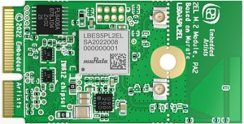

# MATTER NXP RT1170 Applications Guide

<hr>

-   [MATTER NXP RT1170 Applications Guide](#matter-nxp-rt1170-applications-guide)
    -   [Introduction](#introduction)
        -   [Supported configurations](#supported-configurations)
        -   [Supported build systems](#supported-build-systems)
        -   [Hardware requirements for RT1170 + IW612](#hardware-requirements-for-rt1170--iw612)
            -   [Hardware rework for SPI support on MIMXRT1170-EVK-B](#hardware-rework-for-spi-support-on-mimxrt1170-evk-b)
            -   [Board settings (Spinel over SPI, I2C, BLE over UART)](#board-settings-spinel-over-spi-i2c-ble-over-uart)
    -   [Building](#building)
        -   [CMake Build System](#cmake-build-system)
        -   [GN Build System](#gn-build-system)
            -   [Building with Matter over Wifi configuration on RT1170 + IW612](#building-with-matter-over-wifi-configuration-on-rt1170--iw612)
            -   [Building with Matter over Thread configuration on RT1170 + IW612](#building-with-matter-over-thread-configuration-on-rt1170--iw612)
            -   [Building with Matter over Wifi + OpenThread Border Router configuration on RT1170 + IW612](#building-with-matter-over-wifi--openthread-border-router-configuration-on-rt1170--iw612)
        -   [General information](#general-information)
    -   [Manufacturing data](#manufacturing-data)
    -   [Flashing and debugging](#flashing-and-debugging)
    -   [Testing the example](#testing-the-example)
        -   [UART details](#uart-details)
    -   [OTA Software Update](#ota-software-update)
    -   [Thread Border Router overview](#thread-border-router-overview)

## Introduction


The RT1170 application provides a working demonstration of the RT1170 board
integration, built using the Project MATTER codebase and the NXP MCUX SDK.

The RT1170 examples target the
[NXP MIMXRT1170-EVKB](https://www.nxp.com/part/MIMXRT1170-EVKB#/) board by
default.

### Supported configurations

The example supports:

-   Matter over Wi-Fi
-   Matter over Openthread
-   Matter over Wi-Fi with Openthread Border Router support

Here are listed configurations that allow to support Matter over Wi-Fi & Matter
over Thread on RT1170 :

-   RT1170 + IW612 (Wi-Fi + BLE + 15.4)

### Supported build systems

RT1170 platform supports two different build systems to generate the application
:

-   `GN`
-   `CMake`

### Hardware requirements for RT1170 + IW612

Host part:

-   1 MIMXRT1170-EVK-B

Transceiver part :

-   1
    [2EL M2 A1 IW612 Secure Module](https://www.nxp.com/products/wireless/wi-fi-plus-bluetooth-plus-802-15-4/2-4-5-ghz-dual-band-1x1-wi-fi-6-802-11ax-plus-bluetooth-5-2-plus-802-15-4-tri-radio-solution:IW612)



-   1
    [Murata uSD to M2 adapter revC](https://www.murata.com/en-eu/products/connectivitymodule/wi-fi-bluetooth/overview/lineup/usd-m2-adapter-2we-2wf)


-   Male to female Burg cables

#### Hardware rework for SPI support on MIMXRT1170-EVK-B

To support SPI on the MIMXRT1170-EVK-B board, it is required to remove 0Ω
resistors R404,R406,R2015.

#### Board settings (Spinel over SPI, I2C, BLE over UART)

Plug IW612 module to M.2 connector on Murata uSD to M2 adapter

The Murata uSD-M2 adapter should be plugged to the RT1170 via SD-IO.

The below tables explain pin settings (SPI settings) to connect the
MIMXRT1170-EVK-B (host) to a IW612 transceiver (rcp).

-   Murata uSD to M2 adapter connections description:


-   Jumpers positions on Murata uSD to M2 adapter:

    Use USB-C power supply

    | Jumper            | Position |
    | ----------------- | -------- |
    | J1                | 1-2      |
    | J12               | 1-2      |
    | J13               | 1-2      |
    | J14               | 1-2      |
    | JP1.1 (back side) | ON       |

-   Jumpers positions on MIMXRT1170-EVK-B:

    | Jumper | Position |
    | :----: | :------: |
    | `J56`  |  `2-3`   |

-   I2C connection to program `IO_Expander` on the IW612 module

    |  MIMXRT1170-EVK-B  | uSD-M2 adapter |
    | :----------------: | :------------: |
    | `I2C_SDA (J10.18)` |     `J5.2`     |
    | `I2C_SDL (J10.20)` |     `J5.4`     |

-   SPI connection between RT1170 and uSD-M2 adapter

    |  MIMXRT1170-EVK-B   | uSD-M2 adapter |
    | :-----------------: | :------------: |
    | `SPI_MOSI (J10.8)`  |    `J5.10`     |
    | `SPI_MISO (J10.10)` |     `J9.7`     |
    | `SPI_CLK (J10.12)`  |     `J9.8`     |
    |  `SPI_CS (J10.6)`   |     `J5.8`     |
    |  `SPI_INT (J26.4)`  |     `J5.6`     |
    |   `GND (J10.14)`    |    `J5.15`     |

-   UART BLE and Reset connections between RT1170 and uSD-M2 adapter

    |  MIMXRT1170-EVK-B   | uSD-M2 adapter |
    | :-----------------: | :------------: |
    |   `RESET (J26.2)`   |     `J9.3`     |
    | `UART_RXD (J25.13)` |     `J9.1`     |
    | `UART_TXD (J25.15)` |     `J9.2`     |
    | `UART_CTS (J25.9)`  |     `J8.4`     |
    | `UART_RTS (J25.11)` |     `J8.3`     |
    |    `GND (J26.1)`    |     `J7.6`     |

## Building

Make sure to follow shared build instructions from
[MATTER NXP Examples Guide for FreeRTOS platforms](./nxp_examples_freertos_platforms.md#set-up-the-build-environment)
to set-up your environment.

> In the following steps, the "all-clusters-app" is used as an example.

### CMake Build System

The example supports configuration and build with CMake build system. You can
find more information in
[CMake Build System](./nxp_examples_freertos_platforms.md#cmake-build-system)
section which explains how to further configure your application build.

In the `west build` command, the `board` option can be replaced with
`evkbmimxrt1170` for `MIMXRT1170-EVK-B`, and the `core_id` to use is `cm7`. The
Kconfig `CONFIG_MCUX_COMPONENT_component.wifi_bt_module.IW61X` should be set to
`y` to enable the IW612 transceiver.

Example of build command to build the All-Clusters app with Matter-over-WiFi
configuration on RT1170 platform :

```
user@ubuntu:~/Desktop/git/connectedhomeip$ west build -d build_matter -b evkbmimxrt1170 examples/all-clusters-app/nxp -DCONF_FILE_NAME=/prj_wifi.conf -Dcore_id=cm7 -DCONFIG_MCUX_COMPONENT_component.wifi_bt_module.IW61X=y
```

Note that the RT1170 example supports various configurations that can be
provided to the `CONF_FILE_NAME` variable, you can refer to the
[table of available project configuration files and platform compatibility](./nxp_examples_freertos_platforms.md#available-project-configuration-files-and-platform-compatibility)
to check all the supported configurations.

> Note : BLE and Matter-CLI are enabled by default in Matter applications built
> with CMake. To disable them, you can refer to the
> [How to customize the CMake build](./nxp_examples_freertos_platforms.md#how-to-customize-the-cmake-build)
> section.

### GN Build System

#### Building with Matter over Wifi configuration on RT1170 + IW612

-   Build the Wi-fi configuration for MIMXRT1170 board + IW612 transceiver (with
    BLE for commissioning).

```
user@ubuntu:~/Desktop/git/connectedhomeip/examples/all-clusters-app/nxp/rt/rt1170$ gn gen --args="chip_enable_wifi=true iwx12_transceiver=true chip_config_network_layer_ble=true chip_enable_ble=true " out/debug
user@ubuntu:~/Desktop/git/connectedhomeip/examples/all-clusters-app/nxp/rt/rt1170$ ninja -C out/debug
```

#### Building with Matter over Thread configuration on RT1170 + IW612

-   Build the Openthread configuration for MIMXRT1170 board + IW612 transceiver
    (with BLE for commissioning).

```
user@ubuntu:~/Desktop/git/connectedhomeip/examples/all-cluster/nxp/rt/rt1170$ gn gen --args="chip_enable_openthread=true iwx12_transceiver=true chip_inet_config_enable_ipv4=false chip_config_network_layer_ble=true" out/debug
user@ubuntu:~/Desktop/git/connectedhomeip/examples/all-cluster/nxp/rt/rt1170/$ ninja -C out/debug
```

#### Building with Matter over Wifi + OpenThread Border Router configuration on RT1170 + IW612

This configuration supports the Thread Border Router management cluster to
provision the Thread credentials. Enabling the Matter CLI in order to control
the Thread network on the Border Router is optional but recommended for other
features like the Thread credential sharing.

Note that the Thread Border Router management cluster is only supported on the
thermostat application for now.

-   Build Matter with Border Router configuration with BLE commissioning
    (ble-wifi) :

```
user@ubuntu:~/Desktop/git/connectedhomeip/examples/all-clusters-app/nxp/rt/rt11170$ gn gen --args="chip_enable_wifi=true iwx12_transceiver=true chip_config_network_layer_ble=true chip_enable_ble=true chip_enable_openthread=true nxp_enable_matter_cli=true" out/debug
user@ubuntu:~/Desktop/git/connectedhomeip/examples/all-clusters-app/nxp/rt/rt1170$ ninja -C out/debug
```

### General information

The resulting output file can be found in
out/debug/chip-rt1170-all-cluster-example.

Additional GN options can be added when building the application. You can check
[Common GN options to FreeRTOS platforms](./nxp_examples_freertos_platforms.md#general-information)
for the full list.

## Manufacturing data

See
[Guide for writing manufacturing data on NXP devices](./nxp_manufacturing_flow.md)

Other comments:

The all cluster app demonstrates the usage of encrypted Matter manufacturing
data storage. Matter manufacturing data should be encrypted using an AES 128
software key before flashing them to the device flash.

## Flashing and debugging

We recommend using `JLink` from Segger to flash the example application. It can
be downloaded and installed from
https://www.segger.com/products/debug-probes/j-link. Once installed, JLink can
be run to flash the application using the following steps :

```
$ JLink
```

```
J-Link > connect
Device> ? # you will be presented with a dialog -> select `MIMXRT1176xxxA_M7`
Please specify target interface:
J) JTAG (Default)
S) SWD
T) cJTAG
TIF> S
Specify target interface speed [kHz]. <Default>: 4000 kHz
Speed> # <enter>

J-Link > exec EnableEraseAllFlashBanks
J-Link > erase 0x30000000, 0x34000000
```

Program the application executable :

```
J-Link > loadfile <application_binary>
```

To program an application in binary format you can use the following command
instead :

```
J-Link > loadbin <application_binary>.bin 0x30000000
```

## Testing the example

To test the example, please make sure to check the `Testing the example` section
from the common readme
[MATTER NXP Examples Guide for FreeRTOS platforms](./nxp_examples_freertos_platforms.md#testing-the-example).

### UART details

Testing the example with the CLI enabled will require connecting to UART1 and
UART2, here are more details to follow for RT1170 platform :

-   UART1 : To view output on this UART, a USB cable could be plugged in.
-   UART2 : To view output on this UART, the `pin 4` on `connector J9` should be
    plugged to an `USB to UART adapter`.

## OTA Software Update

Over-The-Air software updates are supported with the RT1170 examples. The
process to follow in order to perform a software update is described in the
dedicated guide
['Matter Over-The-Air Software Update with NXP RT example applications'](./nxp_RTs_ota_software_update.md).

## Thread Border Router overview

To enable Thread Border Router support see the [build](#building) section.

The complete Border Router guide is located [here](./nxp_otbr_guide.md).
