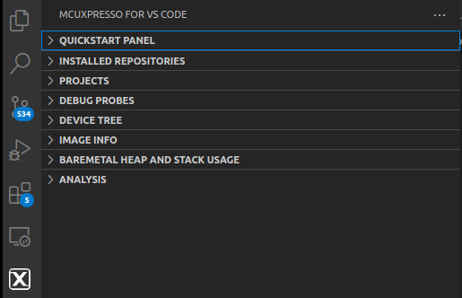
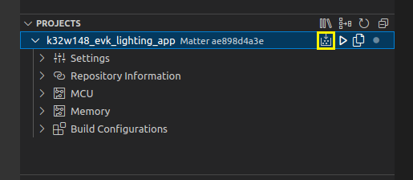
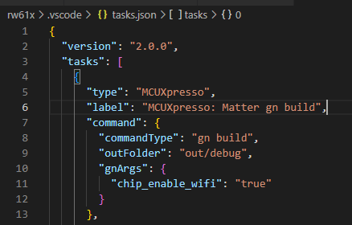
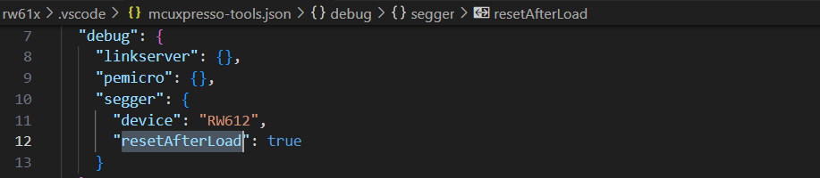

## NXP VSCode development

-   [NXP VSCode development](#nxp-vscode-development)
    -   [Introduction](#introduction)
    -   [Setup](#setup)
    -   [Import a reference application](#import-a-reference-application)
    -   [Build](#build)
    -   [Flash and debug](#flash-and-debug)

### Introduction

NXP provides an optimized embedded developer experience for code editing and
develoment through the
[MCUXpresso for Visual Studio Code](https://www.nxp.com/products/processors-and-microcontrollers/arm-microcontrollers/general-purpose-mcus/mcx-arm-cortex-m/mcx-a-series-microcontrollers/mcuxpresso-for-visual-studio-code:MCUXPRESSO-VSC)
extension.

Please refer to
[MCUXpresso for Visual Studio Code](https://github.com/nxp-mcuxpresso/vscode-for-mcux/wiki)
for a complete guide of the extension.

### Setup

Currently, Matter support is under development so the extension provides some
experimental support. Some prerequisite steps are required before having a
working environment.

1. Define `MCUXPRESSO_VSCODE_MATTER` environment variable

    To enable Matter support, the user must define the environment variable
    `MCUXPRESSO_VSCODE_MATTER` with a value of 1. Please note that this step is
    different depending on the host OS.

2. Install the extension

    To install the extension, just click
    [here](https://marketplace.visualstudio.com/items?itemName=NXPSemiconductors.mcuxpresso)
    and press the `Install` button. Alternatively, this step can also be done in
    `Visual Studio Code`:

    - Open `Extensions Marketplace`
    - Search `NXP` or `MCUXpresso`
    - Click on the blue install button

    Once installed, the extension should be visible in the left navigation
    panel: 

    This is a full view of the extension panels:
    

    `Quickstart panel` overview:

    | Name                           | Description                                                                  |
    | ------------------------------ | ---------------------------------------------------------------------------- |
    | Import Repository              | Wizard used to import a local/remote Matter repo                             |
    | Import Example from Repository | Wizard used to import a Matter reference app from an imported Matter repo    |
    | Import Project                 | Not used by Matter                                                           |
    | Application Code Hub           | Not used by Matter                                                           |
    | Flash Programmer               | Wizard for custom flashing (interface is different based on the debug probe) |
    | Open MCUXpresso Installer      | Wizard for installing prerequisites and additional software                  |

3. Open `MCUXpresso Installer` to install additional dependencies

    This step is required in order to install `Python` and `git` (if not already
    present), alongside debug software such as
    [LinkServer](https://www.nxp.com/design/design-center/software/development-software/mcuxpresso-software-and-tools-/linkserver-for-microcontrollers:LINKERSERVER)
    or [SEGGER J-Link](https://www.segger.com/downloads/jlink/).

    After installing the selected tools, a VSCode restart is needed in order to
    apply the new settings.

4. Import NXP Matter repository

    There are two options for importing repositories: remote and local.

    1. Remote

        The options for remote are:

        - [CSA Matter repository](https://github.com/project-chip/connectedhomeip)
          (macOS/Linux only)
        - [NXP Matter repository](https://github.com/NXP/matter) (also with
          Windows support)

        Once the repository is cloned, a bootstrap process will start
        automatically. This will take a while.

    2. Local

        Importing a local repository implies a manual step:

        ```
        cd connectedhomeip
        git clone https://github.com/NXP/matter-vscode
        ```

        The
        [NXP VSCode metadata repository](https://github.com/NXP/matter-vscode)
        contains metadata files and additional scripts that are used by the
        extension. This repository should be cloned in the Matter root folder.

        This step will not run bootstrap automatically, so it is recommended to
        run bootstrap before importing an example, to avoid any subsequent
        errors.

At this point, the environment should be ready for building a reference
application.

### Import a reference application

The extension includes an `Import Example from Repository` wizard that
simplifies adding a project to the workspace.

### Build

To build, select the project from the projects window and press the
`Build Selected` button:



By default, the build will use the configuration specified through the
`args.gni` of the application. This means additional gn args should be added
manually by creating a `gnArgs` field inside the project `tasks.json` file:



### Flash and debug

For these actions, please refer to the official wiki:

-   [Flash](https://github.com/nxp-mcuxpresso/vscode-for-mcux/wiki/Flash)
-   [Debug](https://github.com/nxp-mcuxpresso/vscode-for-mcux/wiki/Debug)

**Note** :

For Rw61x platform, some additional steps are required in order to debug Matter
applications with the extension.

-   In the `launch.json` file of the project settings, disable the
    `pre-flash actions` by setting the `mcuxSkipPreFlashActions` to true.


-   Edit the `mcuxpresso-tools.json` file of the project settings, and add
    `resetAfterLoad` as true in your `debug` configuration.


