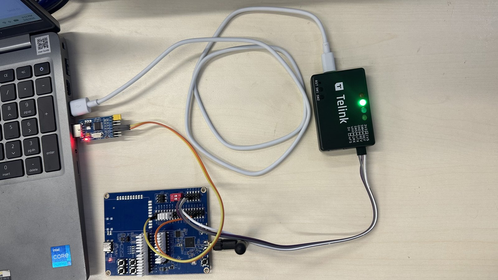
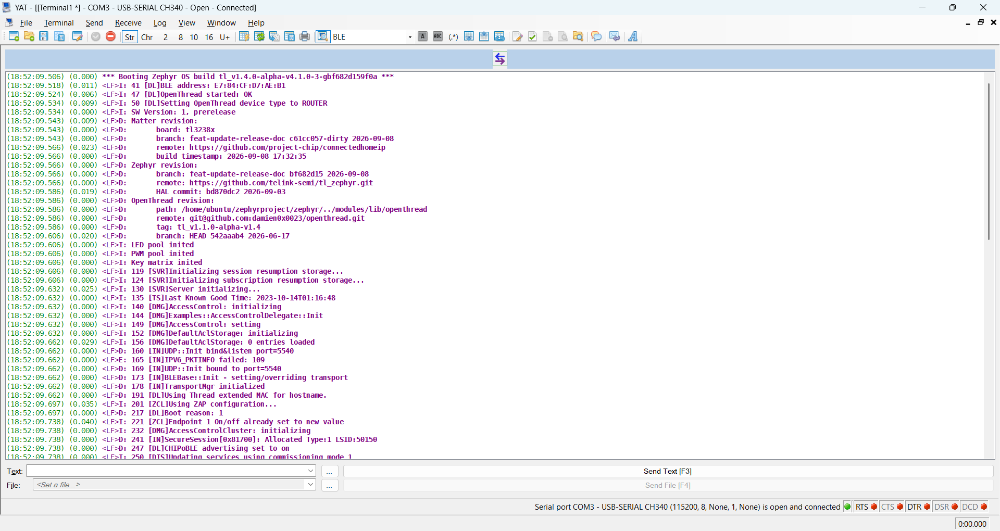

# Telink Matter Getting Started Guide

This guide walks you through setting up the build environment, building,
flashing, and running a Matter-over-Thread device on Telink RISC-V SoC
platforms.

## Prerequisites

### Chip and Board used in the guide

| Board target | Chip Family | EVK Version    | Flash (default) | Notes                                                         |
| ------------ | ----------- | -------------- | :-------------: | ------------------------------------------------------------- |
| `tl3238x`    | TL323X      | C1T388A20_V1.1 |      2 MB       | Matter only by default, Dual-mode (Matter + Zigbee) supported |

> See the [Release Notes](./releases/telink_release_notes.md) for the exact chip
> versions, EVK versions, and per-example support matrix validated in each
> release.

### Hardware

| Hardware          | Description                                     |
| ----------------- | ----------------------------------------------- |
| PC                | Ubuntu 24.04 LTS (recommended)                  |
| Development board | Select a board according to the Release Notes   |
| Programmer        | Telink Programmer V5                            |
| Serial adapter    | USB-to-UART adapter                             |
| USB cable         | Connects the PC to the programmer               |
| Jumper wires      | Connect the programmer to the development board |

### Software

| Software                                                                      | Description                                                                   |
| ----------------------------------------------------------------------------- | ----------------------------------------------------------------------------- |
| [BDT flashing tool](https://doc.telink-semi.cn/tools/bdt/Linux/BDT_Linux.zip) | Telink BDT (Burning and Debugging Tool) for Linux, for flashing and debugging |
| Toolchain                                                                     | riscv64-zephyr-elf, for building Matter firmware                              |
| UART terminal                                                                 | For viewing device logs                                                       |
| [Telink Zephyr SDK](https://github.com/telink-semi/tl_zephyr)                 | Provides the underlying drivers and system support                            |
| [Telink Matter SDK](https://github.com/telink-semi/tl_matter)                 | For developing Matter smart-home devices                                      |

### Telink Matter ↔ Telink Zephyr Dependency

The Telink Matter SDK is built **on top of** the Telink Zephyr SDK. The two are
tightly coupled and must be used as a matched pair:

| Component                                                | Role                                                                                                                        | Required |
| -------------------------------------------------------- | --------------------------------------------------------------------------------------------------------------------------- | :------: |
| **Telink Zephyr SDK** (`dev-tlk_v4.1` branch)            | Provides the Zephyr RTOS core, Telink HAL, BLE stack, MCUBoot, OpenThread, the WEST tool and build toolchain                |    ✅    |
| **Telink Matter SDK** (`dev-tlk_v1.5` branch, this repo) | Provides the Matter protocol stack and Telink example applications; consumes the Telink Zephyr SDK via `TELINK_ZEPHYR_BASE` |    ✅    |

Both are required — the Matter SDK cannot be built without the Zephyr SDK, and
the Zephyr SDK alone does not provide Matter support.

> ⚠️ **Version pairing:** Each Telink Matter release is validated against a
> specific Telink Zephyr SDK tag. Using a different Zephyr revision may cause
> build failures or runtime issues. See the
> [Release Notes](./releases/telink_release_notes.md) for the matched pair.

## Step 1: Set up the Telink Zephyr SDK

The Telink Matter examples use `west build` and require the Telink Zephyr SDK to
be installed and exported via `TELINK_ZEPHYR_BASE`.

Set up the Telink Zephyr SDK first, then build and flash a sample application to
verify the environment. For the full setup, build, and flashing instructions,
see the
[Telink Zephyr SDK Getting Started guide](https://github.com/telink-semi/tl_zephyr/blob/dev-tlk_v4.1/doc/telink/getting_started/index.md).

## Step 2: Get the Matter source code

### 2.1 Install Matter host dependencies

```bash
sudo apt-get install git gcc g++ pkg-config libssl-dev libdbus-1-dev \
  libglib2.0-dev libavahi-client-dev ninja-build python3-venv python3-dev \
  python3-pip unzip libgirepository1.0-dev libcairo2-dev libreadline-dev
```

### 2.2 Clone and set up the Matter repository

```bash
mkdir -p ~/zephyrproject && cd ~/zephyrproject
git clone https://github.com/telink-semi/tl_matter.git connectedhomeip
cd connectedhomeip
git checkout <telink_matter_branch>     # e.g. dev-tlk_v1.5
./scripts/checkout_submodules.py --platform telink,linux
```

### 2.3 Bootstrap the Matter build environment

The first run takes a while as it downloads all pip/gn dependencies:

```bash
source scripts/bootstrap.sh
```

> If you switch commits or branches later, re-run bootstrap after cleaning:
>
> ```bash
> rm -rf .environment
> source scripts/bootstrap.sh
> ```

## Step 3: Build a Matter example

Telink Matter examples live under `examples/<app-name>/telink/`. Each example is
built with `west build` (which invokes the Zephyr build system under the hood).

### 3.1 Activate the environment

```bash
cd connectedhomeip
source scripts/activate.sh
```

### 3.2 Build with west (default configuration)

```bash
cd examples/lighting-app/telink
west build -b tl3238x
```

The built firmware is at `build/zephyr/zephyr.bin`.

> For other configurations (flash size, OTA + LZMA, dual-mode Matter + Zigbee),
> see
> [Appendix: TL3238X build configurations](#appendix-tl3238x-build-configurations).

## Step 4: Flash the firmware

### 4.1 BDT (Telink flashing tool)

Telink provides the **BDT** (Burning Debug Tool) for flashing. On Windows use
the BDT GUI (`Telink BDT.exe`). See the
[Telink Zephyr Getting Started — Flash the Firmware](https://github.com/telink-semi/tl_zephyr/blob/dev-tlk_v4.1/doc/telink/getting_started/index.md#flash-the-firmware)
for the chip-to-BDT name mapping and the unlock/erase/write flow.



### 4.2 UART console

Connect UART to view device logs:

| Name | Pin                           |
| :--: | :---------------------------- |
|  RX  | PB0 (pin 17 of J34 connector) |
|  TX  | PB2 (pin 16 of J34 connector) |
| GND  | GND                           |

Baud rate: **115200** bits/s.

After flashing, reset or power-cycle the board and open the UART terminal. The
expected log output looks similar to:



## Buttons and LEDs

The on-board buttons and LEDs provide basic control and status feedback:

| Button   | Function               | Description                                                    |
| :------- | :--------------------- | :------------------------------------------------------------- |
| Button 1 | Factory reset          | Press 3 times to forget the commissioned Thread network        |
| Button 2 | App control            | Manually triggers the application state (e.g. toggle lighting) |
| Button 3 | Thread start           | Commission with static credentials and enable Thread           |
| Button 4 | Open commission window | Opens the BLE commissioning window                             |

**Red LED** — Thread network state:

| State           | Meaning                                  |
| :-------------- | :--------------------------------------- |
| Short pulses    | Not commissioned; Thread disabled        |
| Frequent pulses | Commissioned; joining the Thread network |
| Wide pulses     | Joined to the Thread network as a CHILD  |

**Green LED** — Identify (blinks when the Identify command is received).

## Next steps

-   [Telink Release Notes](./releases/telink_release_notes.md) — version info,
    chip/EVK versions, per-example support matrix, and resource usage tables.
-   [Telink Zephyr Getting Started](https://github.com/telink-semi/tl_zephyr/blob/dev-tlk_v4.1/doc/telink/getting_started/index.md)
    — Zephyr SDK setup, BDT flashing details, and board overviews.
-   Per-example `README.md` files under `examples/<app>/telink/` —
    example-specific build commands, button/LED mappings, and chip-tool usage.

## Appendix: TL3238X build configurations

TL3238X supports several configurations depending on flash size and dual-mode
(Matter + Zigbee) needs. Key combinations:

| Config                            | Flash | OTA | LZMA | Dual-mode | Conf file                                    |
| --------------------------------- | :---: | :-: | :--: | :-------: | -------------------------------------------- |
| Default (no OTA, no MCUBoot)      | 2 MB  | No  |  No  |    No     | `boards/tl3238x.conf`                        |
| OTA + BT DFU + LZMA               | 2 MB  | Yes | Yes  |    No     | `boards/tl3238x_2m_flash_ota_lzma.conf`      |
| Dual-mode (Matter + Zigbee) + OTA | 4 MB  | Yes |  No  |    Yes    | `boards/tl3238x_4m_flash_dual_mode_ota.conf` |

> ⚠️ For 2 MB Flash + OTA, LZMA compression is **required** — a non-LZMA build
> will not fit.

Example — 2 MB Flash with OTA + LZMA, software version 2:

```bash
west build -p -b tl3238x -d build_tl3238x_lzma_v2 -- \
  -DCONF_FILE="prj.conf boards/tl3238x_2m_flash_ota_lzma.conf" \
  -DCONFIG_CHIP_DEVICE_SOFTWARE_VERSION=2
```

If your board has a flash size other than the default 2 MB, specify it:

```bash
west build -b tl3238x -- -DFLASH_SIZE=4m
```

## Appendix: Per-board build READMEs

Each supported board ships a dedicated `*_README.md` under
`examples/<app>/telink/boards/` with the exact build commands for every
configuration of that board (default, OTA + LZMA, dual-mode Matter + Zigbee, 4
MB flash, Software Version 2 for DFU/OTA images, etc.).

### Lighting App

-   TL3238X:
    [tl3238x_README.md](../../../examples/lighting-app/telink/boards/tl3238x_README.md)
-   TL5218X:
    [tl5218x_README.md](../../../examples/lighting-app/telink/boards/tl5218x_README.md)
-   TL7218X:
    [tl7218x_README.md](../../../examples/lighting-app/telink/boards/tl7218x_README.md)

### Light Switch App

-   TL3238X Retention:
    [tl3238x_retention_README.md](../../../examples/light-switch-app/telink/boards/tl3238x_retention_README.md)
-   TL5218X Retention:
    [tl5218x_retention_README.md](../../../examples/light-switch-app/telink/boards/tl5218x_retention_README.md)
-   TL7218X Retention:
    [tl7218x_retention_README.md](../../../examples/light-switch-app/telink/boards/tl7218x_retention_README.md)

## FAQ

### west build: board target not found (e.g. `tl3238x`)

If `west build -b <board>` fails with a "board not found" error, the board is
most likely not defined in the branch you are on. Telink boards are only
available in the Telink fork on its matched branch, so make sure both
repositories are on the correct branch:

```bash
# Telink Zephyr SDK — must be the Telink fork, dev-tlk_v4.1
cd ~/zephyrproject/zephyr
git remote -v                 # should include telink-semi/tl_zephyr
git branch --show-current     # should be dev-tlk_v4.1
git checkout dev-tlk_v4.1     # switch if needed
west update

# Telink Matter SDK — dev-tlk_v1.5
cd ~/zephyrproject/connectedhomeip
git branch --show-current     # should be dev-tlk_v1.5
git checkout dev-tlk_v1.5     # switch if needed
./scripts/checkout_submodules.py --platform telink,linux
```

See the [Release Notes](./releases/telink_release_notes.md) for the matched
branch of each release.
