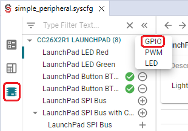

# Configure The Board Files with SysConfig

The board view shows you what pins are available on your board, and what
peripherals are assigned to what pins. Hover over each pin for more information.

  

Enabled and configured peripherals are displayed with green symbols. To add a
new peripheral, press the plus sign next to the peripheral type. The \"Show
generated files\" tab lets you see the files generated based on SysConfig.
Generated files are dynamically updated every time you make a change in
SysConfig. When you build your project, the generated files are exported into
the output folder of your project.

  

## Reserve Peripherals

Certain use cases may require preventing SysConfig from generating the
configuration of specific peripherals.

Examples of use cases requiring to reserve peripherals are:

-   dynamic re-configuration of a peripheral
-   leveraging the Sensor Controller (on devices enabling it)
-   already handling certain peripherals configuration
-   with hardware constraints preventing to use certain peripherals (typically
    `GPIOs`)
-   peripherals reserved for future use

Below are the steps required to utilize the Reserve Peripherals feature.

1.  Open the `.syscfg` file using the SysConfig GUI

2.  Open the panel \"Reserve Peripherals\"

    

      
    

3.  Reserve the resources

    Reserve a peripheral using SysConfig. This image shows how to reserve `DIO`
    15

    

      
    

SysConfig ensures no resource conflict occurs. In case no solution can be found,
an error is raised.

## Hardware View

The Hardware view may be used to add software modules for supporting hardware
resources on EVMs or LaunchPads. The same capability could be done in the
Software view by adding a Hardware. However the Hardware view provides a
hardware-first perspective to show which software could be used with hardware
resources.

Sysconfig Hardware View:

  

