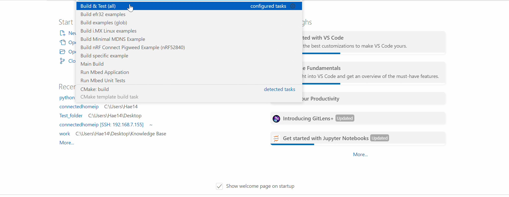
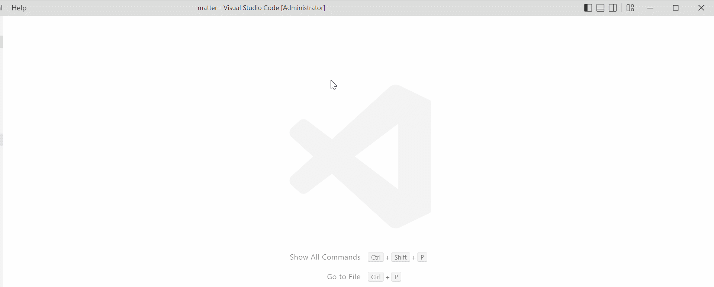

# Building in VS Code

This section covers building the binaries required for [ Flashing ](FLASH.md) and
[ Debugging ](DEBUG.md) the target Matter Accessory Devices.

## Linux/Mac

### Step 1:

Use the shortcut (Ctrl + Shift + P) to trigger the command pallet.

### Step 2:

Search for "run build task" and select the "Run Build Task" option.

### Step 3:

A new drop down menu will appear, select "Build efr32 example".

### Step 4:

On the next menu select an EFR32 example to build.

### Step 5:

Select the appropriate target board.

## Windows

Building for Windows requires one extra step prior to running the build example
task.

### Step 1:

Press (Ctrl + Shift + P) to trigger the command pallet.

### Step 2:

Search for "run build task" and select "Run build task" from the drop
down menu.

### Step 3:

On the next menu, select "Windows setup" from the options.

### Step 4:

The next menu contains two options, "setup" and
"cleanup". Select _setup_ in order to initiate the setup process or _cleanup_ to
clean up the environment after building the examples. This step installs crucial
packages that are required to build the examples such as openssl. if openssl
is not detected, an installation will be initiated in a new window. Follow the installation prompts in order for the setup to be successful.

### Step 5:

This step is identical to the steps for building on Linux/Mac, Refer to
that [ section ](#linMac).

## 

-----

[Table of Contents](../../README.md)
