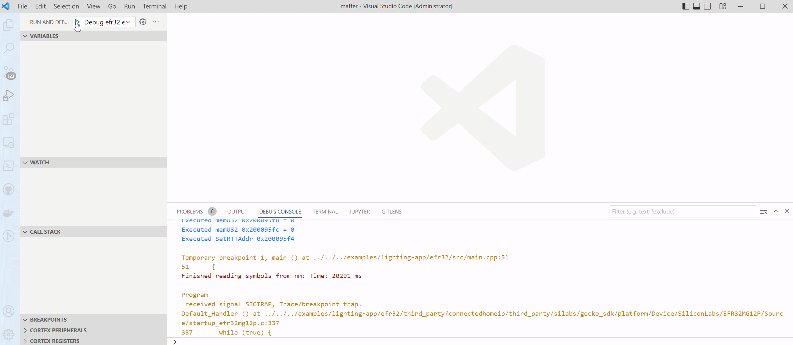

# Debugging in VS Code

This section covers remote Debugging (GDB jlink) of Matter Examples in VS Code.

## Requirements

1. C/C++ Extension Pack (_vscode extension_) - language support
2. Cortex-Debug (_vscode extension_) - GDB debugger support
3. ARM GCC Toolchain
   (https://developer.arm.com/open-source/gnu-toolchain/gnu-rm/downloads) -
   required arm-none-eabi tools
4. J-Link Software Tools - required J-Link GDB Server for J-Link based debuggers
   (https://www.segger.com/downloads/jlink)

## Settings

Before starting a debug session please ensure the following:

<ol>

 
  <li> A path to "arm-none-eabi-gdb.exe" is provided in the "Settings.Json" file under the "cortex-debug.gdbPath.windows" property.</li>  
  <li> A path to the GDB jlink server executable is provided in the launch.Json file for the property "serverpath". Find this property under the configuration name "Debug efr32 example app"</li>
</ol>

## Debugging

<ol>

### Step 1:

Use the shortcut (Ctrl + Shift + P) to trigger the command pallet.

### Step 2:

A drop down menu will appear along with a prompt. Please
select the "Debug efr32 example app" and Start Debugging, or press F5 on
your keyboard.

### Step 3:

Select the example you want to debug.

### Step 4:

Select the desired target device, from the drop down menu.

## </ol>

-----

[Table of Contents](../../README.md)
