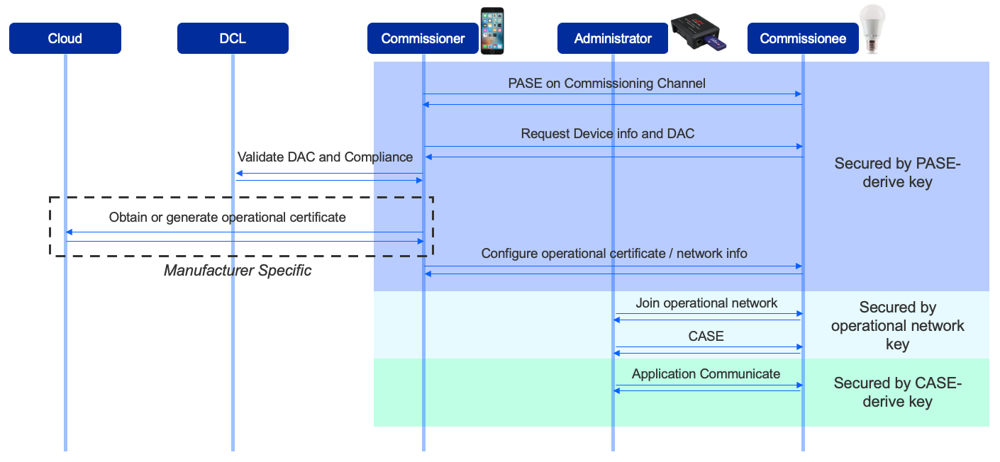
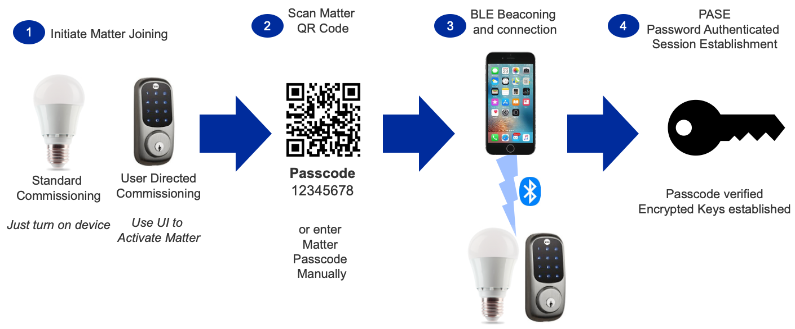
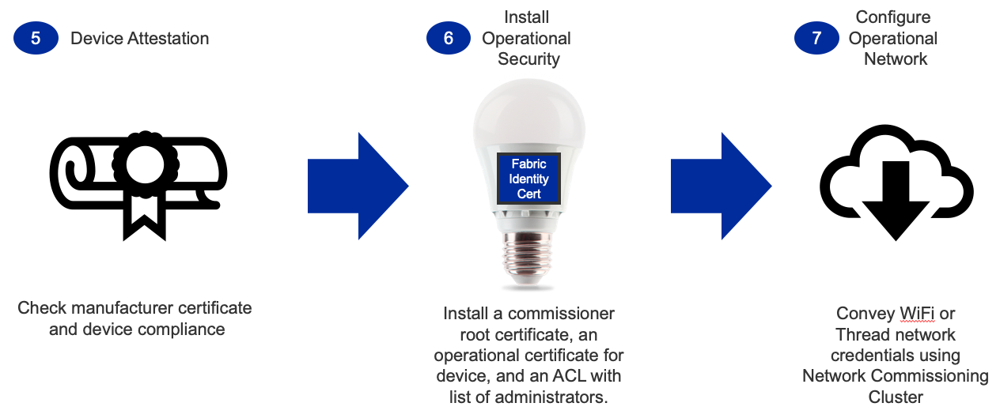
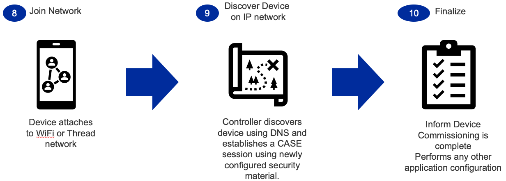

# Commissioning

## Overview

The commissioning process supports two potential starting points:

1. The device is already on the network
2. The device needs network credentials for Wi-Fi or Thread (requires Bluetooth LE (BLE) support)

The current Matter revision supports Ethernet, Wi-Fi, and Thread devices.

- Ethernet devices get into the operational network when their Ethernet cable is connected. Therefore the devices are normally already on the network before commissioning.
- Wi-Fi and Thread devices must have credentials configured before the devices can be joined into the operational network. This is normally done over BLE.

This page focuses on Wi-Fi and Thread. The first step for these devices is to enter commissioning mode, following one of two scenarios:  

| Scenario Name | Description |
| ------------------------- | ----------- |
| Standard | Device automatically goes into the commissioning mode on power-up. Beneficial for limited UI devices (such as light bulbs) |
| User-Directed | Device only enters commissioning mode when initiated by the user.  Helpful for devices that have user interfaces or for which commissioning should not be initiated without a user present. |

The following figure provides an overview of the commissioning process and the actions each role performs.

## Example Commissioning Flow

In step 1, the Matter device must enter commissioning mode in one of the two scenarios described above.

Usually, a mobile phone serves as the administrator. Step 2 is to use the mobile phone to scan the QR code of the Matter device. The QR code is used as a passcode to set up a secured BLE connection.

Step 3 is to set up the BLE beaconing and connection between the mobile phone and the Matter device, so that the commissioning information can be exchanged through the BLE connection channel.

As the connection should be secure, step 4 is to secure the connection in a process known as password-authenticated session establishment (**PASE**). The passcode derived from the QR code is used as an input for this process. The output is the security key used by the connection.

After the secured connection is established, step 5 is to verify the Matter device's manufacturer certificate and compliance status. Each Matter device must have a device certificate programmed before it is shipped. The mobile phone, acting as administrator, reads the device certificate through the commissioning channel, then communicates with a remote database to validate the certificate and the compliance status of the device. The remote database is called the Distributed Compliance Ledger (**DCL**).

Step 6 is to install the operational certificate for the device. The administrator either obtains the certificate from the remote server or generates the certificate locally and then transfers the certificate to the device. The administrator also configures the Access Control List (**ACL**) with the list of administrators.

After operational security is configured, step 7 is to configure the operational network for the device. For Wi-Fi devices, the SSID and the password are configured. For Thread devices, the PAN ID, network key, and other parameters are configured.

In step 8, the device starts to join the operational network with the configured parameters.

Once the device is attached to the network (step 9), it can be discovered through Service Registration Protocol (**SRP**). To control that device, you must establish a secured connection through the Certification Authorized Session Establishment (**CASE**) process.

After the CASE session is established, the Matter device is commissioned successfully and can communicate with other devices in the Matter network (step 10).
