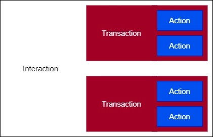
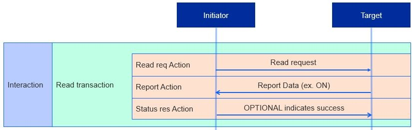
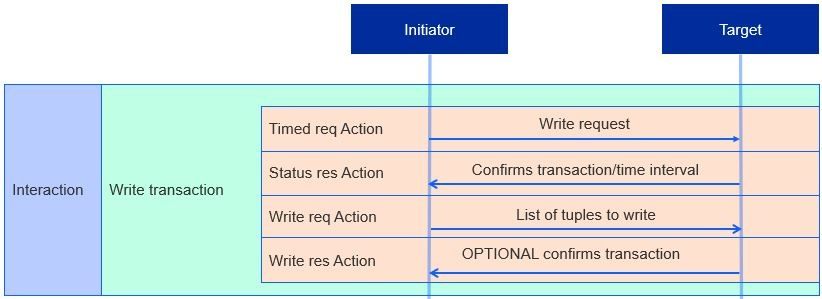
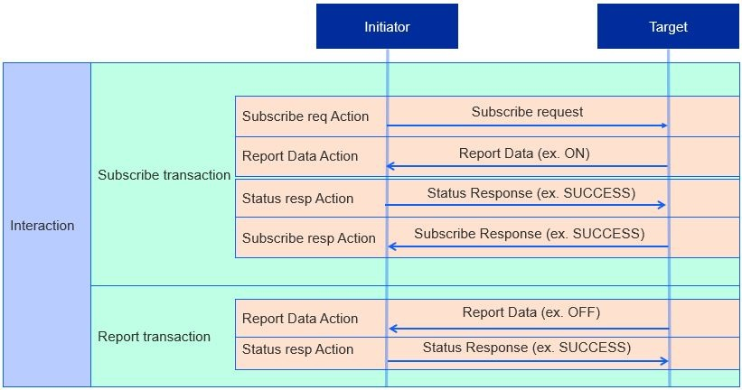

# The Matter Interaction Model

The Matter Device Interaction Model (IM) defines the methods of communication between nodes, and serves as the common language for node-to-node information transmission.

Nodes communicate with each other through interactions. Interactions are a sequence of transaction(s), which in turn are a sequence of actions.

For example, in a Read Interaction, a client cluster can initiate a Read Transaction, where the client can request to read an attribute and a server cluster can respond by reporting the attribute. Both the client request and the server response are separate actions, but they are part of the same Read Transaction, which the Read Interaction encompasses.

The Interaction Model supports four types of interactions:

- **Read**
- **Write**
- **Invoke**
- **Subscribe**

All interaction types except Subscribe consist of one transaction. The Interaction Model supports five types of transactions:

- **Read** - Get attributes and/or events from a server.
- **Write** - Modify attribute values.
- **Invoke** - Invoke cluster commands.
- **Subscribe** - Create subscription for clients to receive periodic updates from servers automatically.
- **Report** - Maintain the subscription for the Subscribe Interaction.

The following concepts are important for understanding transactions.

- **Initiators and Targets** - Interactions happen between an initiator node and target node(s). The initiator starts the transaction, and the target responds to the initiator's action. More specifically, the transaction is usually between a client cluster on the initiator node and a server cluster on the target node.
- **Transaction ID** - The transaction ID field must be present in all actions that are part of a transaction to indicate the logical grouping of the actions as part of one transaction. All actions that are part of the same transaction must have the same transaction ID.
- **Groups** - Groups of devices allow an initiator to send an action to multiple targets. This group-level communication is known as a groupcast, which leverages Ipv6 multicast messages.
- **Paths** - Paths are the location of the attribute, event, or command an interaction seeks to access. Examples of path assembly:

  - `<path> = <node> <endpoint> <cluster> <attribute / event / command>`
  - `<path> = <group ID> <attribute / event / command>`

  When groupcasting, a path may include the group or a wildcard operator to address several nodes simultaneously, decreasing the number of actions required and thus decreasing the response time of an interaction. Without groupcasting, humans may perceive latency between multiple devices reacting to an interaction. For example, when turning off a strip of lights, a path would include the group containing all the lights instead of turning off each light individually.

The following sections review each of the four interaction types and their constituent transactions and actions.

## The Read Interaction

An initiator starts a Read Interaction when it wants to determine the value of one or more of a target node's attributes or events. The following steps occur:

1. **Read Request Action** - Requests a list of the target’s attributes and/or events, along with paths to each
2. **Report Data Action** - Generated in response to the Read Request Action. Target sends back the requested list of attributes and/or events, a suppress response, and a subscription ID.

   1. Suppress response: Flag that indicates whether the status response should be sent or withheld.
   2. Subscription ID: Integer that identifies the subscription transaction, only included if the report is part of a Subscription Transaction.

3. **Status Response Action** (OPTIONAL) - Generates a Status Response by default; however, not sent if the suppress response flag is set. Ends transaction once the initiator sends the Status Response or receives a Report Data with the suppress flag set.

Read Transactions are restricted to unicast only. This means that the Read Request and Report Data actions cannot target groups of nodes, whereas the Status Response Action cannot be generated as a response to a groupcast.

## The Write Interaction

An initiator modifies a target’s attributes through a Write Interaction, which consists of either a Timed or Untimed Write Transaction.

An untimed transaction remains open to the receiver for an indefinite period, whereas a timed transaction establishes a maximum period (usually a few seconds) to receive a return action.

### Timed Transactions and Security

Timed transactions are mainly used for devices such as doors or locks because they protect assets and thus are a greater target for intercept attacks. To understand why timed transactions are effective it is important to understand the nature of intercept attacks:

1. The initiator node sends an initial message directed to the target node.
2. An attacker intercepts the message and holds it, preventing the message from reaching the target.
3. Since the initiator did not receive a message back from the target, the initiator sends another message.
4. The attacker intercepts this second message and sends the first message to the target, keeping the second message for later use.
5. The target receives the first message as if it were arriving from the initiator node, sending a confirmation response to the initiator node and, unknowingly, the attacker.

The problem lies in the second message; since the target never received the second message, the attacker now has a valid message to use at its convenience. The message may elicit a response from the target node such as “unlock” or “open door,” which means that the network now has a breach in security. By establishing a maximum period to receive a message back, a timed transaction effectively guards against intercept attacks. The attacker can no longer hold a message to use at its convenience, as the message will expire after a set time.

Although timed transactions are important in guarding against attacks, they increase the complexity of a network since they need more actions. Therefore, they are only recommended for use on transactions that give access to valuable information.

### Timed Write Transactions

A Timed Write Transaction consists of the following sequence of actions:

1. **Timed Request Action** - Sets the time interval to send a Write Request Action.
2. **Status Response Action** - Confirms the transaction and time interval.
3. **Write Request Action** - Requests three items:

    1. List of tuples (each tuple is called a write request) containing the path and data to be modified.
    2. Timed request flag indicating if the transaction is timed.
    3. Suppress response flag.

   If the transaction is timed and a timed request flag is set, the initiator must also send a timeout: the number of milliseconds the transaction remains open, during which the next action to be received is still valid.
4. **Write Response Action (OPTIONAL)** - A list of paths or error codes for every write request. Like a Read Transaction Status Response, a Write Response is not sent if the suppress response flag is set.

### Untimed Write Transactions

An Untimed Write Transaction requires only the Write Request Action and the Write Response Action Timed Write Transaction since there is no time interval that needs to be set or confirmed.

### Write Transaction Restrictions

Untimed and timed Write Transactions differ in their restrictions. All actions in timed transactions are unicast-only, whereas Untimed Write Request Actions may be multicast but require the Suppress Response flag to be set to prevent the network from flooding with status responses.

## Invoke Interaction

An initiator invokes command(s) on a target’s cluster(s) through Invoke Interactions. An Invoke Interaction consists of either a Timed or Untimed Invoke Transaction, just like a Write Interaction consists of a Timed or Untimed Write Transaction.

Just like a Timed Write Transaction, a Timed Invoke Transaction consists of the following steps:

1. **Timed Request Action** - Sets the time interval to send a Write Request Action.
2. **Status Response Action** - Confirms the transaction and time interval.
3. **Invoke Request Action** - Requests four items:

    1. List of paths to cluster commands (each item in the list is an invoke command which may optionally contain argument(s) for the command).
    2. Timed request flag.
    3. Suppress response flag.
    4. Interaction ID: Integer to match the Invoke Request to its corresponding Invoke Response.

   An Invoke Request initiating a timed Invoke Transaction must also send a timeout just like a timed Write Transaction.

4. **Invoke Response (OPTIONAL)** - Target responds by sending back the interaction ID and a list of invoke responses: command responses and statuses for each invoke request. Like a Write Response, an Invoke Response is not sent if the suppress response flag is set

Untimed and timed Invoke Transactions differ in the same way that untimed and timed Write Transactions differ, both in their actions and restrictions on unicast or multicast.

## Subscription Interaction

An initiator uses a Subscription Interaction to automatically receive periodic Report Data Transactions from the target. This creates a relationship between the initiator and target, which are referred to respectively as the subscriber and publisher after the subscription has been made.

Subscription Interactions include two transactions types: A Subscribe Transaction and Report Transaction.

### Subscribe Transaction

The Subscribe Transaction is as follows:

1. **Subscribe Request Action** - Requests three items:

    1. Min interval floor (minimum interval between Data Reports).
    2. Max interval ceiling (maximum interval between Data Reports).
    3. Request for attributes and/or events to be reported.

2. **Subscribe Request Action** - A Report Data Action containing the first batch of data, known as the Primed Published Data.
3. **Status Response Action** - Acknowledges the Report Data Action.
4. **Subscribe Response Action** - Finalizes the subscription ID (an integer that acts as an identifier for the subscription) and the min interval floor and max interval ceiling. Indicates a successful subscription between the subscriber and publisher.

### Report Transaction

After a successful subscription, Report Transactions are sent to the subscriber. There are two types of Report Transactions: non-empty and empty.

1. **Non-empty**

   1. Report Data Action - Reports data and/or events with the SuppressResponse flag set to FALSE
   2. Status Response - Indicates a successful report or an error, the latter of which ends the interaction

2. **Empty**

   1. Report Data Action - A report that has no data or events with the SuppressResponse flag set to TRUE, meaning no Status Response.

### Subscription Interaction Restrictions

Subscription Interactions have a few restrictions.

- First, the Subscribe Request and Subscribe Response actions are unicast-only, meaning an initiator cannot subscribe to more than one target simultaneously.
- Second, Report Data Actions in the same Subscription Interaction must have the same subscription ID.
- Third, a subscription may be ended if the subscriber responds to a Report Data Action with an “INACTIVE_SUBSCRIPTION” status or if the subscriber does not receive a Report Data Action within the max interval ceiling. The latter connotes that the publisher may end a subscription by not sending Report Data Actions.

## Relating Matter to Zigbee

The Matter Interaction Model originates from Chapter 2 in the Zigbee Cluster Library found here: [https://groups.csa-iot.org/wg/members-all/document/23019](https://groups.csa-iot.org/wg/members-all/document/23019); the Interaction model extends this by abstracting interactions from other layers (security, transport, message format, encoding). The Interaction Model fills in gaps in the Zigbee Cluster Library identified by the Matter Data Model Tiger Team, adding Multi-Element Message support, Synchronized Reporting, reduce message types in commands and actions, complex data type support in all messages, Events, and interception attack.

## Matter Specifications

More information on the Matter Interaction Model can be found in Chapter 8 of Matter Core Specifications [Specifications Download Request - CSA-IOT](https://csa-iot.org/developer-resource/specifications-download-request/).
