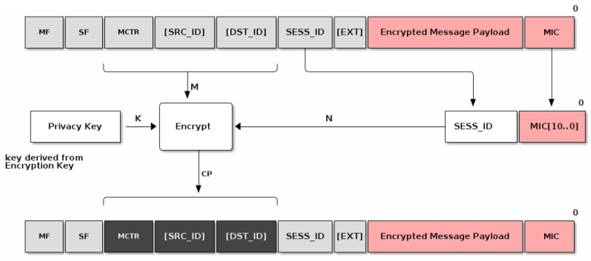
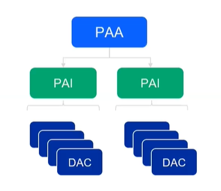
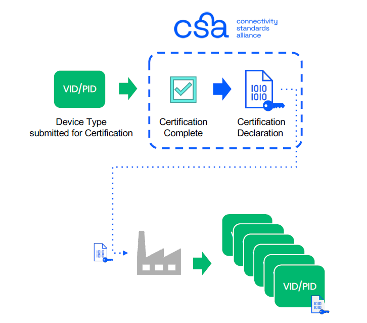
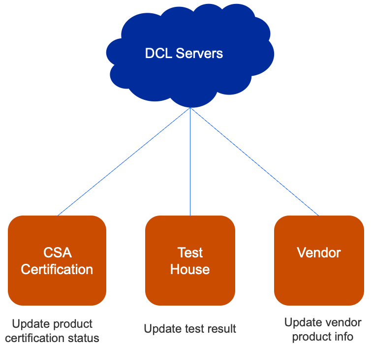
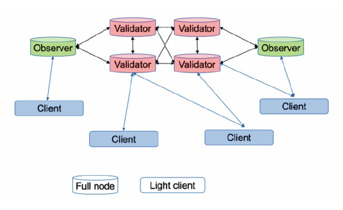
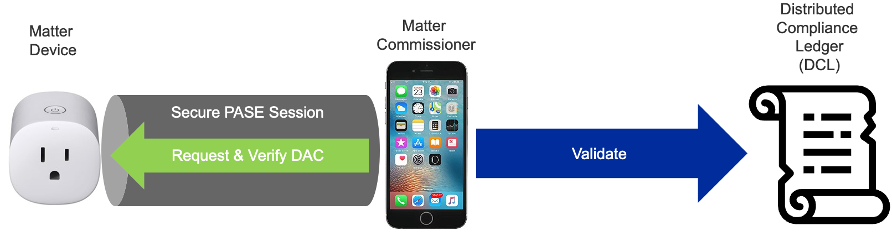
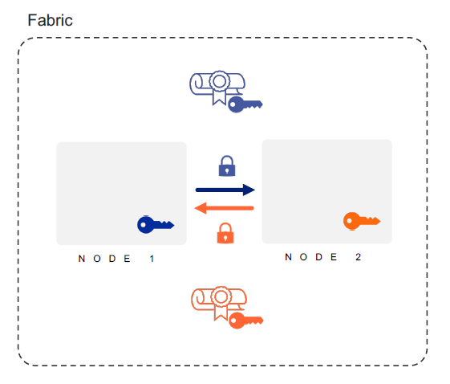
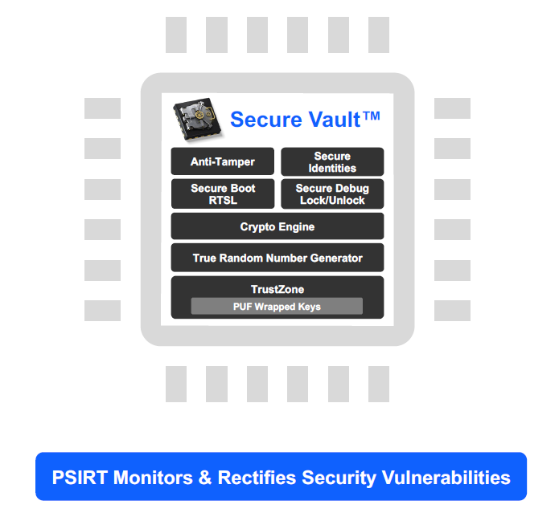
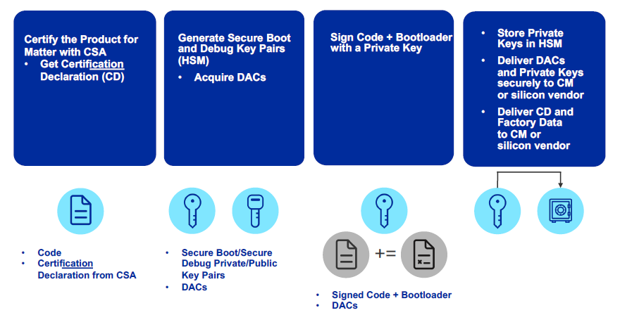
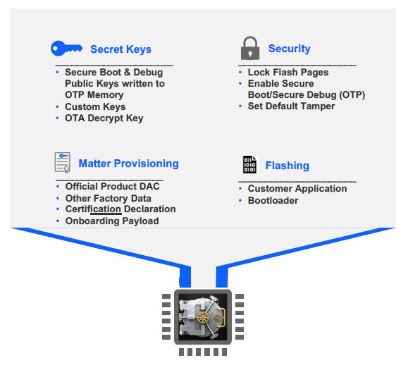

# Matter Security

Matter raises the bar on security to a new level beyond simply guaranteeing the communication pipe is secure. Now, the end device must be proven to be authentic. The Matter Node Security will likely raise over time. As threats evolve, the SHOULDs will become SHALLs. Creating Secure Identities and injecting them securely in your manufacturing process is not trivial and can be costly. Silicon Labs has the hardware, software, and services to get your secure Matter products to market quickly and cost effectively.

Register at [Silicon Labs Tech Talks](https://www.silabs.com/about-us/events/tech-talks-wireless-technology-training/matter) to watch a detailed on-demand discussion of Matter Security, along with other tech talks as part of the Interactive Matter Training Series.

>Note: All graphics were extracted from the Tech Talk, *Future-Proofing Matter Security with Secure Vault*, created by the Connectivity Standards Alliance (CSA) and used with permission.

## Principles

The following are the guiding principles for the Matter security design:

1. **No anonymous joining**: Always requires “proof of ownership” (that is, a device-specific passcode).
2. **Device Attestation**: Every device has unique identity that is authenticated by the manufacturer and verified through the CSA as a certified device.
3. **Operational Credentials**: When commissioned onto a Matter network, every device is given unique operational credentials after verifying their manufacturer credentials.
4. **Network Credentials**: The Wi-Fi network key or Thread Master key are not given until the device’s certificate is verified and authenticated properly.
5. **Open standard**: The open-source software is open to third parties vetting the claims by examining the standard and auditing the source code.

## Security Tenants Promoted by the Connectivity Standards Alliance (CSA)

1. Easy, secure, and flexible device commissioning
2. Validation that each device is authentic and certified
3. Up-to-date information via Distributed Compliance Ledger
4. Strong device identity so only your devices can join
5. Secured communications protecting confidentiality, etc.
6. Even group communications secured
7. Multiple administrators and controllers, maximizing choice
8. Verified access controls to prevent unauthorized actions
9. Secured, standard software updates
10. Remote monitoring of software integrity

## Matter Security Relevant Nomenclature

- **Node**: An independently addressable entity on a Matter network, which must be running an approved protocol (eg, Wi-Fi and Thread).
- **Device**: Anything that you take out of a box, such as a thermostat. Devices can have multiple nodes.
- **Router**: A standard router found in homes.  
- **Controller**: Controls multiple nodes on a network.
- **Commissioner**: Can commission multiple nodes on a network in three ways:

  - BLE (most common)
  - Wi-Fi AP protocol
  - Ethernet

Once commissioned, devices can start communicating on the Matter network via an approved protocol, usually Wi-Fi.

A **Bridge** bridges to other protocols, such as Zigbee or ZWave to allow other devices communicate in the network.

A **Border Router** is intended to perform the communication protocol translation between approved protocols. It does not bridge between other protocols.

**Device Identity** starts with an identity within the device called a device attestation certificate (DAC). Any device that needs to be commissioned needs a DAC. If the device is inherently trusted within the ecosystem that it's trying to join, it does not need a DAC. If not, it does need a DAC.

End devices are what need to be trusted.

## Matter Security Provisioning

### Certificates and Process Overview

Each Matter device gets two certificates. The first, the **device certificate**, is programmed by the manufacturer before the device is shipped. This will be used later for device attestation when trying to join the network. The other, the **operational certificate**, is assigned by the commissioner in the commissioning stage. Certificates natively use a CHIP TLV format but can convert to/from X.509 format. All devices are given an operational certificate to prove their authorization on the Matter network (fabric) and securely identify them.

Communication between Matter devices is protected with different keys in different stages. At the commissioning stage, the key is a result of the Password Authenticated Session Establishment (**PASE**) process over the commissioning channel using the passcode from the device's QR code as the input. During this initial setup, verification of possession of the passcode by both commissioner and joining device is confirmed. At the operational stage, the key is a result of the Certificate Authenticated Session Establishment (**CASE**) process over the operational channel using the operational certificate as the input. These sessions are used during normal operation between controller and device to validate that both are part of the Matter network.

### Message Protection

Various cryptographic algorithms are used to ensure communication security and integrity. These include:

- **Hashing Algorithm**: SHA\-256

- **Message Authentication**: HMAC-SHA\-256

- **Public Key**: ECC Curve NIST P\-256

- **Message Encryption**: AES\-CCM (128 bit keys)

**Confidentiality**: Message payload is encrypted by the encryption key (AES)

**Privacy**: Addresses are encrypted by the privacy key

### Onboarding Payload

The Onboarding Payload is the information used by the Commissioner to ensure interoperability between commissioners and devices. It can be encoded in different formats:

- Human-readable (numeric string)
- Machine-readable (QR code and NFC tag)

:::custom-table{width=25%,75%}
| Onboarding Payload Element | Description |
|-------------------------------------------|-------------|
| Version | Provides versioning of the payload. |
| Vendor ID | Assigned by CSA. Allows a way to identify the maker of the device. |
| Product ID | Vendor specified. Unique for each certified product within a Vendor ID. |
| Commissioning Flow | :para[Indicates to the Commissioner the steps needed before commissioning can take place.] :list[Standard commissioning flow: A device, when uncommissioned, always enters commissioning mode upon power-up. \n User-intent commissioning flow: Device requires user action (pressing a button, for example) to enter commissioning mode. \n Custom commissioning flow: Interaction with a service provided by the manufacturer is required for initial device setup.] {type=unordered} |
| Discovery Capabilities Bitmask | :para[Indicate device’s available technologies for device discovery:] :list[Soft-AP \n BLE \n On IP Network (device is already on the IP network)] {type=unordered} |
| Discriminator | Helps to further identify potential devices during the setup process. |
| Passcode | Establishes proof of possession and is also used as the shared secret for the initial secure channel before further onboarding steps. |
| TLV Data | :para[(Optional) TLV (Tag-length-value) data.] :para[Indicates manufacturer-specific information elements and/or elements common to Matter. For instance, kTag_NumberOfDevices: Number of devices that are expected to be onboarded using this payload when using the Enhanced Commissioning Method.] |
:::

## Commissioning Steps

There are four steps involved in commissioning devices to start communicating on a Matter network:

1. Device Discovery
2. Secure Channel (PASE)
3. Device Attestation
4. Configuration

### 1. Device Discovery

The focus of this phase is getting the onboarding payload. The steps are:

1. The Device announces its availability for commissioning over initial network.
2. The Commissioner finds the Device.
3. The Commissioner connects to the Device, using:

   - Discriminator
   - Vendor ID (optional)
   - Product ID (optional)

### 2. Secure Channel (PASE)

The focus of this phase is establishing a secure link. The steps are:

1. The Commissioner establishes a secure unicast channel to the Device.
2. Protocol PASE = Password Authenticated Session Establishment
3. Based on SPAKE2+ protocol
4. Uses:

   - Passcode
   - Verifier

Several key constructs are important to understand prior to understanding Device Attestation.

#### Public Key Infrastructure (PKI)

A PKI is a set of roles, policies, and procedures used to create, manage, distribute, and revoke digital certificates and manage public-key encryption. The Matter Certificate Policy defines the rules and
methods by which the Matter PKI Policy Authority (PKI-PA) is governed.

The Matter PKI for Device Attestation is comprised of:

- Certificate authorities:

  - PAA (Product Attestation Authority)
  - PAI (Product Attestation Intermediate)

- Authorized entities:

  - DAC (Device Attestation Certificate)
  
    

#### Certification Declaration

Another data construct that is necessary for Device Attestation is the Certification Declaration (CD), which is cryptographically signed by CSA and contains the Vender and Device information as well as the PAA of the device. The CD must be put into the Device during manufacturing to be used during the Device Attestation process. The Commissioner will ask for the stored CD during the commissioning of the Node.

#### Distributed Compliance Ledger

The Distributed Compliance Ledger (DCL) is the immutable single source of truth. It is a private blockchain-based distributed ledger of data records. Reading from the DCL is open to public, but writing to the DCL is restricted to various parties/roles. These roles typically include CSA certification, test house, and vendor roles.

It contains records about all certified devices, such as:

- Certification status
- Vendor ID (VID)
- Product ID (PID)
- Product name
- Part number and version
- Software and firmware versions
- Special commissioning instructions
- URLs to product pages and user manual

It also contains the Root PAA certificate for that Device, which is needed to complete the Device certificate chain verification. The DCL also contains the Certification Declaration ID number that will be compared with the CD pulled from the Device.

### 3. Device Attestation

Every device has a unique certificate that is signed by the manufacturer. There is no single root CA across all devices. During commissioning, the device is challenged to prove possession of the associated private key. The certificate can be validated against the Distributed Compliance Ledger (**DCL**) to verify device certification status.

The hierarchy allows for a 3-level tier:

- The first level is the Product Attestation Authority (PAA).
- The PAA will be used to sign the Product Attestation Intermediate (PAI).
- The PAI will be used to sign the Device Attestation Certificate (DAC). The DAC will be transferred to the commissioner and verified against the DCL.

The focus of this phase is to verify the authenticity of the Device. The high-level steps are:

1. The Commissioner verifies the Device’s:
   - VID
   - PID
   - Certification status
2. To do so, it uses:
   - Device Attestation Credentials
   - Distributed Compliance Ledger (DCL) or
   - Certification Declaration (CD)

DAC is retrieved and verified before the device joins the Thread or Wi-Fi network. The Commissioner issues a challenge to the device to prove it possesses the associated Private Key.

First, the Commissioner asks the Node for the CD, the PAI Certificate, and the DAC. It then pulls the Certificate ID, the PAA Certificate, and the Device VID/PID from the immutable root of trust DCL. At that point, it has all the information needed to perform the device attestation. The Commissioner then runs a certification chain check from the DAC to the PAI, and all certificates should chain together correctly. If that check is passed, the Commissioner takes the certification ID from the DCL and checks it against the CD ID that it pulled from the device itself to make sure the device is a genuine CSA certified device. The final step is to verify that the public key in the DAC pulled from the Matter device mathematically matches the private key inserted in the device during manufacture. This is done by sending a message to the device during this final step of Device Attestation, and having the message signed by the device and then the signature verified using the public key from the DAC.

#### Node Operational Credentials

The Node Operational Credentials enable a Node to identify itself within a Fabric. A Node receives its initial set of Node Operational Credentials when it is commissioned to a Fabric by a Commissioner.

The Node Operational Credentials include the following items:

- Node Operational Key Pair
- Node Operational Certificate (NOC)
- Intermediate Certificate Authority (ICA) Certificate (optional)
- Trusted Root Certificate Authority (CA) Certificate(s)

>Note: The Node Operational Credentials are distinct from the Device Attestation credentials.

#### Commissioning Process

The Commissioning process uses the DAC to establish that the Commissioner is talking to a certified Matter Device and then loads operational identities for each ecosystem that it joins.

### 4. Configuration

The Commissioner configures the Device by:

- Loading Node Operational Credentials per ecosystem:

  - Fabric ID
  - Node ID
  - Trusted Root Certificate
  - ICA Cert
  - Operational Cert
  - Node Operational Key Pair
  - Access Control List (ACL)
  - Operational Network
  - Time (optional)

- Establishing communication with other Nodes using CASE

This completes all the commissioning steps and now on the Matter Network.

## Matter Security Requirements

### Matter Security as Specified by CSA

**Manufacturing**: Matter Devices must be injected with a unique DAC certificate/private key, Onboarding Payload (QR code delivered), Certification Declaration (CD), and other static/dynamic data during manufacturing. (SHALL)

**Commissioning**: DAC with VID/PID must be checked against the DCL and CD verified to ensure only authentic and certified Matter Devices are commissioned. (SHALL)

**Device Communication**: Communication between Matter Devices must be secured and encrypted using cryptographic keys and PBKDF. (SHALL)

**Software Updates**: Devices must support OTA firmware updates to allow vulnerabilities to be patched. (SHALL)

### Other Security Specifications

- Authentication and encryption keys must be generated by a “Deterministic Random Bit Generator” seeded by NIST 800-90B TRNG. (SHALL)
- Debug interfaces and access to secure boot trust anchors should be disabled to only allow authorized access (fusing). (SHOULD)
- DACs and operational private key confidentiality should be protected from remote attacks. (SHOULD)
- Vendors should have a public policy and mechanism to identify and rectify security vulnerabilities in a timely manner. (SHOULD)
- The software should be encrypted *at rest* to prevent unauthorized access to core IP. (MAY)
- Some devices should be protected against *physical* attacks to prevent tampering, side-channel, or debug glitching attacks. (MAY)

### Matter Compliant Security Solution

- Secure Vault Mid or High supports all Matter security functionalities now (Shall) and future (Should, May)
- Uncrackable keys are generated by the True Random Number Generator (TRNG)
For DAC, secure boot, secure debug, OTA, software image and communication encryption
- The Crypto Engine assists with special algorithms like SPAKE2+ and CASE with side channel protection
- Secure key storage at PSA/SESIP Level 2 (Mid) and Level 3 (High); Private keys are stored with a TEE/TZ (SV Mid) or PUF Wrapped (SV
High)
- Secure Matter Identities (DACs) securely programmed at our factory
- Secure Boot with RTSL ensures code running on the device is trusted.
- Secure OTA firmware updates in conjunction with Secure
- Boot prevents the installation of malicious software and allows for vulnerability patching
- Glitch Mitigated Secure Debug Lock/Unlock only allow authorized access with security tokens that can be revoked
- Anti-Tamper protects from physical attacks (SV High)

  

## Matter Secure Manufacturing

The following diagram describes the high-level process of what needs to happen before secure programming.

The following diagram describes the high-levels steps as part of secure programming.

