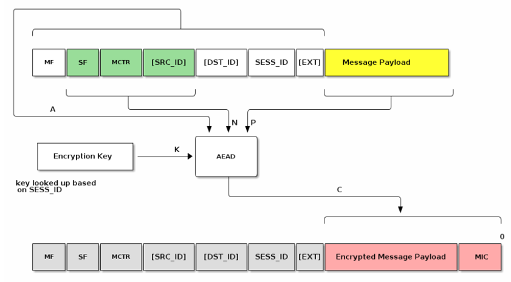
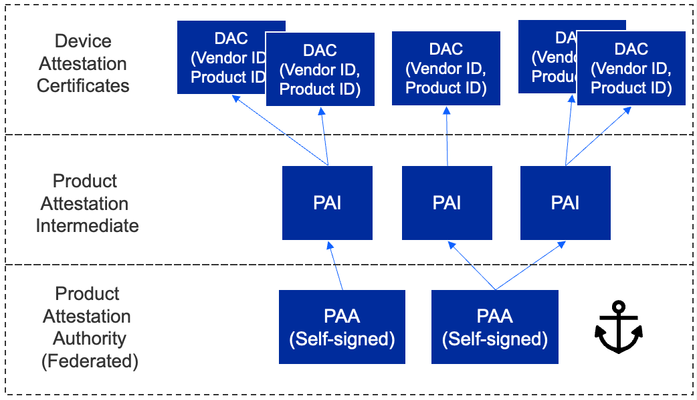

# Security

## General

Each Matter device gets two certificates. The first, the **device certificate**, is programmed by the manufacturer before the device is shipped. This will be used later for device attestation when trying to join the network. The other, the **operational certificate**, is assigned by the commissioner in the commissioning stage. Certificates natively use a CHIP TLV format but can convert to/from X.509 format. All devices are given an operational certificate to prove their authorization on the Matter network (fabric) and securely identify them.

Communication between Matter devices is protected with different keys in different stages. At the commissioning stage, the key is a result of the Password Authenticated Session Establishment (**PASE**) process over the commissioning channel using the passcode from the device's QR code as the input. During this initial setup, verification of possession of the passcode by both commissioner and joining device is confirmed. At the operational stage, the key is a result of the Certificate Authenticated Session Establishment (**CASE**) process over the operational channel using the operational certificate as the input. These sessions are used during normal operation between controller and device to validate that both are part of the Matter network.

### Principles - 

1. **No anonymous joining** - Always requires “proof of ownership” (that is, a device-specific passcode)

2. **Device Attestation** - Every device has unique identity that is authenticated by the manufacturer and verified through the CSA as a certified device

3. **Operational Credentials** - When commissioned onto a Matter network every device is given unique operational credentials after verifying their manufacturer credentials

4. **Network credentials are given only *after* device authentication** - Wi-Fi network key or Thread Master Key are not given until device’s certificate is verified

5. **Open standard and open-source software** - Open to third parties vetting the claims by examining the standard and auditing the source code

## Message Protection

Various cryptographic algorithms are used to ensure communication security and integrity. These include: 

- **Hashing Algorithm** - SHA\-256

- **Message Authentication** - HMAC-SHA\-256

- **Public Key** - ECC Curve NIST P\-256

- **Message Encryption** - AES\-CCM (128 bit keys)

**Confidentiality** - Message payload is encrypted by the encryption key (AES)

**Privacy** - Addresses are encrypted by the privacy key 

## Device Attestation

Every device has a unique certificate that is signed by the manufacturer. There is no single root CA across all devices. During commissioning the device is challenged to prove possession of the associated private key. The certificate can be validated against the Distributed Compliance Ledger (**DCL**) to verify device certification status

The hierarchy allows for a 3-level tier:

- The first level is the Product Attestation Authority (**PAA**)
- The PAA will be used to sign the Product Attestation Intermediate (**PAI**)
- The PAI will be used to sign the Device Attestation Certificate (**DAC**). The DAC will be transferred to the commissioner and verified against the DCL.

DAC is retrieved and verified before the device joins the Thread or Wi-Fi network. The Commissioner issues a challenge to the device to prove it possesses the associated Private Key.

## Distributed Compliance Ledger

DCL is a database of all certified products which includes:

- Certification status
- Product name / description / firmware URL
- Product certificates

Reading from the DCL is open to public, but writing to the DCL is restricted to various parties/roles. These roles typically include CSA certification, test house, and vendor roles.

----
[Table of Contents](../README.md) | [Thread Demo](../thread/DEMO_OVERVIEW.md) | [Wi-Fi Demo](../wifi/DEMO_OVERVIEW.md)