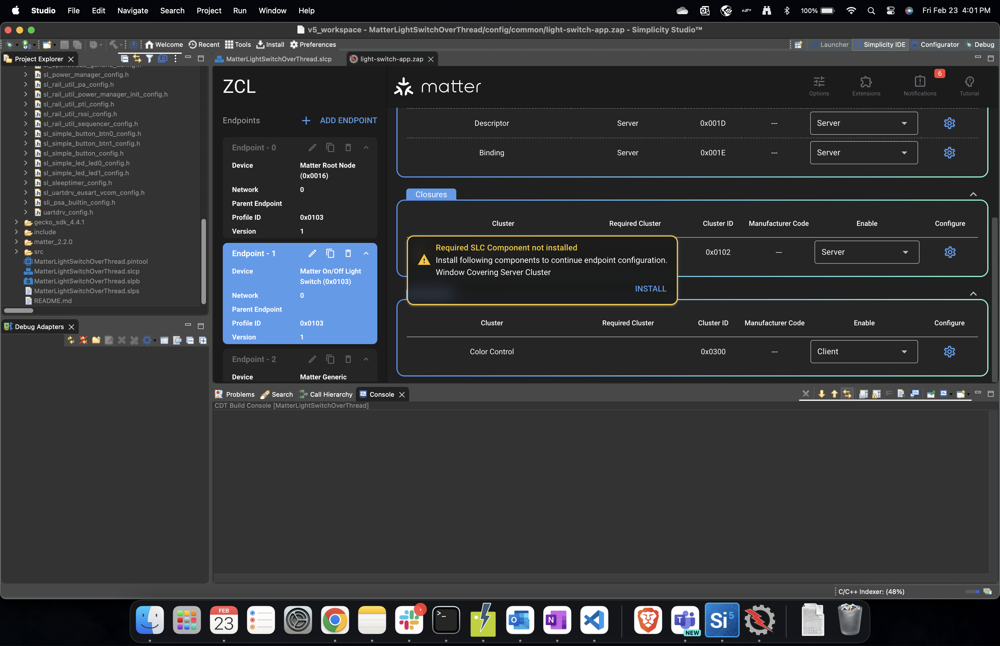

# SMG to Matter Extension (SLC/Simplicity Studio) Project Migration Guide 

Following describes instructions on how to migrate an already created project from SMG to SLC based project in Simplicity Studio. 

Assuming user has installed Simplicity studio ([Getting started with Simplicity Studio](https://docs.silabs.com/simplicity-studio-5-users-guide/latest/ss-5-users-guide-getting-started/)) and has an SMG project. 

1. Install the same release of GSDK used to create the SMG project and the mapped matter extension in Simplicity studio . Following table shows what GSDK and Matter Extension to be used depending on the SMG version of the project that you are trying to migrate.  

   |**SMG version**|**Matter Extension Version**|**GSDK Version**|
   | :-: | :-: | :-: |
   |[1.1.0-1.1](https://github.com/SiliconLabs/matter/releases/tag/v1.1.0-1.1)|[v2.0.0](https://github.com/SiliconLabs/matter_extension/releases/tag/v2.0.0)|[v4.3.0](https://github.com/SiliconLabs/gecko_sdk/tree/v4.3.0)|
   |[2.0.0-1.1](https://github.com/SiliconLabs/matter/releases/tag/v2.0.0-1.1)|[v2.1.0](https://github.com/SiliconLabs/matter_extension/releases/tag/v2.1.0)|[v4.3.1](https://github.com/SiliconLabs/gecko_sdk/releases/tag/v4.3.1)|
   |[2.1.0-1.1](https://github.com/SiliconLabs/matter/releases/tag/v2.1.0-1.1)|[v2.1.1](https://github.com/SiliconLabs/matter_extension/releases/tag/v2.1.1)|[v4.3.2](https://github.com/SiliconLabs/gecko_sdk/releases/tag/v4.3.2)|
   |[2.2.0-1.2](https://github.com/SiliconLabs/matter/releases/tag/v2.2.0-1.2)|[v2.2.0](https://github.com/SiliconLabs/matter_extension/releases/tag/v2.2.0) (Older Extension versions do not fully work with GSDK 4.4.x)|[v4.4.0](https://github.com/SiliconLabs/gecko_sdk/releases/tag/v4.4.0)|
   |2.3.0-1.3|v2.3.0-1.3 (expected June 2024) |TBD|

   > Note: New Matter 1.3 features available within SMG release v2.3.0-1.3 will not be available on the Matter Extension side until the expected corresponding Matter 1.3 June 2024 Matter Extension release.

   †Steps to add GSDK and matter extension to Simplicity Studio. Refer to [Install SDK Extensions](https://docs.silabs.com/simplicity-studio-5-users-guide/latest/ss-5-users-guide-getting-started/install-sdk-extensions).

   1. Once Simplicity Studio 5 is installed you will be prompted to install the Gecko SDK Suite (GSDK). Install the Matter Extension by making sure the extension is checked. This will install the latest GSDK as well as the Matter Extension.
   2. If using an older version of a GSDK corresponding to the SMG version of your project, install by: install -> Manage Installed Packages -> SDKs. Click on menu option next to GSDK version and change the desired version. 
   3. If you have changes in GSDK and want to use the same GSDK from SMG, complete step 1 and then install your specific GSDK by: preferences -> Simplicity Studio (dropdown) -> SDKs -> Add SDK. Browse to the SDK location. Trust the contents of this GSDK. Download the respective matter extension for that GSDK from [matter extension release page](https://github.com/SiliconLabs/matter_extension/releases), unzip it (make sure to keep `matter_extension` as the folder name) and add the matter extension to the previously added GSDK: Preferences -> Simplicity Studio (dropdown) -> SDKs -> (Select SDK) -> Add Extension, and browse to the extension location. Trust the contents of the extension. 
2. Create a sample app with the same board and same type. Select Simplicity IDE as project generator.  
   -  For example, if SMG project is lighting app for thread using board BRD4161A: Select BRD4161A in the New Project Wizard and then select SoC Lighting over thread in the Example project selection page. 
   -  For example, if SMG project is lock app for wifi RS9116 using board BRD4187C: Select BRD4187C in the New Project Wizard and then select NCP Lock over Wifi (with RS9116 in the description) in the Example project selection page.
3. **Build Flags:** Simplicity Studio has components which map to the build flags option in SMG build scripts. To configure the project through the component library, click the **SOFTWARE COMPONENTS** tab. A number of filters, as well as a keyword search, are available to help you explore the various component categories. Users can install/uninstall components to enable and disable certain functionalities.  
   
   The mapping is as follows:

   |**Build Flag**|**Simplicity Studio Component**|
   | :- | :- |
   |chip\_build\_libshell|Matter Shell|
   |chip\_logging|Matter Core Components , click on gear icon(configuration) and select the required logging level|
   |chip\_openthread\_ftd|Stack (FTD)Configure|
   |enable\_heap\_monitoring|Memory Monitoring|
   |enable\_openthread\_cli|OpenThread CLI|
   |kvs\_max\_entries|Matter Core Components , click on gear icon(configuration) and modify the Maximum amount of KVS Entries value. Default 255. Threshold: 30 <= kvs\_max\_entries <= 255|
   |show\_qr\_code|Matter QR Code Display|
   |chip\_enable\_icd\_server|Icd Management Server Cluster|
   |use\_rs9116 ,use\_SiWx917 , use\_wf200|Select the appropriate series-1, series-2 or Siw917Soc boards and select respective projects in new project wizard.|
   |'import("//with\_pw\_rpc.gni")'|Will be introduced in Matter Extension v2.3.0-1.3 release|
   |ota\_periodic\_query\_timeout\_sec|OTA Requestor, click on gear icon(configuration) and modify the  OTA Requestor periodic timeout|
   |rs91x\_wpa3\_transition|
Add the following statement to the project's SLCP file:

define:

- name: WIFI\_ENABLE\_SECURITY\_WPA3\_TRANSITION

value: "1"

|
   |slc\_gen\_path|Already part of studio project. No need to do anything|
   |sl\_pre\_gen\_path|Already part of studio project. No need to do anything|
   |sl\_matter\_version|Matter Core Components , click on gear icon(configuration) and select Device software version |
   |sl\_matter\_version\_str|Matter Core Components , click on gear icon(configuration) and select Device software version string|
   |sl\_hardware\_version|Matter Core Components , click on gear icon(configuration) and select Device hardware version |

   |**Presets**|**Simplicity Studio Component**|
   | :- | :- |
   |icd|
Icd Management Server Cluster

|
   |low-power|
Lower Power Mode

|
   |additional\_data\_advertising|GATT Additional Advertising|
   |use\_ot\_lib|OpenThread Certification Libraries|
   |use\_chip\_lwip\_lib|Matter LwIP|
   |release| Install Matter No Debug ,  remove Matter LCD|
   |uart\_log|
Add the following statement to the project's SLCP file:

define:

- name: SILABS\_LOG\_OUT\_UART

value: "1"

|
   |slc\_generate|Already part of studio project. No need to do anything|
   |slc\_reuse\_files|Already part of studio project. No need to do anything|
   |bootloader|Already part of studio project. No need to do anything|

4. Once the application is created in Studio, the user can locate all the project files in the **Project Explorer** menu on the left. 
5. Zap Changes: 
   1. If there are zap changes for the project, from project explorer menu of studio project, replace the zap file located at `config/common/<app-name>.zap` with the SMG project zap file.
   2. Do following to install the cluster components for enabled clusters , Click on <projectname>.slcp from project explorer menu -> Configuration Tools -> Open **Zigbee Cluster Configurator**.
   3. Select Enabled Clusters filter from Filters drop down in zap GUI.
   4. Go through list of enabled clusters and if shown warning, click on install to get the respective cluster components installed. 
   5. 
6. If there are code changes in the project files such as files located in `include/` and `src/`, replace the files from the SMG project to the respective `include/` and `src/` directories.
7. The matter stack and platform source files can be found in project explorer menu under the `matter_<version_number>` directory. You can move over all the files changed from the SMG project to the Studio project. 
8. If you have created new source files then depending on the IDE, users will need to:
   - For Simpliciy Studio IDE: copy them over to respective locations in the studio project.
   - For IAR EW: Make use of the `Add File` mechanism
   - For CMake or Makefile: Add using a custom CMake/Makefile subfile as described in their readmes or comments
9. Project should be ready to build and flash. 

## **Troubleshooting**

1. If you receive zap feature level error from studio please add the latest zap in studio by [following these instructions](https://docs.silabs.com/zap-tool/1.0.0/zap-users-guide/update-zap). 
1. Get Familiar with [Simplicity Studio Project Configurator](https://docs.silabs.com/simplicity-studio-5-users-guide/latest/ss-5-users-guide-developing-with-project-configurator/project-configurator).