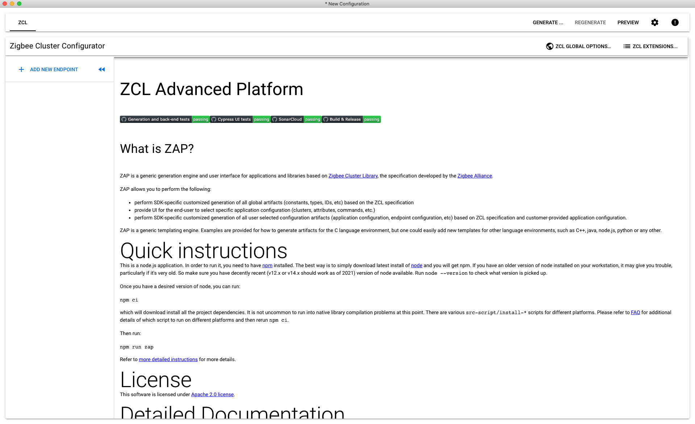
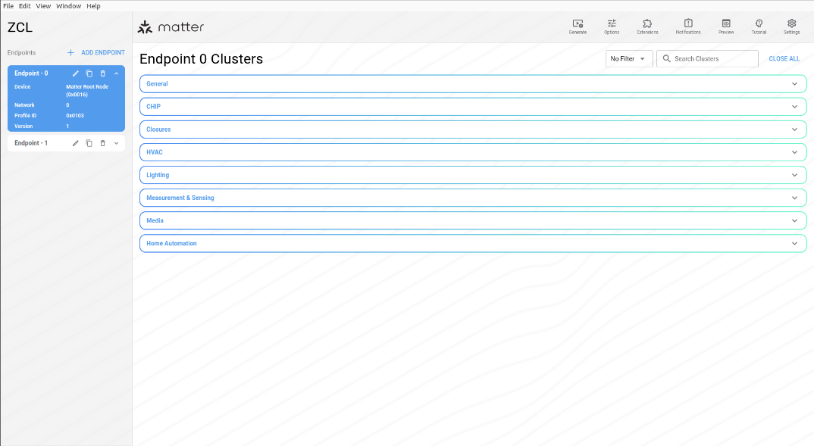
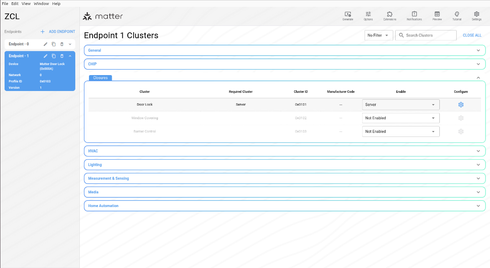
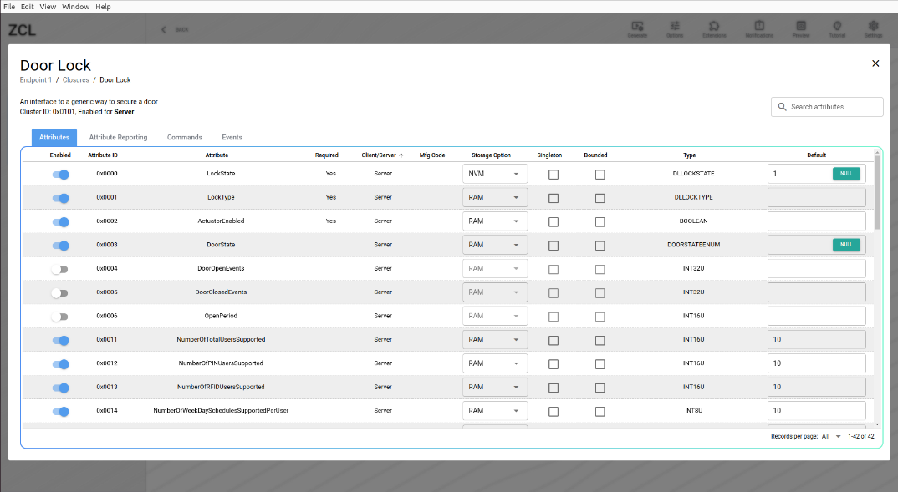
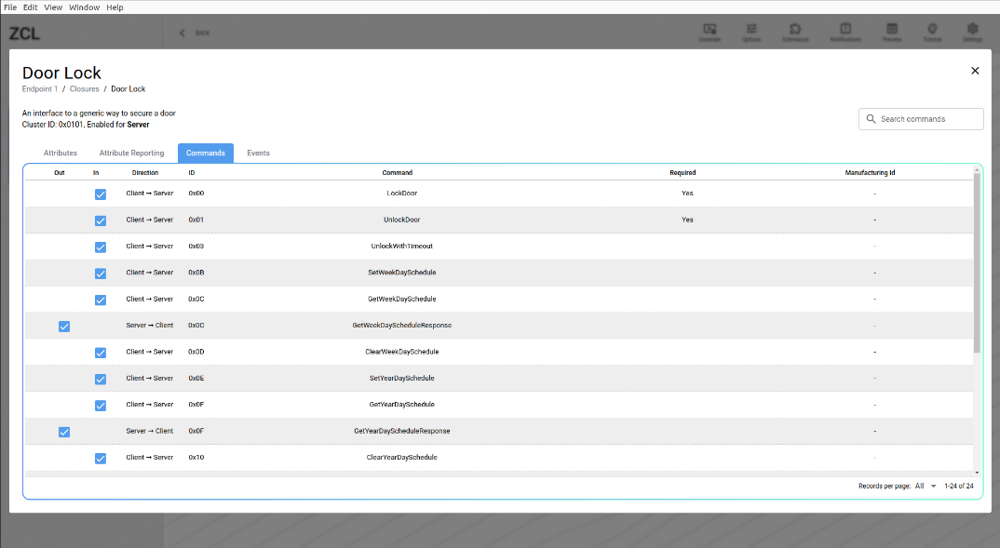

# ZCL Advanced Platform (ZAP) Tool for Matter

## Overview

EFR32 example applications provide a baseline demonstration of a lock device,
built using the Matter SDK and the Silicon Labs GeckoSDK. It can be controlled
by a CHIP controller over OpenThread network.

The EFR32 device can be commissioned over Bluetooth Low Energy (BLE) where the
device and the CHIP controller will exchange security information with the
Rendez-vous procedure. Thread Network credentials are provided to the EFR32
device which will then join the network.

The LCD on the Silicon Labs WSTK shows a QR Code containing the needed
commissioning information for the BLE connection and starting the Rendez-vous
procedure.

The lock example is intended to serve both as a means to explore the workings of
CHIP, and a template for creating real products on the Silicon Labs platform.

Each Matter application consists of the following layers:

- Matter SDK: Source code necessary to communicate through the Matter network over Thread or Wi-Fi
- Data model layer in the form of clusters. There are two types of clusters:
  - Utility Clusters:
    - They represent common management and diagnostic features of a Matter
            endpoint
    - Identify cluster is an example of a Utility Cluster. Given a Node
            ID, it can be used to Blink LED0 to the corresponding Silicon Labs WSTK
  - Application Clusters:
    - These clusters represent functionalities specific to a given
            application
    - Door Lock Cluster is an example of an Application specific cluster.
            This cluster contains commands to lock and unlock a door(door-lock is represented by an LED), with options to set passwords and lock schedules

## Clusters

Every Matter Application uses multiple clusters leveraged from the Zigbee
Cluster Library (ZCL). A cluster can be seen as a building block for the Data
Model of a Matter application. Clusters contains attributes, commands, and
events. Attributes are customizable variables specified by the Zigbee Advanced
Platform (ZAP) tool. Commands are sent to the application, which may respond with
data, LED flickering, lock actuation, etc. Events are notifications sent out by
the server.

An application can have multiple Matter endpoints. Application endpoints
generally refer to one device, and inherits its information from the "cluster"
it belongs to. Utility clusters are required to be on the endpoint with ID 0.
Application clusters are assigned to endpoints with IDs 1 and higher.

Some applications have callbacks that are left to be implemented by the device
manufacturer. For example, the storage and management of users and credentials in
the lock-app is left up to the application developer.

## ZAP Tool

The ZAP tool is built and maintained by Silicon Labs and developers in the ZAP
open source community. It inherits its name and features from the Zigbee Cluster
Library, which was the starting point for the Matter data model. ZAP is used for
generating code for Matter applications based on the Zigbee Cluster Library and
associated Matter code templates.

The ZAP tool is no longer present as a submodule in the Matter repo. The ZAP tool 
can be downloaded as a binary from GitHub or optionally you can clone the entire ZAP 
repo and build the ZAP binary from scratch.

ZAP binaries can be downloaded from the latest ZAP release here:

`https://github.com/project-chip/zap/releases/latest`

Optionally, the ZAP tool can be cloned using the following git command. This will create a
root level zap folder in your current directory. 

`$ git clone https://github.com/project-chip/zap.git`

The ZAP tool can be invoked using the `run_zaptool.sh` script located in the Matter repo at 
`./scripts/tools/zap/run_zaptool.sh`. Before you run this script you have to provide the location of the ZAP instance to be run. This is either the binary that you downloaded or 
the binary that you built from scratch in the ZAP repo. You can do this by setting the `ZAP_INSTALL_PATH` environment variable
like this:

`$ export ZAP_INSTALL_PATH=(path to your instance of the ZAP binary)`

The `run_zaptool.sh` script can be invoked without arguments, or, you can
provide the path to a ZAP file to be opened upon launch.

In the following examples, the ZAP file for the lock-app has been chosen.

`$ ./scripts/tools/zap/run_zaptool.sh ($PATH_TO_ZAP_FILE)`

ZAP files for the various sample applications are included in the sample applications `data_model` directory such as

`./examples/lighting-app/silabs/efr32/data_model/lighting-thread-app.zap`.

This shows the output of the `run_zaptool` script with no arguments. To load a new
zap file, click the application menu for Electron (Upper left corner of the
screen for macs), then click "Open File". Then navigate to the desired .zap
file.

This shows the output of the run_zaptool script with a zap file given as an
argument, or after a .zap file has been opened in the ZAP UI. An Electron
application will open, pre-loaded with the information from the .zap file
provided as a command line argument.

The Out of the box (OOB) example lock application has 2 endpoints. Endpoint 0 is
called the root node. It contains all Service and Device management clusters. In
general, any cluster or feature that is not specific to a device type belongs in
Endpoint 0. Examples of clusters one might find in Endpoint 0: Device Descriptor
cluster, Network Diagnostics cluster.

Endpoint 1 contains information specific to the device type. Conveniently, the
ZAP tool offers a Door lock cluster, which contains Commands (lock, unlock, set
credential, and so on) and Attributes (Lock state, Require PIN) that a standard door
lock application might use.

More endpoints can be added. Each endpoint acts like a port on a network
interface.

Endpoints contain clusters which are bundles of device functionality. Clusters
have both a Client and a Server interface. In general the Client interface sends
commands and the Server interface receives them. For instance a Light would
implement the Server side of the on/off clusters. A Switch would implement the
Client side of the same cluster.

Click on Endpoint 1 on the left hand side of the application. The door lock
cluster should already be enabled as "Server".

## Attributes

Attributes are analogous to member variables of a class. Each attribute is
provided with generated setter/getter code from the ZAP tool. They can be
enabled or disabled for each cluster on a Matter endpoint. Some attributes are
required to be enabled, else the application will not function properly. There
is an option to add attributes to either the server code or client code. The ZAP
tool also allows you choose a storage space for attributes. Attributes can be
stored in standard RAM, Non-volatile memory or external memory. Each attribute
has a type, some are standard C types and some have specially defined enums.
Each attribute can be provided with a default starting value value.

Click the settings wheel to enable/disable, choose a storage option, and choose
a default value for attributes, commands and events for Endpoint 1.

## Commands

Commands can be enabled/disabled like attributes. Some commands are required for
an application to function properly. Many of the functions run when a command is
received are implemented on the server side. But some of these are left up to
the application to define. In the EFR32 lock example, the set/get user and
credential functions are customizable as each implementation of a lock might
store these differently.

## Generation of Code

Once you have chosen the cluster options, save the current ZAP configuration using the application menu in the upper left corner. 

Before v1.1.0-1.1 you needed to click the Generate button to generate code. Now, code is generated automatically in the save function. You will be prompted to choose a save location for the generated ZAP code. In the Silicon Labs Matter repository, the lock-app generated files belong in 
matter/zzz_generated/lock-app/zap-generated.