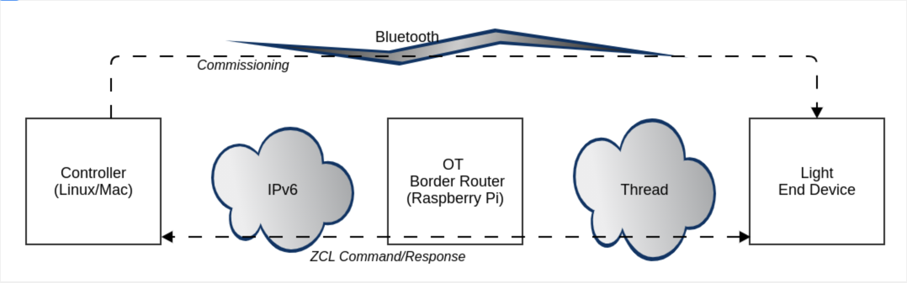

[<< Back to TOC](../README.md)

# Introduction

**Matter 15.4 Setup** 

A typical simple Matter 15.4 (Thread) network is setup as shown in the image
above. It consists of the following 4 elements:

1.  A **Controller** such as an app running on a phone or the ChipTool running
    on a Linux box or Raspberry PI
2.  An Open Thread Border Router (**OTBR**) running on a Linux box or Raspberry
    Pi
3.  A Radio Co-Processor (**RCP**) which the OTBR uses to communicate with
    Thread network
4.  An End Device such as a light or switch, which is the Matter Accessory
    Device (**MAD**)

The flow of the setup described above is as follows:

1. The controller commissions the End Device directly over Bluetooth – this
   makes the End Device join the Thread network and the CHIP fabric.
2. After commissioning, the Bluetooth connection is terminated and all further
   communication is done over Matter.
3. The controller sends ZCL commands, such as the OnOff Toggle, and the End
   Device performs the corresponding action; in the case of the OnOff Toggle,
   this would turn the LED of the End Device on or off

 

There are a few different ways that a Matter network can be built using a
combination of Silicon Labs hardware, a Raspberry Pi, and any external
controller(Macbook, Ubuntu, Android, etc.)

The suggested method involves using a Raspberry Pi to function as both, the
controller, and the OTBR, with a Silicon Labs device as the MAD.

An alternate configuration would be using a Macbook as the controller, a
Raspberry Pi as the OTBR, with a Silicon Labs Device as the MAD. This requires
additional routing between the controller and OTBR.
