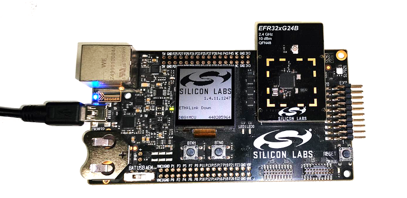
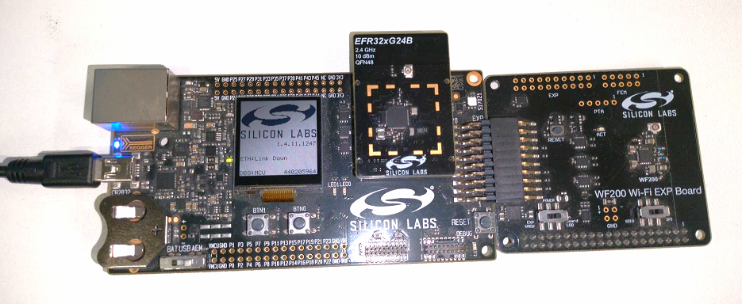
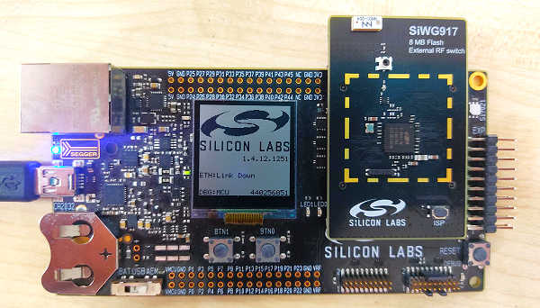
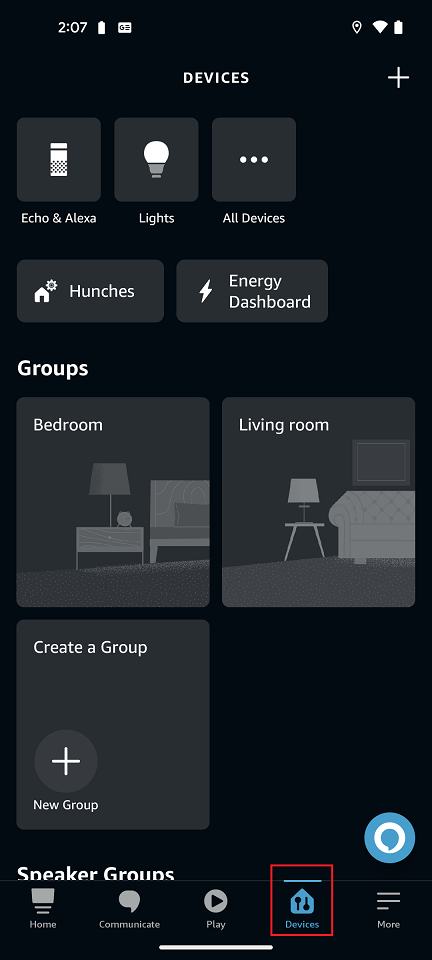
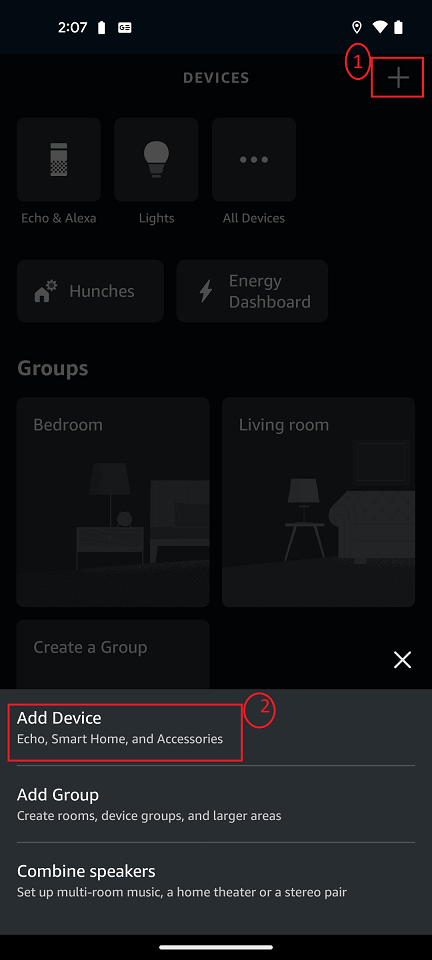
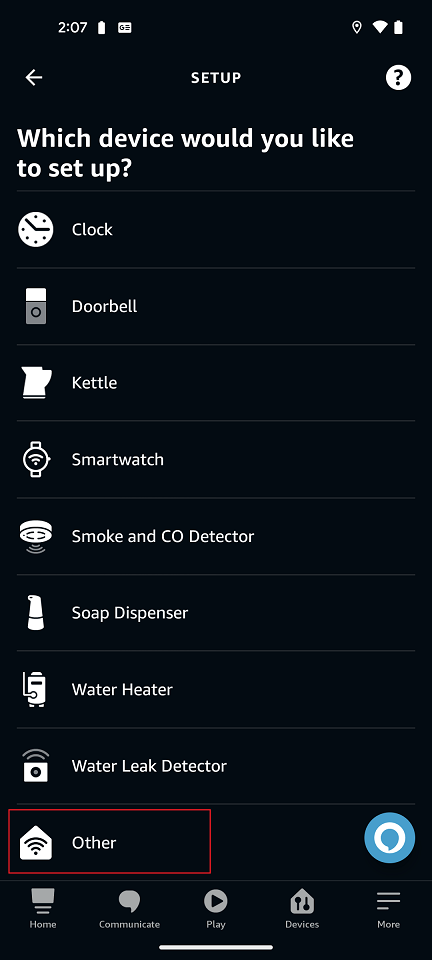
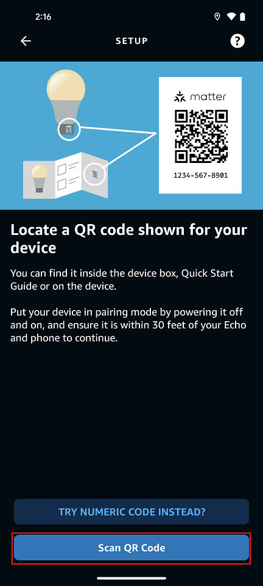
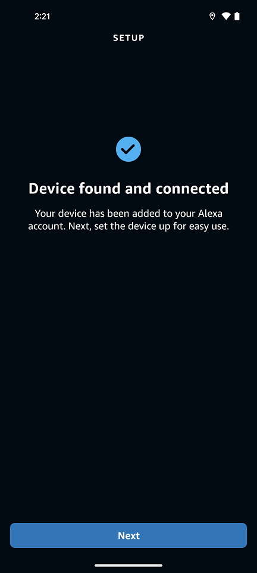
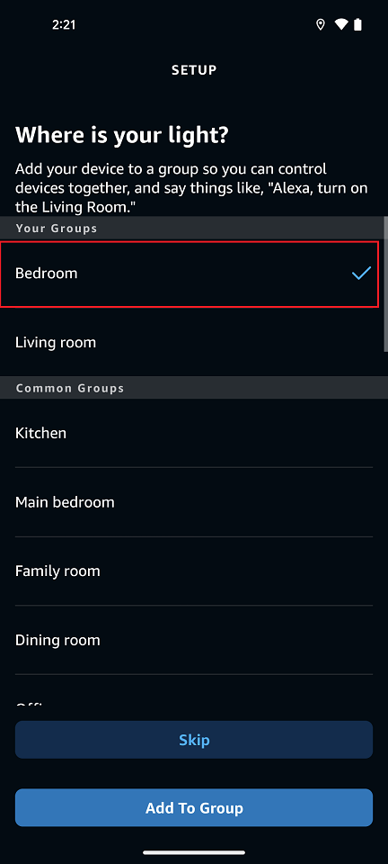
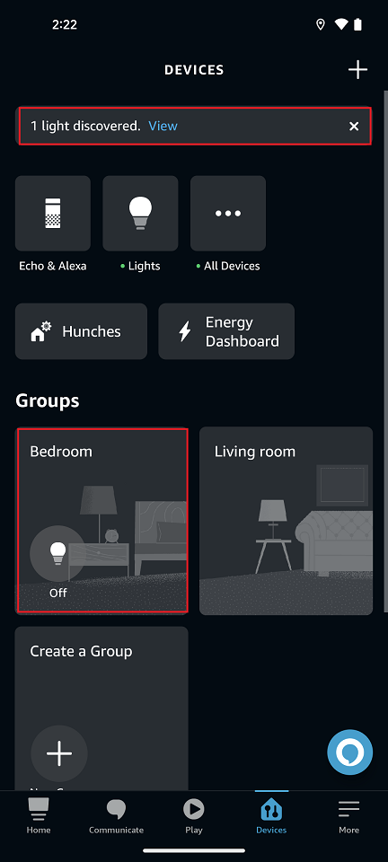

# Amazon Ecosystem Setup and Demo Execution

## Hardware Requirements

- For the hardware required for an Amazon EcoSystem, refer [Ecosystem Prerequisites section](./ECOSYSTEM_SETUP.md#prerequisites)

## Software Requirements

- Amazon account
- Amazon Alexa App on a smartphone. refer [smartphone to control section](./ECOSYSTEM_SETUP.md#smartphone-to-control-ecosystem)

## Amazon Alexa and Android Smart Phone Setup

### Amazon Alexa MSS (Matter Simple Setup)

As part of partnership with Amazon, the following link contains information required for Matter device certification with Amazon. 

[https://developer.amazon.com/docs/frustration-free-setup/matter-simple-setup-for-wifi-overview.html](https://developer.amazon.com/docs/frustration-free-setup/matter-simple-setup-for-wifi-overview.html)

In the context of MSS for Wi-Fi, the provisionee, or commissionee, is the device that is to be automatically set up. If you want to make your device eligible to be an MSS commissionee, you must satisfy the following:

  1. Configure the device to beacon over Bluetooth LE (BLE) with specific fields needed for MSS for Wi-Fi (detailed below).
  
  2. Onboard your device via the FFS developer portal by creating a Matter new device type. On the developer portal, you will manage your FFS onboarding lifecycle tasks, like managing your test devices and manufacturing data and submitting for certification.
  
  3. Integrate a unique barcode on your device packaging. You can also use an existing unique barcode on your packaging, such as a serial number, or MAC address.
  
  4. Share your device control log data with Amazon services. Control Logs are a mechanism that allows manufacturers to provide Amazon with unique device identifiers and authentication material, such as the Matter passcode, that are critical to ensure a frictionless customer setup. The unique package barcode is associated with your device identifier through the control logs. See the Matter Control Logs section for more details.
  
  5. Complete Frustration-Free Setup certification and Amazon ASIN onboarding. Review the certification section below for more information.

### Amazon Alexa Setup

Refer to [Set up Alexa in a Few Easy Steps](https://www.amazon.com/alexa-setup-guide/b?ie=UTF8&node=17978645011).

## Matter Demo Execution using Amazon Alexa

1. Build Matter Application by referring page
  [Build MATTER Application](./SW_SETUP.md)

2. To Connect a board to a computer follow below steps

    - For Wi-Fi NCP Mode Boards
        1. Mount the EFx32 radio board on the EFx32 WSTK board.
        
           
        2. Connect the NCP expansion board to the EXP header on the EFx32 WSTK board.
        
           
        3. Toggle the upper switch on the NCP expansion board to EXP-UART.
    
    - For Wi-Fi SOC Mode Boards
        1. Mount the SiWx917 radio board on the SiWx917 WSTK board.
    
            
    
        2. Connect your SiWx917 Wireless Starter Kit (WSTK) board to your computer using a USB cable.

3. Flash the bootloader binary for your device along with the application (e.g., lighting , lock, thermostat, window covering, light-switch).
   - For Wi-Fi NCP Mode Boards [Follow the instructions in this link to flash binaries](../general/FLASH_SILABS_DEVICE.md)
   - For Wi-Fi SOC Mode Boards [Follow the instructions in this link to flash binaries](../general/FLASH_SILABS_SiWx917_SOC_DEVICE.md)

4. Once the Amazon Alexa setup is done, make sure echo dot is ready.

5. Make sure Matter Application is flashed into the Matter Device (for example, EFR32MG24, SiWx917 SoC, SiWx917 NCP).

6. In the Alexa App, tap **Devices section**.

    

7. Then, tap "+" at top right corner. Three options are displayed: 

   - Add device
   - Add group
   - Combine speakers

8. Tap **Add device**.  Several options are displayed.

    

9. Scroll down and select **other** option.

    

10. Logos such as “Matter”, “Bluetooth”, “Zigbee”, “Wi-fi”, “Z-wave" are displayed. Tap the “Matter” logo.

    

11. Alexa App will ask "Does your device have a matter logo?" Select "Yes".
12. Alexa will be prompted to "Locate a QR code shown for your device." Select **Scan QR Code**.
 
    

13. After scanning the QR code through a smartphone camera, verify Commissioning is started by checking the Device logs.

14. Once commissioning is triggered the Alexa app will prompt for Access Point Credentials. Add them. 

15. After Access Point Credentials are provided the device will join to the network and commissioning is completed.

    

16. Next, select a group for your device (for example, Bedroom), and click **Add to Group**.

    

17. Now the application is ready to use. You can see the Matter application in Amazon Alexa app inside the **Groups Panel** at the **Bedroom** tab.

    

In the Amazon Alexa app, you will now be able to tap your light to turn it ON and OFF. You can also control the light by giving a voice command (for example, 'Hey Alexa! Turn ON Light') and through the app user interface.

The LED1 on your WSTK board will turn on or off depending on the command you enter.

## Deleting Matter Application from Amazon Alexa

1. Click Matter Application for detailed view.
2. Click **Setting** button on top right corner.
3. Select **Dustbin Button** on top right corner, it will prompt **Remove "First light"**. Click **DELETE**.