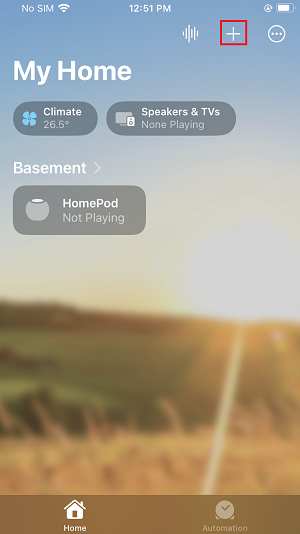
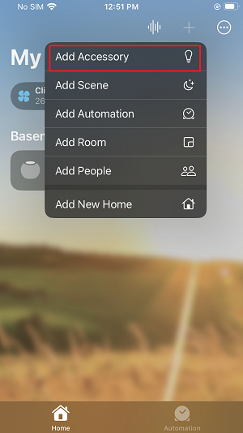
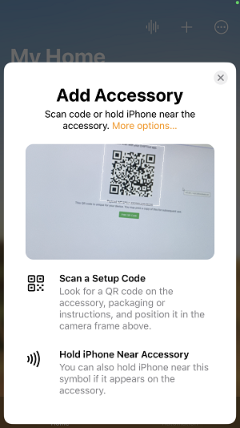

# Apple Ecosystem Setup and Demo Execution

This guide describes how to setup Apple Ecosystem for Matter and test Matter Application using Apple Home Pod Mini.

## Hardware Requirements
Hardware Required for Apple EcoSystem [Refer Ecosystem overview Perquisites Section](./ECOSYSTEM_SETUP.md#prerequisites)
## Software Requirements
-  Apple Account
-  Apple Home App on Smartphone

   **Note:** Only With IOS version-16.1 or more Apple has matter support
## Setup of Apple HomePod and Apple Phone
[Refer Official Set up HomePod or HomePod mini](https://support.apple.com/en-in/HT208241)

## Matter Demo Execution using Apple Homepod

1. Build Matter Application by referring page
  [Build MATTER Application](./SW_SETUP.md)

2. To Connect Board to a Computer follow below steps
    - For Wi-Fi NCP Mode Boards
        1. Mount the EFx32 radio board on the EFx32 WSTK board.
          
         
      
        2. Connect the NCP expansion board to the EXP header on the EFx32 WSTK board.
          
         
    
        3. Toggle the upper switch on the NCP expansion board to EXP-UART.
    
    - For Wi-Fi SOC Mode Boards
        1. Mount the SiWx917 radio board on the SiWx917 WSTK board.

         

        2. Connect your SiWx917 Wireless Starter Kit (WSTK) board to your computer using a USB cable.

3. Flash the bootloader binary for your device along with the application (e.g., lighting , lock, thermostat, window covering, light-switch).
   - For Wi-Fi NCP Mode Boards [Follow the instructions in this link to flash binaries](../general/FLASH_SILABS_DEVICE.md)
   - For Wi-Fi SOC Mode Boards [Follow the instructions in this link to flash binaries](../general/FLASH_SILABS_SiWx917_SOC_DEVICE.md)

4. In Apple Home App Click on "+" button.
      
      

5. Select **Add Accessory**

      

6. It will prompt for Scanning QR Code using Mobile Camera.
      
      

7. Plug Device to computer and scan the QR code within the Home app.

8. Proceed to add the device to your home. You should see LED0 fast blinking when commissioning happens.

9. Once commission is done Apple Home app will ask for **select One Room** to add your Matter application. Select any room as per your choice and give Application name. (For Example: Light, Lock)

## Control the Light via Apple Home App
- In the Apple Home app, you will now be able to tap your light to turn it ON and OFF.
- You can control the light by giving a voice command (for example, 'Hey Siri! Turn ON Light') and through the app user interface.
- You will see the LED1 on your WSTK board turned on or off depending on the command you enter.

## Deleting Matter Application From Apple Home

1. Click on Matter Application for detailed view.
2. Scroll Down at the end.
3. Select **Remove Accessory**.
4. It will prompt to remove from **My Home** select it and your Matter Application is removed from Apple Home.

**Note**:- Removing Matter Application from Apple Home App it will remove from Apple Home Pod as well.