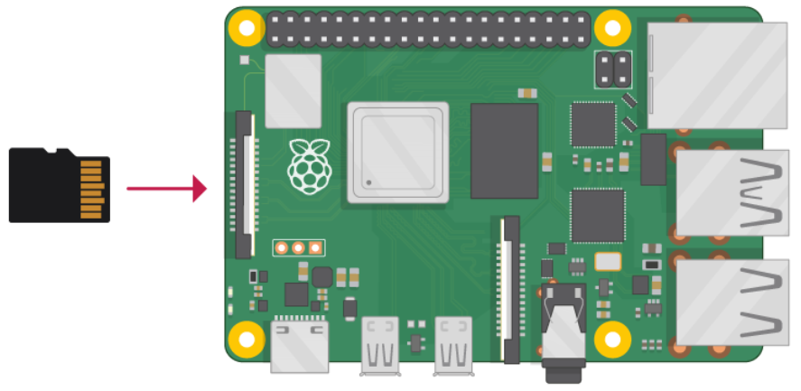

[<< Back to TOC](../README.md)

# Building Environment using Raspberry Pi 4

1. Flash the Ubuntu OS onto the SD card
2. Insert the flashed SD card (directly or using a card reader) into the
   laptop/PC that will run the Raspberry Pi Imager tool
3. Launch Raspberry Pi 4 Imager
4. Click on 'Choose OS' --> 'Other General-purpose OS' --> 'Ubuntu' --> 'Ubuntu 22.04 64-bit server OS'
5. Click 'Storage' and select the 'SD card detect'
6. This Raspberry Pi 4's console can be accessed in multiple ways, refer to:
   https://www.raspberrypi.com/documentation/computers/remote-access.html
7. In this guide, Raspberru Pi 4 is being accessed using Putty. Enter the
   details like User name, Password, SSID and it's password to connect to
   network. Then, click 'Save'
8. Click 'Write' and then 'Yes' when you are asked for permission to erase data
   on the SD card. It will then start flashing the OS onto the SD card
9. When it is done, click 'Continue'
10. Remove the SD card from the reader and insert it into the Raspberry Pi as
    shown below:

<!--  -->

11. On powering up the board, the red and green lights should start blinking
12. Use this reference to find the IP address of your Raspberry Pi: [Finding Your Raspberry Pi](../general/FIND_RASPI.md)
13. Once you find the IP address, launch Putty, select 'Session', enter the IP
    address of the Raspberry Pi, and click 'Open'
14. Enter the username and password given at the time of flashing and click
    'Enter'
    If you don't give username and password default is user account "ubuntu" and password "ubuntu",

15. Update the latest packages by running following commands in the terminal:

    > `$ sudo apt update`

    > `$ sudo apt install`

16. Install required packages using the following commands:

    > `$ sudo apt-get install git gcc g++ pkg-config libssl-dev libdbus-1-dev \
     libglib2.0-dev libavahi-client-dev ninja-build python3-venv python3-dev \
     python3-pip unzip libgirepository1.0-dev libcairo2-dev libreadline-dev'

     
    > If you see any popups between installs, you can select 'Ok' or 'Continue'

## Installing prerequisites on Raspberry Pi 4
   Finally, install some Raspberry Pi specific dependencies

    refer this link : https://github.com/project-chip/connectedhomeip/blob/master/docs/guides/BUILDING.md
    In above link follow section "Installing prerequisites on Raspberry Pi 4".

## Bluetooth setup
   Make sure BLE is up and running on Raspberry-Pi.
   Raspberry pi internally has some issue in BLE and sometimes it crash in middle, BLE is used for
   commissioning purpose on Matter So make sure BLE is running.

   Use below commands to turn on or restart bluetooth on Raspberry - Pi.

   To stop BLE if it is already running.
   `$ sudo systemctl stop bluetooth.service`

   To restart the Bluetooth service, we need to enable it first as we did before. Hence, we have been using the same systemctl command with a one word change e.g. enable.
   `$ sudo systemctl enable bluetooth.service`

   When you check the status of a Bluetooth service, you will find it inactive because we haven’t restarted the service yet.
   `$ sudo systemctl status bluetooth.service`

   So, one needs to restart the Bluetooth service to make it active and running. So we have executed the query below.
   `$ sudo systemctl restart bluetooth.service`

   After this command, when we have checked the status of the Bluetooth service, we found it active and running.
   `$ sudo systemctl status bluetooth.service`
