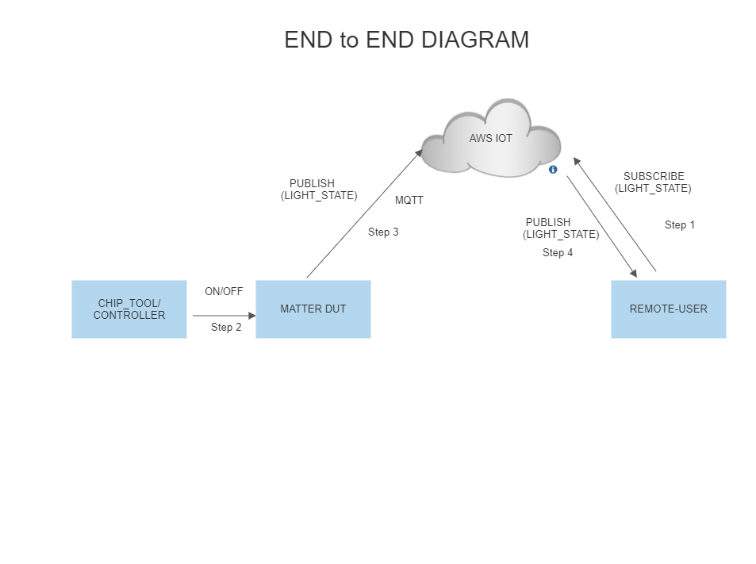
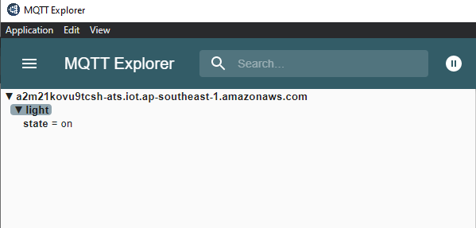
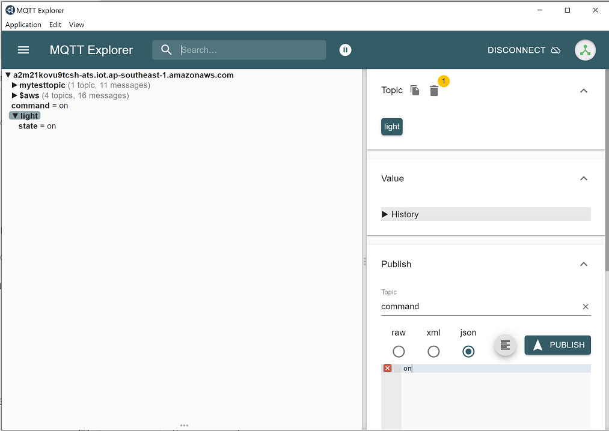
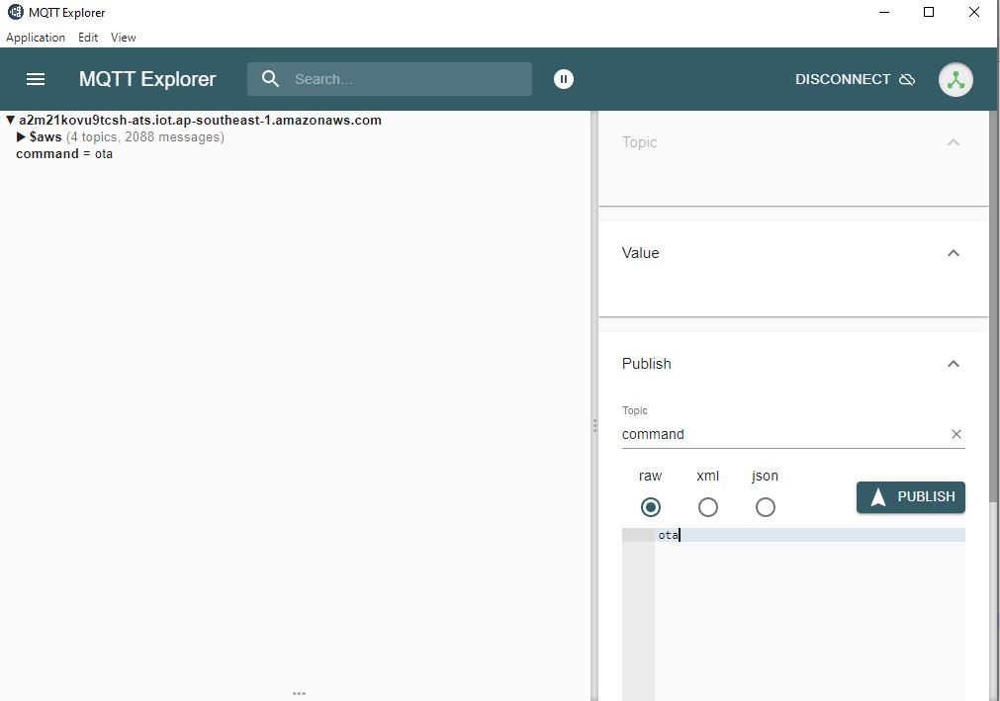

# Matter Wi-Fi Direct Internet Connectivity
-  Direct Internet Connectivity (DIC) is a silabs only feature to connect matter devices to proprietary cloud solutions(AWS,GCP,APPLE ...) directly.  As such, a Matter Wi-Fi device must support connecting locally on the Matter Fabric, via IPv6, and connecting to the Internet via IPv4.
-  Matter devices can be controlled by chip-tool or controller and the respective status of the attribute modified will be published to the cloud.
-  Remote user can install the cloud specific application to get the notification on the attribute status.

## Feature Design

## End-to-End Set-up bring up
## Message Queuing Telemetry Transport (MQTT)
- MQTT is an OASIS standard messaging protocol for the Internet of Things (IoT). It is designed as an extremely lightweight publish/subscribe messaging transport that is ideal for connecting remote devices with a small code footprint and minimal network bandwidth. Refer https://mqtt.org/ for more details

### Configuration of MQTT server
To set up and configure AWS or Mosquitto for DIC support please see the following documentation: 
   - [AWS installation](./AWS_CONFIGURATION_REGISTRATION.md)
   - [Mosquitto installation](./MOSQUITTO_SETUP.md)
### Remote User Setup (MQTT Explorer)
     
  - A remote user is used to check the state of device. In this context MQTT explorer is used as a remote user.
  - [MQTT explorer setup and configuration](./MQTT_EXPLORER_SETUP.md)

### DUT Setup
 - Software and Hardware prerequisites for working with Silicon Labs Matter.
1. [Matter Hardware Requirements](../general/HARDWARE_REQUIREMENTS.md)
2. [Matter Software Requirements](../general/SOFTWARE_REQUIREMENTS.md)
3. Use the build command for DIC instead of Normal build command which one present in SW_SETUP.md [Don't use normal build comands](./SW_SETUP.md)
 - [Build for DIC](./BUILD_DIC.md)

## End-to-End Test of DIC Light Application

  - Sharing status of device to cloud
    - End-to-end command to be executed from chip-tool, refer [Running the Matter Demo on EFR32 hosts](RUN_DEMO.md)
    - Below is the application specific attribute/s information or state shared to the cloud through Direct Internet Connectivity Solution
       - For Lighting App, On/Off Attributes
       - For Lock App, lock/unlock Attributes
       - For On/off Plug App, On/Off Attributes
    - Application status would be updated on the mqtt_explorer UI, as shown in below image.

 - Control of the device through cloud interface
     - Make sure matter device is up and commissioned successfully, refer [Running the Matter Demo on EFR32 hosts](RUN_DEMO.md)
     - For Controlling the device, set topic name and the commands to be executed in the mqtt_explorer for below applications.
       - Lighting App
         - Topic: command
         - Commands:
           - toggle
           - on
           - off
       - Onoff-plug App
         - Topic: command
         - Commands:
           - toggle
           - on
           - off
       - Lock App
         - Topic: command
         - Commands:
           - lock
           - unlock
    - Then click `publish` button to execute the command.
   

 - Download AWS OTA Image through cloud interface
     - Make sure matter device is up and commissioned successfully, refer [Running the Matter Demo on EFR32 hosts](RUN_DEMO.md)
     - Make sure device is connected to MQTT Server successfully.
     - Then Create a AWS OTA Job in the AWS Website, refer [How to create AWS OTA JOB](AWS_CONFIGURATION_REGISTRATION.md)
     - Trigger OTA Command through MQTT Explorer like below.
     - Then click `publish` button to execute the AWS OTA command.
   