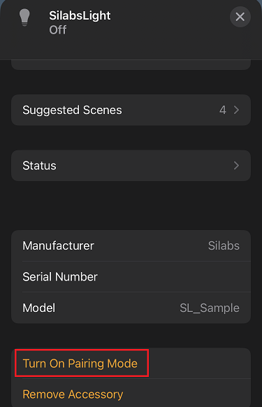
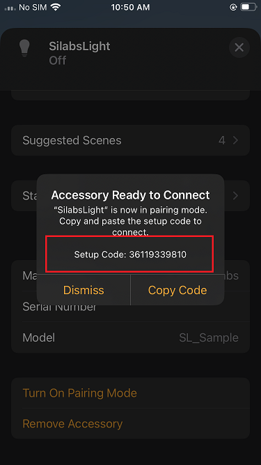
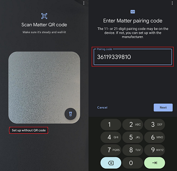

# Sharing Multi-Control over Wi-Fi Light from Apple Home Pod to Google Home Ecosystem

This phase is very similar to the Single Controller Ecosystems. The difference is that the Matter Over Wi-Fi device will be controlled using the Apple Home Ecosystem. The process will be almost identical, with some minor difference related to Apple Home App UI.
In this section how to setup Apple Home Ecosystem steps not repeated in very detailed way.

## Steps to perform Multi-Controller From Apple Home to Google Home

1. Open Apple Home App.
2. Click on the Light Application to open detailed view.
3. Scroll down at the bottom of the application detailed view.

    
4. Open the commissioning window for the Google Home Pod by clicking **Turn on Pairing Mode** button.
5. The **Setup Code** will appear, with message printed as shown below in Apple Home App.

    
6. Open Google Home App and click on **Devices Section** and click on "Add" Button.
7. Click on **Set up without QR Code** and insert the setup code displayed in **Step 5**.

   
8. The commissioning will start and proceed in the same way as explained in [Matter Demo using Google Home](./GOOGLE_ECOSYSTEM_SETUP.md)
9. Once the commissioning is done, the new Matter Wi-Fi device should be visible in the Room view of Google Home App.