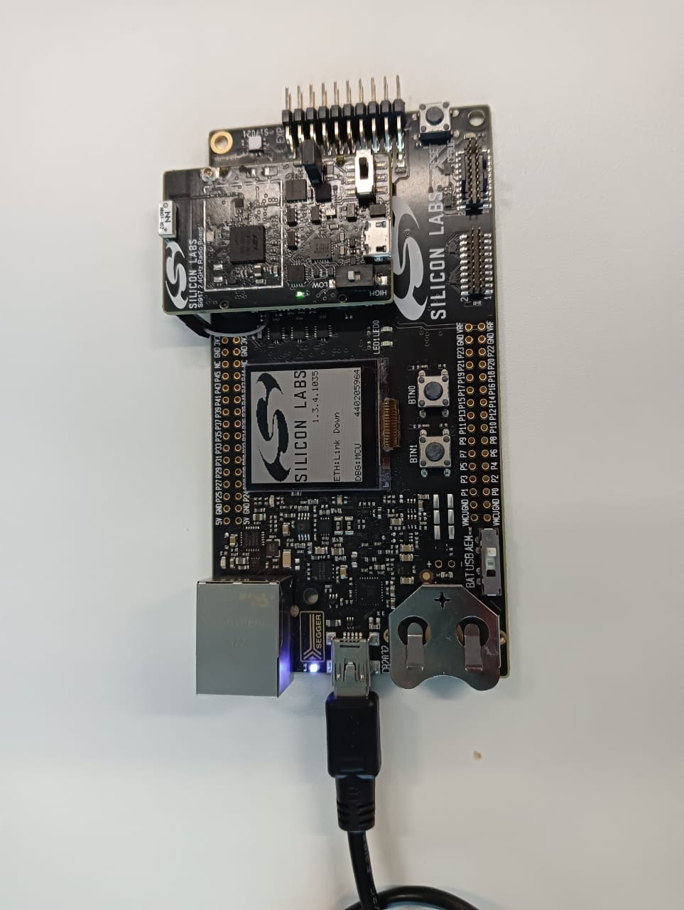

# Running the Matter Demo over Wi-Fi for SiWx917 SoC

## Flashing Images/Binaries on the SiWx917 SoC platform using Ozone or Simplicity Studio and Simplicity Commander

> **Note:** 
>    1. SiWx917 SoC device support is available in the latest Simplicity Studio and Simplicity Commander(versions 1v14p5 and above). To flash the TA Firmware/Matter application on SiWx917 SoC,
>       - Convert the .s37 file into .rps file using the below command,
>
>           `commander rps create <file-name>.rps --app <file-name>.s37`
>       - Flash to the device using,
>
>           `commander rps load <file-name>.rps`

>    2. Official support for SiWx917 SoC device is not yet available in the Ozone Debugger, but can be configured - [Ozone Environment Setup for SiWx917 SoC](SiWx917_Enablement_For_Ozone.md).
>    3. 917 SoC switch positions: Left switch should be on the **OFF/LOW**, and right switch should be on the **NORMAL** side.

1.  Plug the WSTK and SiWx917 radio board into the laptop.


 
2.  Launch the Ozone Debugger.
 
3.  In the **New Project Wizard**:

    - Click the three dots (`...`) on the **Device** tab and select the **Manufacturer** as `Silicon Labs`.
    - Select the **Device** as `Si917DualFlash`.
    - Click **OK**.
    - The **Register set** tab is populated automatically.

> **Note:** Entering data in the **Peripherals** tab is optional.
 
4.  Click **Next**. A window will be displayed showing the following:

    -   Serial Number: Read from device
    -   Target Interface: JTAG
    -   Speed: 4MHz
    -   Host Interface: USB
    -   One Product in the **Emulators connected via USB** tab
 
5. Select the Product shown in the **Emulators connected via USB** tab and click **Next**.
 
6.  Click the detected **Silicon Labs device** that gets displayed and click **Next**.
 
7.  Click the three dots (`...`) on that tab, select **Browse** and choose the `*.out` image you wish to flash and run. Click **Next**.

> **Note**: The image you select will be the one built using the instructions on the [Building a Matter Wi-Fi End Device page](./SW_SETUP.md).
 
8.  Make sure the next screen has **Initial PC** selected as `Read from Base Address Vector Table` and click **Finish**.
 
9.  A Diagnostics Warning may be displayed about FreeRTOS being detected. Click **Continue**.
 
10.  Select **Download and Reset Program** in the dropdown next to the **Power** button on the top-left hand corner of the page.
 
11.  The SiWx917 SoC device will be erased and programmed.
 
12.  Click **Reset Program to main (F4)** next to the **Play/Pause** button on the top-left hand corner of the page.

> **Note**: This will reset the MCU after flashing the application.
 
13.  Run the image by clicking the **Resume/Halt** button on the top-left hand corner of the page (or press the **F5** key).

> **Note:**
> 1. The output of the SiWX917 SoC application will be displayed on the Ozone terminal or J-Link RTT Client.
> 2. The RTT Client is provided with Ozone and does not have to be downloaded separately.
 

## Demo Execution - Commissioning a SiWx917 SoC Device using chip-tool for Linux

> **Note**: Commissioning can be done using chip-tool running either on Linux or Raspberry Pi.

1. Get the SSID and PSK of the Wi-Fi network (WPA2 - Security) you are connected to.

2. Run the following:

    ```shell
    $ cd $MATTER_WORKDIR/matter
    ```

    ### Commissioning Command:

    ```shell
    $ out/standalone/chip-tool pairing ble-wifi 1122 $SSID $PSK 20202021 3840
    ```

> **Note:**
>    1. The Node ID used here is `1122`. This will be used in future commands.
>    2. The below given steps (3, 4, 5) are for Lighting-app, use app specific commands if you are using any other application.
 
3. To turn **on** the LED on the SiWx917:
    ```shell
    $ out/standalone/chip-tool onoff on 1122 1
    ```
 
4. To turn **off** the LED on the SiWx917:
    ```shell
    $ out/standalone/chip-tool onoff off 1122 1
    ```

5. The updated **on/off** state may be verified with the following command:
    ```shell
    $ out/standalone/chip-tool onoff read on-off 1122 1
    ```
 
If you are having difficulty getting the chip-tool to commission the device
successfully, refer to the troubleshooting information on the 
[Running the Matter Demos over Wi-Fi on EFR32 hosts page](./RUN_DEMO.md).

As the device remembers the Access Point credentials given for commissioning, if
you want to run the demo multiple times, do a [Factory Reset](./SiWx917SoC_Factory_Reset.md).

The commissioning command mentioned above does the following:

- chip-tool scans BLE and locates the Silicon Labs device that uses the specified discriminator
- Sends the Wi-Fi SSID and Passkey
- The Silicon Labs device will join the Wi-Fi network and get an IP address.
It then starts providing mDNS records on IPv4 and IPv6
- chip-tool then locates the device over Wi-Fi and establishes operational certificates
- Future communications (tests) will then happen over Wi-Fi
 
---

[Table of Contents](../README.md) | [Thread Demo](../thread/DEMO_OVERVIEW.md) |
[Wi-Fi Demo](./DEMO_OVERVIEW.md)
