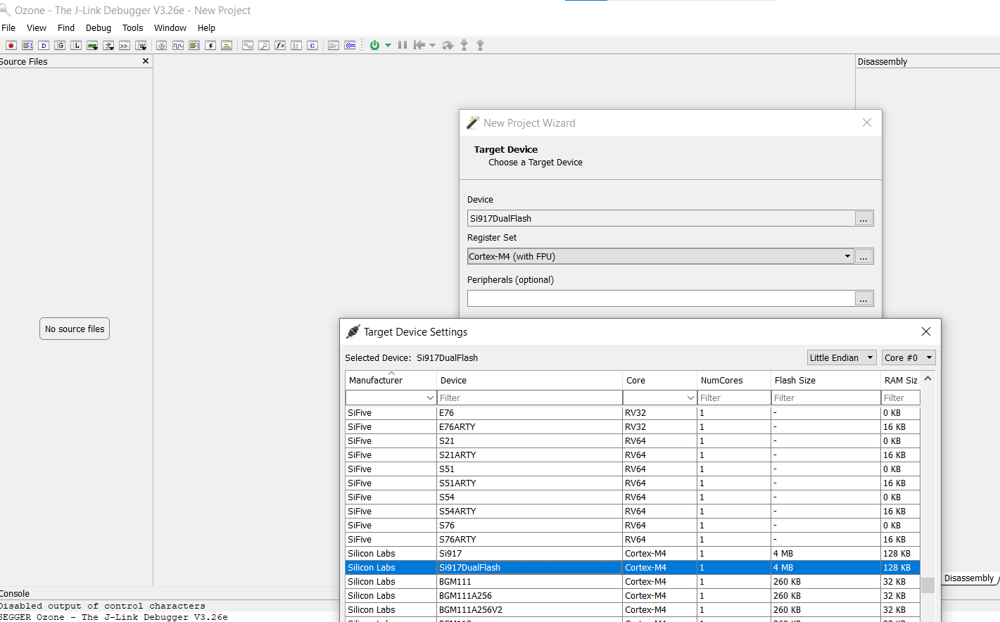
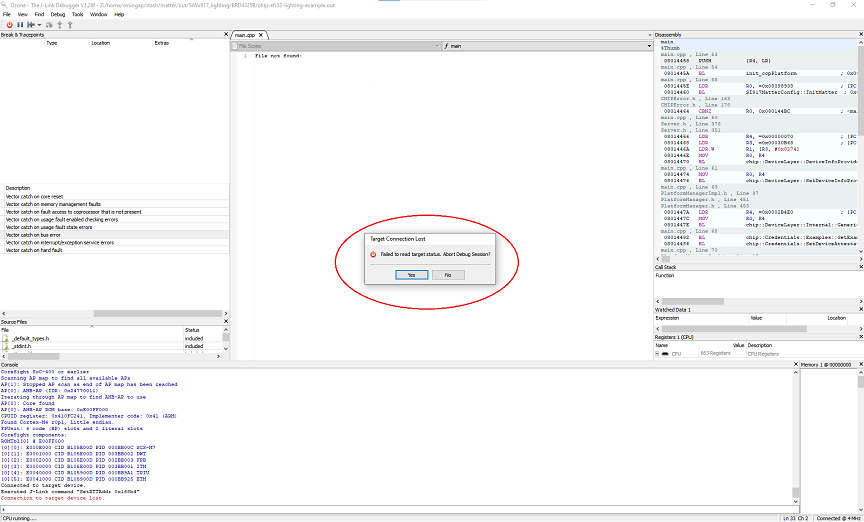
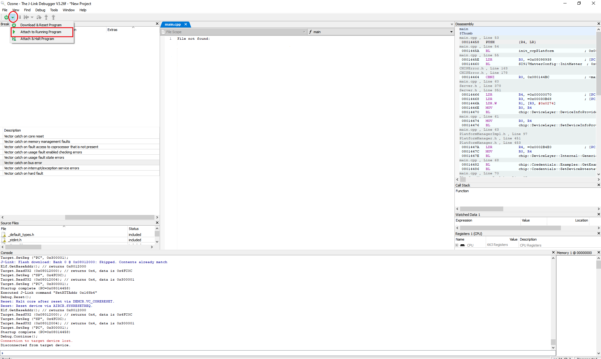

# Ozone and JLink RTT Environment Setup for a SiWx917 SoC Device

- Ozone debugging support is enabled for SiWx917 Dual flash boards only.
- For Common Flash Boards Ozone debugging support is not enabled.
- Auto detection of SiWx917 SoC device in Ozone is not enabled.
- Follow the steps to manually configure the SiWx917 SoC with Latest Ozone Debugger.

## Steps to Configure the SiWx917 SoC on the JLink-RTT Logging and Ozone Debugger

1.  Update the **JlinkDevices.xml** and **ELF** files found in the [Matter Artifacts page](../general/ARTIFACTS.md).

     - Download the **JLinkDevices.xml** file and copy it in your Ozone installation path shown in this  [JLinkDevices folder](https://wiki.segger.com/J-Link_Device_Support_Kit#JLinkDevices_folder). If there is no JLinkDevices Folder, create a JLinkDevices folder and copy the **JlinkDevices.xml** file.

     - In the `JLinkDevices` folder, create a `Devices` folder and then create a sub-folder named `SiliconLabs`.

     - Download the **ELF** file (Flash driver) and copy it in the created `SiliconLabs` folder.

2.  Launch Ozone. The SiWx917 Dual Flash SoC device should be visible in the **Device** field's selection list.

    

3.  In the **New Project Wizard**:

    - Click the three dots (`...`) on the **Device** tab and select the **Manufacturer** as `Silicon Labs`.
    - Select the **Device** as `Si917DualFlash`.
    - Click **OK**.
    - The **Register set** tab is populated automatically.

**Note:** Entering data in the **Peripherals** tab is optional.
 
4.  Click **Next**. A window will be displayed showing the following:

    -   Serial Number: Read from device
    -   Target Interface: JTAG
    -   Speed: 4MHz
    -   Host Interface: USB
    -   One Product in the **Emulators connected via USB** tab
 
5. Select the Product shown in the **Emulators connected via USB** tab and click **Next**.
 
6.  Click the detected **Silicon Labs device** that gets displayed and click **Next**.
 
7.  Click the three dots (`...`) on that tab, select **Browse** and choose the `*.out` image you wish to flash and run. Click **Next**.
 
8.  Make sure the next screen has **Initial PC** selected as `Read from Base Address Vector Table` and click **Finish**.
 
9.  A Diagnostics Warning may be displayed about FreeRTOS being detected. Click **Continue**.
 
10.  Select **Download and Reset Program** in the dropdown next to the **Power** button on the top-left hand corner of the page.
 
11.  The SiWx917 SoC device will be erased and programmed.
 
12.  Click **Reset Program to main (F4)** next to the **Play/Pause** button on the top-left hand corner of the page.

**Note**: This will reset the MCU after flashing the application.
 
13.  Run the image by clicking the **Resume/Halt** button on the top-left hand corner of the page (or press the **F5** key).

**Note:**
1. The output of the SiWX917 SoC application will be displayed on the Ozone terminal or J-Link RTT Client.
2. The RTT Client is provided with Ozone and does not have to be downloaded separately.
 
## SiWx917 SOC Factory Reset
### Factory Reset without Ozone

1. Press the BTN0 on WSTK for about 6-7 seconds. The LED0 will flash 5 times and board will reboot.

### Factory Reset with Ozone

1. You will get "Target Connection Lost" pop-up on Ozone, click **YES**.
   
   

2. Select **Attach to Running Program** in the dropdown next to the **Power** button on the top-left hand corner of the page.
   
   