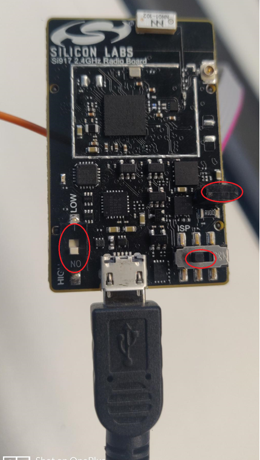
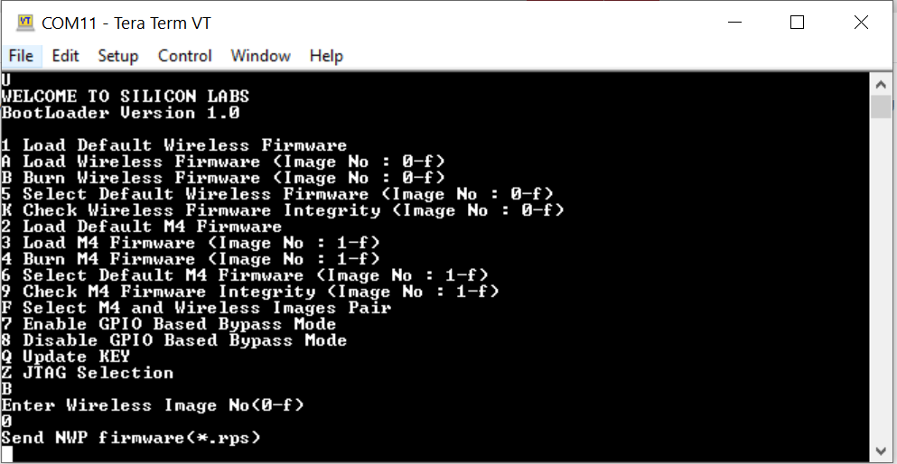
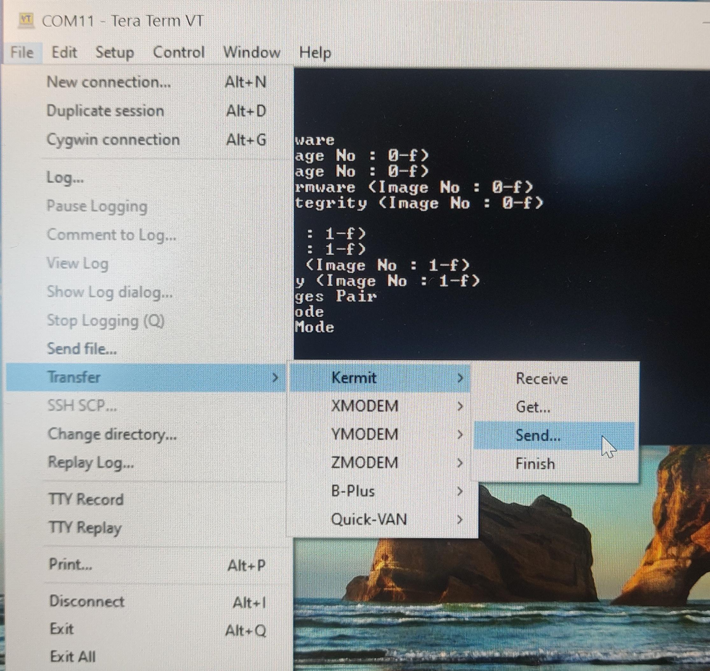

# Updating SiWx917 SoC Connectivity Firmware

Download the recommended version of firmware before you start with the update process from the [Matter Artifacts page](../general/ARTIFACTS.md)

## Steps to update the firmware on SiWx917 SoC radio board using Simplicity Studio
1. Refer to the Simplicity Studio documentation on flashing a device [Upgrading SiWx917 Connectivity firmware](http://docs.silabs.com/simplicity-studio-5-users-guide/latest/ss-5-users-guide-building-and-flashing/flashing)
   
   
## Steps to update the firmware on SiWx917 SoC radio board using Simplicity Commander
1. Refer to the Simplicity Commander documentation on flashing a device [Upgrading SiWx917 Connectivity firmware with Simplicity Commander](https://www.silabs.com/documents/public/user-guides/ug162-simplicity-commander-reference-guide.pdf)
   

## Steps to update the firmware on SiWx917 SoC radio board using Tera Term
1. Connect power cable to radio board.
    
2. Jumper should be connected.

3. Switches: Left switch should be **ON/high**, and the right switch should be on the **ISP** side.

4. Open Tera term in windows PC and check for connected USB devices.

5. Select JLink CDC UART Port and change baud rate to 921600 to increase speed.

6. From terminal type "CTRL + |" for boot message "U", then type "U" for boot menu, type "B", "0" to burn wireless / "4", "1" to burn MCU firmware, and give (Ctrl + \ + c) to exit from kermit.

7. From terminal, go to Transfer->Kermit→Send and select *.rps file to load.

8. Once the image transfer is complete, type "c" to continue to check the upgrade sequence, once the upgrade is successful , Enter "1" for the Enter next command , once text "Loading..." appears type (Ctrl + \ + c) to exit from Kermit and "q" to quit and return to the terminal.

9. Reset 917 SoC switch positions: Left switch should be on the **OFF/LOW**, and right switch should be on the **NORMAL** side
