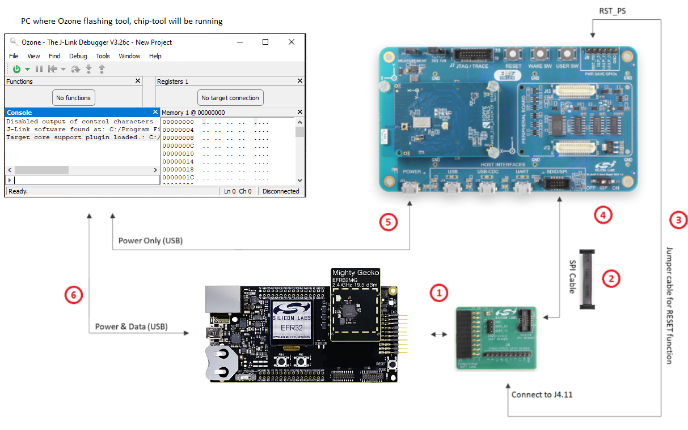
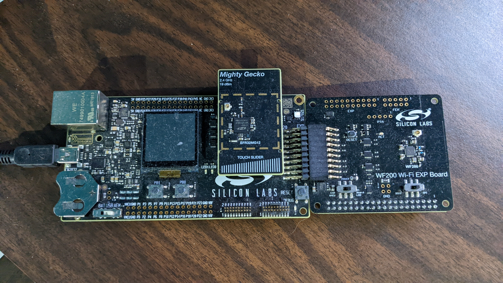

# Matter Wi-Fi Prerequisites

Silicon Labs Matter Wi-Fi is supported on two different platforms, the
[WF200](https://www.silabs.com/wireless/wi-fi/wf200-series-2-transceiver-ics)
and the
[RS9116](https://www.silabs.com/development-tools/wireless/wi-fi/rs9116x-sb-evk-development-kit).
In both cases the Wi-Fi part is attached to an EFR32MG12 development board via a
daughter card. The EFR32MG12 is used as a host processor for the application and
for its Bluetooth capability, which is necessary for Matter commissioning.

In addition to the EFR32MG12 and Wi-Fi boards, you will need to run the Matter
ChipTool. This can be built and run on a Linux or Mac laptop or
on a Raspberry Pi.

The hardware that you will need for Silicon Labs Matter Wi-Fi development is as
follows:

## EFR32MG12 + RS9116 Hardware Overview

## EFR32MG12 + WF200 Hardware Overview

 

## Hardware

-   Linux PC/Laptop **or** Raspberry Pi 4 (This is for running the ChipTool to
    commission and control the device)
-   Kits/Boards:
    -   SLWSTK6000B Wireless Starter Kit main board
    -   BRD4161A/BRD4163A/BRD4164A/BRD4186C/BRD4187C daughter boards are supported
          - [SLWRB4161A](https://www.silabs.com/development-tools/wireless/zigbee/slwrb4161a-efr32mg12-radio-board)
          - [SLWRB4163A](https://www.silabs.com/development-tools/wireless/zigbee/slwrb4163a-efr32mg12-radio-board)
          - [SLWRB4164A](https://www.silabs.com/development-tools/wireless/zigbee/slwrb4164a-efr32mg12-radio-board)
          - [XG24-RB4186C](https://www.silabs.com/development-tools/wireless/xg24-rb4186c-efr32xg24-wireless-gecko-radio-board)
          - [XG24-RB4187C](https://www.silabs.com/development-tools/wireless/xg24-rb4187c-efr32xg24-wireless-gecko-radio-board)
        > BLE and Matter code run here
    -   Wi-Fi Dev Kit, either
        [RS9116X-SB-EVK1](https://www.silabs.com/development-tools/wireless/wi-fi/rs9116x-sb-evk-development-kit)
        **or**
        [WF200](https://www.silabs.com/wireless/wi-fi/wf200-series-2-transceiver-ics)
    -   Interconnect board (included in the Wi-Fi kits)
    -   SPI Cable (included in the RS9116 kit)
    -   Jumper Cables (included in the RS9116 kit)
-   Access point with Internet access
-   microSD card (32GB) (if using Raspberry Pi)
-   **[Optional]** Android Mobile phone (If using the ChipTool on Android)

 

## Software

-   Ozone (optional) to flash the images generated
    -   Windows: [Download Ozone](https://www.segger.com/downloads/jlink/)
        > Search for "Ozone - The J-Link Debugger" and download the latest
        > Windows (32 or 64 bit) version and install it
    -   Linux:
        [Download Ozone](https://www.segger.com/downloads/jlink/Ozone_Linux_x86_64.deb)
        and install it
-   [Simplicity Studio or Simplicity Commander](../general/FLASH_SILABS_DEVICE.md) (optional) to flash images generated
-   Raspberry Pi imager tool (optional): To flash an operating system or Raspberry Pi image on the SD card of the Raspberry Pi if you are using one to run the ChipTool.  Note: The ChipTool may also be compiled and run on a Linux machine or Mac. [Download](https://www.raspberrypi.com/software/)
-   Upgrade firmware on RS9116 EVK:
    [Reference](http://draft-docs.suds.silabs.net/rs9116-wiseconnect/2.5/wifibt-wc-getting-started-with-pc/update-evk-firmware)

 

## RS9116: Steps to Update Firmware

Pre-Built Rs9116 firmware is available on the
[Matter Artifacts page](../general/ARTIFACTS.md)

1. [Setting up TeraTerm](https://docs.silabs.com/rs9116/wiseconnect/2.0/tera-term-setup)
2. [Updating the RS9116 Firmware](https://docs.silabs.com/rs9116/wiseconnect/2.0/update-evk-firmware)

----
[Table of Contents](../README.md) | [Thread Demo](../thread/DEMO_OVERVIEW.md) | [Wi-Fi Demo](./DEMO_OVERVIEW.md)