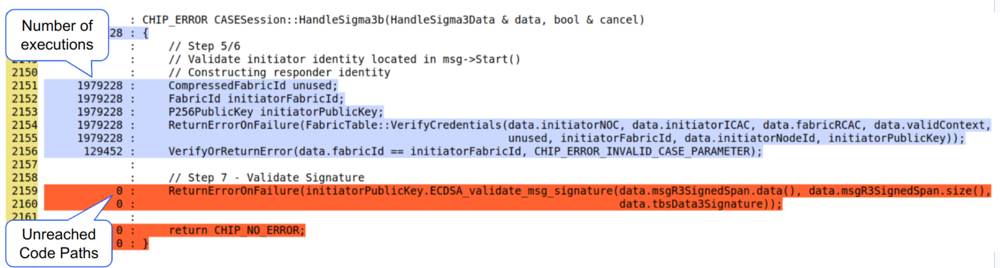
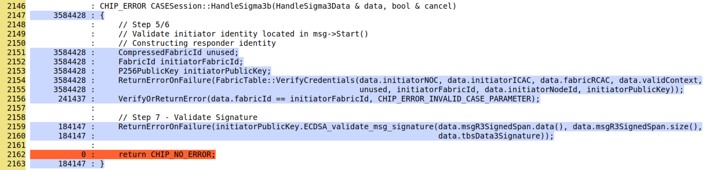

# Fuzz testing

-   Fuzz Testing involves providing random and unexpected data as input to
    functions and methods to uncover bugs, security vulnerabilities, or to
    determine if the software crashes.
-   it is often continuous; the function under test is called in iteration with
    thousands of different inputs.
-   Fuzz testing is often done with sanitizers enabled; to catch memory errors
    and undefined behavior.
-   The most commonly used fuzz testing frameworks for C/C++ are libFuzzer and
    AFL.
-   [Google's FuzzTest](https://github.com/google/fuzztest) is a newer framework
    that simplifies writing fuzz tests with user-friendly APIs and offers more
    control over input generation. It also integrates seamlessly with Google
    Test (GTest).

## Fuzz testing with libFuzzer

The following example demonstrates how to use libFuzzer to write a simple fuzz
test. Each fuzzer function is defined using
`LLVMFuzzerTestOneInput(const uint8_t * data, size_t len)`.

The Fuzzer must be located in a Test Folder : `src/some_directory/tests/`

```
#include <cstddef>
#include <cstdint>

/**
 *    @file
 *      This file describes a Fuzzer for ...
 */

extern "C" int LLVMFuzzerTestOneInput(const uint8_t * data, size_t len)
{

    // Instantiate values as needed
    // Call target function for the fuzzer with the fuzzing input (data and len)

    return 0;
}

```

See
[FuzzBase38Decode.cpp](https://github.com/project-chip/connectedhomeip/blob/master/src/setup_payload/tests/FuzzBase38Decode.cpp)
for an example of a simple fuzz test.

### Compiling and running

-   Add to `src/some_directory/tests/BUILD.gn`

    -   Example

        ```
        import("${chip_root}/build/chip/fuzz_test.gni")

        if (enable_fuzz_test_targets) {
            chip_fuzz_target("FuzzTargetName1") {
                sources = [ "Fuzzer1.cpp" ]
                public_deps = [
                    // Dependencies go here.
                ]
            }
            chip_fuzz_target("FuzzTargetName2") {
                sources = [ "Fuzzer2.cpp" ]
                public_deps = [
                    // Dependencies go here.
                ]
            }
        }
        ```

        -   CHIP_FUZZ_TARGET : the name of the fuzz target
        -   SOURCES : file in the test folder containing the fuzzer
            implementation
        -   PUBLIC_DEPS : Code Dependencies needed to build fuzzer

    -   Another example:
        [src/setup_payload/tests/BUILD.gn](https://github.com/project-chip/connectedhomeip/blob/b367512f519e5e109346e81a0d84fd85cd9192f7/src/setup_payload/tests/BUILD.gn#L43)

-   Add to `${chip_root}/BUILD.gn`

    -   Add the Fuzzing Target in this part of the code :
        [\${chip_root}/BUILD.gn](https://github.com/project-chip/connectedhomeip/blob/b367512f519e5e109346e81a0d84fd85cd9192f7/BUILD.gn#L52)

    -   Add Fuzzing Target like that

        ```
        if (enable_fuzz_test_targets) {
            group("fuzz_tests") {
            deps = [
                "${chip_root}/src/credentials/tests:fuzz-chip-cert",
                "${chip_root}/src/lib/core/tests:fuzz-tlv-reader",
                "${chip_root}/src/lib/dnssd/minimal_mdns/tests:fuzz-minmdns-packet-parsing",
                "${chip_root}/src/lib/format/tests:fuzz-payload-decoder",
                "${chip_root}/src/setup_payload/tests:fuzz-setup-payload-base38",
                "${chip_root}/src/setup_payload/tests:fuzz-setup-payload-base38-decode",
                // ADD HERE YOUR FUZZING TARGET
                "${chip_root}/some_directory/tests:FuzzTargetName"
                ]
            }
        }
        ```

-   Build all fuzzers
    ```
    ./scripts/build/build_examples.py --target <host>-<compiler>-tests-asan-libfuzzer-clang build
    ```
    e.g.
    ```
    ./scripts/build/build_examples.py --target darwin-arm64-tests-asan-libfuzzer-clang build
    ```
    \*\* Make sure to put the right host and compiler
-   Fuzzers binaries are compiled into:

    -   `out/<host>-<compiler>-tests-asan-libfuzzer-clang/tests`
    -   e.g. `darwin-arm64-tests-asan-libfuzzer-clang`

-   Running the fuzzer with a corpus
    -   `path_to_fuzzer_in_test_folder path_to_corpus`

## `Google's FuzzTest`

-   Google FuzzTest is integrated through Pigweed
    [pw_fuzzer](https://pigweed.dev/pw_fuzzer/concepts.html).

### Use cases

1. Finding Undefined Behavior with Sanitizers:

    - Running fuzz tests while checking if a crash or other sanitizer-detected
      error occurs, allowing detection of subtle memory issues like buffer
      overflows and use-after-free errors.

2. Find Correctness Bugs using Assertions:
    - For example, in Round trip Fuzzing, fuzzed input is encoded, decoded, and
      then verified to match the original input. An example of this can be found
      in src/setup_payload/tests/FuzzBase38PW.cpp.

-   More information can be found in the
    [FuzzTest Use Cases](https://github.com/google/fuzztest/blob/main/doc/use-cases.md)
    documentation.

### Writing FuzzTests

Keywords: Property Function, Input Domain

-   FuzzTests are instantiated through the macro call of `FUZZ_TEST`:

```cpp
FUZZ_TEST(TLVReader, FuzzTlvReader).WithDomains(fuzztest::Arbitrary<std::vector<std::uint8_t>>());
```

-   The Macro invocation calls the **Property Function**, which is
    `FuzzTlvReader` above.

-   The **input domains** define the range and type of inputs that the
    **property function** will receive during fuzzing, specified using the
    `.WithDomains()` clause.
-   In the macro above, FuzzTest will generate a wide range of possible byte
    vectors to thoroughly test the `FuzzTlvReader` function.

#### The Property Function

```cpp
// The Property Function
void FuzzTlvRead(const std::vector<std::uint8_t> & bytes)
{
    TLVReader reader;
    reader.Init(bytes.data(), bytes.size());
    chip::TLV::Utilities::Iterate(reader, FuzzIterator, nullptr);
}
```

-   The Property Functions must return a `void`
-   The function will be run with many different inputs in the same process,
    trying to trigger a crash.
-   It is possible to include Assertions such as during Round-Trip Fuzzing

-   More Information:
    https://github.com/google/fuzztest/blob/main/doc/fuzz-test-macro.md#the-property-function

#### Input Domains

-   FuzzTest Offers many Input Domains, all of which are part of the
    `fuzztest::` namespace.
-   All native C++ types can be used through `Arbitrary<T>()`:

```cpp
FUZZ_TEST(Base38Decoder, FuzzQRCodeSetupPayloadParser).WithDomains(Arbitrary<std::string>());
```

-   using vector domains is one of the most common. It is possible to limit the
    size of the input vectors (or any container domain) using `.WithMaxSize()`
    or `.WithMinSize()`, as shown below:

```cpp
FUZZ_TEST(MinimalmDNS, TxtResponderFuzz).WithDomains(Arbitrary<vector<uint8_t>>().WithMaxSize(254));
```

-   `ElementOf` is particularly useful as it allows us to define a domain by
    explicitly enumerating the set of values in it and passing it to FuzzTest
    invocation. Example:

```cpp
auto AnyProtocolID()
{
    return ElementOf({ chip::Protocols::SecureChannel::Id, chip::Protocols::InteractionModel::Id, chip::Protocols::BDX::Id,
                       chip::Protocols::UserDirectedCommissioning::Id });
}

FUZZ_TEST(PayloadDecoder, RunDecodeFuzz).WithDomains(Arbitrary<std::vector<std::uint8_t>>(), AnyProtocolID(), Arbitrary<uint8_t>());
```

-   A detailed reference for input domains can be found here:
    [FuzzTest Domain Reference](https://github.com/google/fuzztest/blob/main/doc/domains-reference.md#elementof-domains-element-of).

#### Domain Combinators

-   Domain Combinators: Useful when we have input domains that we want use to
    create another domain; e.g. construct an object and pass it to the property
    function.
-   An example is `Map` documented in FuzzTest's official documentation
    [Aggregate Combinators#Map](https://github.com/google/fuzztest/blob/main/doc/domains-reference.md#map)
-   Using a Map, we can take several input domains, pass them into the mapping
    function, and get a single Domain as output.
-   An example from the Stack is `AnyValidationContext()` used in
    `FUZZ_TEST(FuzzCASE, HandleSigma3b)`

#### Seeds and Corpus

-   Using initial seeds is very useful when fuzzing functions that take complex
    inputs, such as large byte arrays
-   The fuzzing engine starts by mutating these initial seeds instead of
    generating completely random inputs
-   This helps the fuzzing engine explore more realistic and meaningful code
    paths faster, making it more likely to uncover issues

-   Adding `.WithSeeds()` to the _Input Domains_ within a FUZZ_TEST Macro
    invocation allow us to use initial seeds.
-   Two Ways to use `.WithSeeds()`:

    1. **Using variables as inputs**: Examples of this usage are in
       `FuzzCASE.cpp` in the lambda `SeededEncodedSigma1()` used in the Fuzz
       Test Case `FUZZ_TEST(FuzzCASE, ParseSigma1_RawPayload)`

    2. **Using files as inputs** with `fuzztest::ReadFilesFromDirectory()`:
        - Returns a vector of single-element tuples, each containing file
          content as a string
        - Use a lambda like `seedProvider` in `FuzzChipCertPW.cpp` to unpack the
          tuples and extract contents
        - The lambda should return `std::vector<std::string>` to be used with
          `std::string` domain as shown below:

    ```cpp
        FUZZ_TEST(FuzzChipCert, ConvertX509CertToChipCertFuzz).WithDomains(Arbitrary<std::string>().WithSeeds(seedProvider(isDerFile)));
    ```

### Running FuzzTests

There are several ways to run the tests:

1.  Unit-test mode (where the inputs are only fuzzed for a second):

```bash
./fuzz-chip-cert-pw
```

2.  Continuous fuzzing mode; we need to first list the tests, then specify the
    FuzzTestCase to run:

```bash
$ ./fuzz-chip-cert-pw --list_fuzz_tests
[.] Sanitizer coverage enabled. Counter map size: 11134, Cmp map size: 262144
[*] Fuzz test: ChipCert.ChipCertFuzzer
[*] Fuzz test: ChipCert.DecodeChipCertFuzzer

$ ./fuzz-chip-cert-pw --fuzz=ChipCert.DecodeChipCertFuzzer
```

3. Running all Tests in a TestSuite for a specific time, e.g for 10 minutes

```bash
#both Fuzz Tests will be run for 10 minutes each
./fuzz-chip-cert-pw --fuzz_for=10m
```

4. For Help

```bash
# FuzzTest related help
./fuzz-chip-cert-pw --helpfull

# gtest related help
./fuzz-chip-cert-pw --help

```

### Coverage Report Generation

> [!TIP]
>
> Use Coverage Reports to get more insights while writing FuzzTests.

1. Build FuzzTests with coverage instrumentation
   [Building pw_fuzzer FuzzTests](https://github.com/project-chip/connectedhomeip/blob/master/docs/guides/BUILDING.md#pw_fuzzer-fuzztests).

2. Run These FuzzTests using `scripts/tests/run_fuzztest_coverage.py`

    - run them in `Continuous Fuzzing Mode` for as long as possible to get max
      coverage

3. The path for the HTML Coverage Report will be output after generation

### Coverage Reports and Fuzz Blockers

-   Coverage Reports can give (FuzzTest Developers) insights and help identify
    `Fuzz Blockers`.
-   **Fuzz Blocker**: something that prevents a fuzz test from exploring a
    certain part of the code.

#### Example of Fuzz Blocker Analysis:

-   Screenshot below shows how we can use a Coverage Report to identify a Fuzz
    Blocker
-   We can see the number of executions of each line in the report.
-   Line (#2159) was not reached, in at least 129,452 executions.
-   The line (#2156) just above it is possibly a Fuzz Blocker.

    -   The `data.fabricId` check is always failing and it is blocking the
        execution of the function that follows it.



-   Thus, we can adapt our FuzzTest in a way to be able to pass that check.
-   **Solution**: One approach will be to:

    1. Seed the Fuzzed `NOC` with a valid NOC Certificate
    2. Fuzz the `FabricId`
    3. Seed the `FabricId` using the same **valid** `FabricId` included in the
       valid NOC Cert.

-   After doing this, Screenshot below shows Line #2159 is now reached; We have
    increased our coverage and we are sure that our FuzzTest is more effective:
-   This approach was used FuzzTest Case `FUZZ_TEST(FuzzCASE, HandleSigma3b)`



### FAQ

#### What revision should the FuzzTest and Abseil submodules be for running `pw_fuzzer` with FuzzTest?

-   Google FuzzTest is integrated into Matter using `pw_fuzzer`, which has
    several dependencies. These dependencies are listed here:
    [Step 0: Set up FuzzTest for your project](https://pigweed.dev/pw_fuzzer/guides/fuzztest.html#step-0-set-up-fuzztest-for-your-project).
-   Matter integrates these dependencies as submodules, including Google
    FuzzTest and Abseil.
-   Since FuzzTest and Abseil only support the `bazel` and `CMake` build systems
    and do not support GN, Pigweed maintainers use a script to generate GN files
    for these dependencies.
-   the revision of FuzzTest and Abseil submodules in Matter should match or at
    least be as new as the specific version (SHA1) used when generating these GN
    files.
-   You can find the version used for the generated GN files here:
    [FuzzTest Version](https://pigweed.dev/third_party/fuzztest/#version) and
    [Abseil Version](https://pigweed.dev/third_party/abseil-cpp/#version).

#### TO ADD:

-   More Information on Test Fixtures (After issues are resolved)
-   How to add FuzzTests to the Build System
-   More Information on OSS-FUZZ
