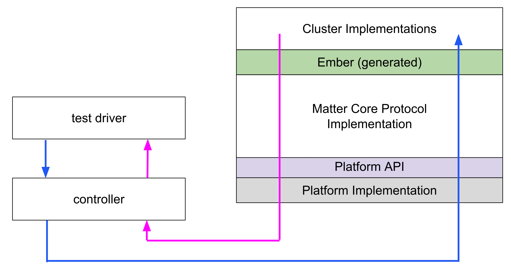
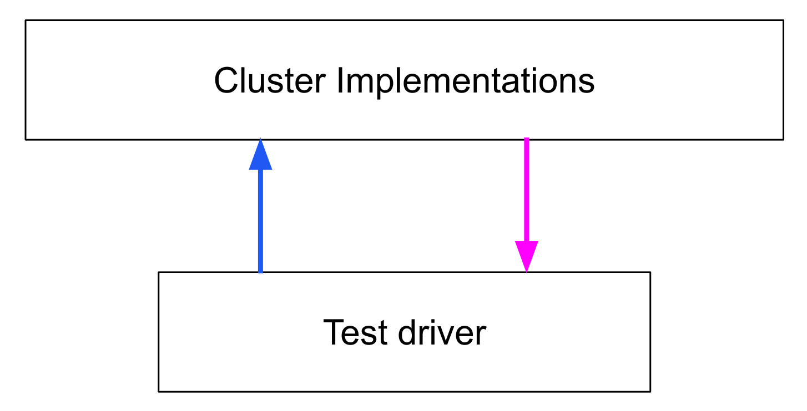

# Testing Guides

The following guide provide an introduction to the testing mechanisms available
in the SDK.

```{toctree}
:glob:
:maxdepth: 1
:hidden:

*
```

## Integration and Certification tests

Integration tests test the entire software stack using the same mechanisms as a
standard controller.



The certification tests are all integration tests, since they run against the
product as a black box.

-   [Integration and Certification tests](./integration_tests.md)
-   [YAML](./yaml.md)
-   [Python testing framework](./python.md)
-   [Enabling tests in the CI](./ci_testing.md)
-   [Integration test utilities](./integration_test_utilities.md)

## Unit testing

Unit tests run on small pieces (“units”) of business logic. They do not use an
external controller and instead test at the public interface of the class or
function. For clusters, this requires an API that separates the cluster logic
from the global ember and message delivery layers.



-   [Unit tests](./unit_testing.md)

## PICS and PIXIT

-   [PICS and PIXIT](./pics_and_pixit.md)

## Testing in the CI

-   [CI testing](./ci_testing.md)
