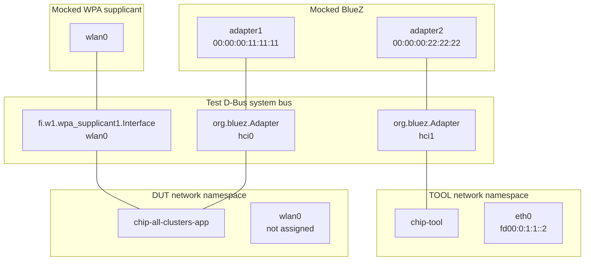

# Integration and Certification Tests

Integration tests use a server and a controller or controllers to test the
behavior of a device. Certification tests are all integration tests. For
certified products, the device under test (DUT) is tested against one of the SDK
controller implementations (either chip-tool or the python-based controller,
depending on the test type). For software component certification, the software
component is tested against a sample device built from the SDK.

Certification tests require an accompanying certification test plan in order to
be used in the certification testing process. More information about test plans
can be found in the
[test plans repository](https://github.com/CHIP-Specifications/chip-test-plans/tree/master/docs).
Integration testing can also be used outside of the certification testing
program to test device behavior in the SDK. Certification tests are all run in
the [CI](./ci_testing).

There are two main integration test types:

-   [YAML](./yaml.md)
-   [Python framework](./python.md)

YAML is a human-readable serialization language that uses structured tags to
define test steps. Tests are defined in YAML, and parsed and run through a
runner that is backed by the chip-tool controller.

The Python framework tests are written in python and use the
[Mobly](https://github.com/google/mobly) test framework to execute tests.

## Which test framework to use

Both types of tests can be run through the Test Harness for certification
testing, locally for the purposes of development and in the CI for the SDK. The
appropriate test framework to use is whatever lets you automate your tests in a
way that is understandable, readable, and has the features you need

-   YAML
    -   pros: more readable, simpler to write, easy for ATLs to parse and
        understand
    -   cons: conditionals are harder (not all supported), no branch control,
        schema not well documented
-   python
    -   pros: full programming language, full control API with support for core
        (certs, commissioning, etc), less plumbing if you need to add features,
        can use python libraries
    -   cons: more complex, can be harder to read

## Running integration tests locally

### Application and tool binary path selection in the YAML test framework

The `scripts/tests/run_test_suite.py` script is used to run the YAML tests
locally. Apart from the YAML files describing particular test cases the script
also needs information about the locations of the application (for example
`chip-all-clusters`) and tool (for example `chip-tool`) binaries. This
information is provided via `--app-path` and `--tool-path` commandline switches.
As an example:

```shell
scripts/tests/run_test_suite.py --runner chip_tool_python \
    run \
    --tool-path chip-tool:out/linux-x64-chip-tool/chip-tool \
    --app-path all-clusters:out/linux-x64-all-clusters/chip-all-clusters-app
```

The distinction between applications and tools is not merely cosmetic. It is
used when running tests in Linux network namespaces to place applications and
tools in separate network namespaces.

In order to help with using the YAML tests for local usage the
`--discover-paths` flag can be used to automatically discover paths to
applications and tools. The root directory of the Matter SDK is used as the
starting path of the search.

You can also list the known keys for applications and tools by using the
`--help-paths` option:

```shell
scripts/tests/run_test_suite.py run --help-paths
…
---
# Known application and tool path keys:
- key: all-clusters
  kind: app
- key: all-devices
  kind: app
- key: air-purifier
  kind: app
- key: bridge
  kind: app
- key: camera
  kind: app
- key: camera-controller
  kind: app
- key: closure
  kind: app
- key: energy-gateway
  kind: app
- key: evse
  kind: app
- key: fabric-bridge
  kind: app
- key: fabric-admin
  kind: app
- key: fabric-sync
  kind: app
…
```

## Connectivity mocking for local testing

When integration tests are run locally, the test runner (YAML or python) needs
to mock network connectivity between the controller and the device under test,
so that all tests can be run without actual hardware. In case of a simple test
case when a single device is tested with on-network commissioning, nothing
special is needed - the controller can connect to the device directly over the
local (loopback) network interface. However, for more complex test cases that
involve multiple devices or other than on-network commissioning (e.g. ble-wifi
or ble-thread), some additional setup is needed.

### Running tests in Linux network namespaces

The test suite on Linux uses user namespaces (`unshare --map-root-user`) to
create these isolated network environments. On some systems, this feature might
be disabled by default. To enable it, ensure the following lines are present in
`/etc/sysctl.conf` or a new file under `/etc/sysctl.d/`:

```
kernel.unprivileged_userns_clone = 1
```

On systems with AppArmor (like Ubuntu), you also need:

```
kernel.apparmor_restrict_unprivileged_userns = 0
```

After adding these lines, apply the changes by running `sudo sysctl --system`.

The simplest way to mock more complex network topologies is to use Linux network
namespaces. Each device (controller or DUT) is run in its own network namespace,
which allows them to have their own network interfaces and corresponding IP
addresses.

For convenience, there is a script that can set up network namespaces and run a
test case in them:

```shell
# Build the chip-tool and chip-all-clusters-app if not done already
scripts/build/build_examples.py --target linux-x64-chip-tool --target linux-x64-all-clusters build
# Run the TestOperationalState test case in the Linux network namespaces
scripts/tests/run_test_suite.py --runner chip_tool_python \
    --target TestOperationalState \
    --log-level=debug \
    run \
    --app-path all-clusters:out/linux-x64-all-clusters/chip-all-clusters-app \
    --tool-path chip-tool:out/linux-x64-chip-tool/chip-tool
```

### Running tests with mocked BLE and Wi-Fi connectivity

For more complex commissioning flows that involve BLE and Wi-Fi, the test runner
needs to mock BLE and Wi-Fi connectivity as well. On Linux, BLE and Wi-Fi are
provided by the BlueZ stack and WPA supplicant, respectively. The SDK uses D-Bus
to interact with these services. This allows the test runner to mock BLE and
Wi-Fi connectivity by simply mocking used D-Bus APIs of these services.

Additionally, the Matter specification forbids device to advertise on more than
one network type at a time, so in case of ble-wifi commissioning, the DUT shall
not be accessible over Wi-Fi until it is commissioned. This can be achieved by
using Linux network namespaces as described above, but instead of setting up
network interfaces before commissioning, the test runner assigns IP address to
the DUT's network interface only after mock Wi-Fi connection is associated.

See the diagram below for an overview of the setup:



In order to run tests with mocked BLE and Wi-Fi connectivity and Linux network
namespaces use the `--commissioning-method ble-wifi` option to the `run` command
of the `scripts/tests/run_test_suite.py` script:

```shell
# Run the TestOperationalState test case with ble-wifi commissioning
scripts/tests/run_test_suite.py --runner chip_tool_python \
    --target TestOperationalState \
    --log-level=debug \
    run \
    --app-path all-clusters:out/linux-x64-all-clusters/chip-all-clusters-app \
    --tool-path chip-tool:out/linux-x64-chip-tool/chip-tool \
    --commissioning-method ble-wifi
```
