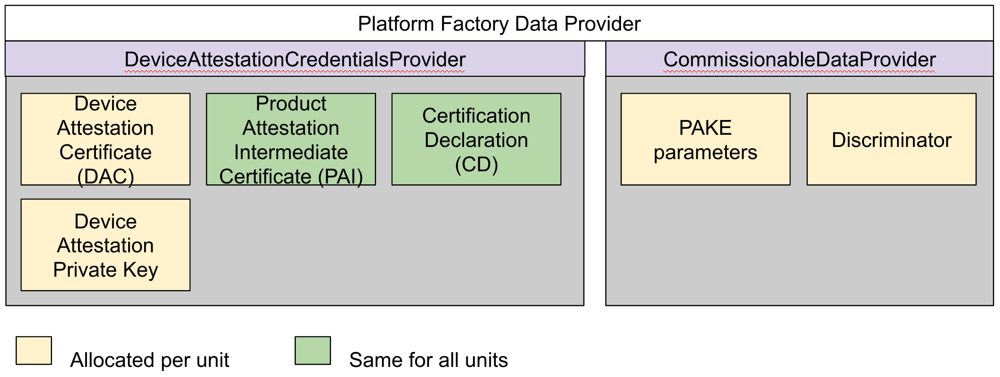

# Product Development and Certification

// TODO: import a pretty picture. Or better still, ask someone else to make my
picture pretty

The process of product development and certification consists of a number of
stages. The exact sequencing of these stages and their substeps is
company-dependent, but generally follows the sequence outlined below. Additional
steps particularly in the development and factory process are likely. This guide
aims only to give an outline of common considerations for the integration of
Matter rather than a general outline of the development process of an entire
product line.

## Joining the CSA and getting a Vendor ID number

Information about joining the Connectivity Standards Alliance (CSA) can be found
here: [Becoming a Member](https://csa-iot.org/become-member/).

Companies need to be a member of the CSA in order to certify and release a
product using Matter.

Companies need an assigned Vendor ID in order to certify a product. This number
is assigned by the CSA and appears in the device firmware and in the attestation
certificates to identify the manufacture and show the product has been properly
certified. Companies should send requests for new Vendor IDs to
[help@csa-iot.org](help@csa-iot.org) or through the
[Contact Us page](https://csa-iot.org/contact-us/).

## Product Development

The process of developing a Matter product is highly dependent on the device
being developed, the platform being used and the policies of the company. There
is no single "best" way to integrate Matter into a product. This guide aims to
address the common considerations for Matter product development.

SDK development guides are available to aid in the process of software
development and system and data model design. Information on Matter
implementations is available at The SDK documentation is available in the
[Matter Handbook SDK documentation](https://handbook.buildwithmatter.com/sdk/).
Information on the CSA open source SDK is available at the
[Matter SDK documentation site](https://project-chip.github.io/connectedhomeip-doc/index.html).

[//]: #(TODO: what did we actually call the OS SDK in the handbook?)

Integration of the SDK on specific platforms is covered by the
[Platform guides](../../platforms/).

The documentation in this section aims to give an brief overview of some of the
common product and factory considerations and challenges that may differ from
non-Matter products.

Matter device require some material to be provisioned at the factory, after
certification. Some of these materials need to be provisioned on a per-device
basis, some are per-product-line.

Most platforms provide a comprehensive factory data solution customized to
Matter materials. Please see the documentation for your selected
[Platform](../../platforms/).

### Device Attestation Certificates and Certification Authorities

Device attestation certificates are used to attest devices as being authentic
devices that are manufactured by the stated vendor and certified as a Matter
device. The full attestation procedure and certificate set is described in the
handbook
[Device Attestation](https://handbook.buildwithmatter.com/howitworks/attestation/)
section. The attestation certificate chain matches the vendor and product IDs
declared on the device and in the certification declaration.

The device attestation chain consists of the Device Attestation Certificate
(DAC), which is signed by the Product Attestation Intermediate (PAI), which is
signed by the Product Attestation Authority (PAA).

The DAC and PAI are provided by the device, and the PAA is distributed in the
DCL and does not appear on the device.

As a part of the attestation chain, each device need to be provisioned with:

-   Device attestation private key
    -   private, stored in the secure subsystem where possible
    -   see Spec section 6.3.2 Firmware information
    -   Covered by the
        [Security Attestation declaration](https://groups.csa-iot.org/wg/members-all/document/27432)
-   Device Attestation Certification (DAC)
    -   public
    -   signed by the PAI
-   Product Attestation Intermediate (PAI)
    -   public
    -   signed by the PAA (DCL)

Devices can either opt to purchase DACs from a Matter PKI provider or use their
own PAA by operating a Certification Authority (CA) that conform to the CSA PKI
requirements. Both of these options have impact on the operational and/or BOM
costs of the product and should therefore be considered early in the process.
More information about this important product decision can be found in
[Getting a DAC for your product](https://groups.csa-iot.org/wg/matter-tsg/document/25881).

Operation of a CA is covered by the PKI certificate policies and attested by the
CPS.

-   [Matter PKI Certificate policy](https://groups.csa-iot.org/wg/matter-tsg/document/25032)
-   [CSA PKI CPS Template](https://groups.csa-iot.org/wg/matter-tsg/document/27111)
-   [Certificate Policy Self-Attestation Compliance Form](https://groups.csa-iot.org/wg/matter-tsg/document/27269)

A list of PKI providers can be found on the CSA site:

-   [Product Attestation Authorities](https://csa-iot.org/certification/paa/)

### Certification Declaration

The certification declaration is provided by the CSA after a device is
certified. It is tied to the vendor and product ID (or IDs) of the certified
device, and is signed by CSA. The public key corresponding to the signing key is
well known and distributed by the CSA (TODO: It shows up everywhere, but where's
the official source for this?)

The certification declaration is NOT a standard x.509 certificate, but is
instead a CMS-encoded SignedData payload containing a TLV-encoded structure,
described in section 6.3.1 Certification Declaration of the spec. Certification
Declarations can be viewed using the
[Certificate Tool](https://project-chip.github.io/connectedhomeip-doc/src/tools/chip-cert/README.html),

The certification declaration for the product line is provided after
certification testing, and therefore cannot be hard coded in the firmware. New
certification declarations are issued for each certified firmware update.
Therefore, product development should include a strategy for initial
provisioning and updates of the certification declaration.

See
[Preparing a Device for Certification](#preparing-a-device-for-certification)
for discussion of CDs used for certification testing.

### Matter on-boarding materials (QR codes and manual codes)

-   TODO: need a way to address custom flow and the different requirements for
    on-boarding material

In addition to DACs, each individual unit needs to be provisioned with its own
on-boarding material for discovery and initial commissioning. This includes the
following per-unit items provisioned on the device:

-   discriminator
-   PAKE verifier (encodes the passcode and PAKE salt)
-   PAKE salt

It also includes the following items encoded on the device exterior or
packaging, both of which encode the discriminator and passcode for the
corresponding unit:

-   QR code
-   manual code

Manual codes are required for all devices, QR codes are optional but
recommended. The rules for QR and manual code inclusions are covered in section
5.7.6 and section 13.6 of the specification. These requirements are attested at
certification in the

[Matter Setup Code Guidelines](https://groups.csa-iot.org/wg/members-all/document/27481)

### Multi-product QR codes

For products where multiple devices are in one box, it can be challenging for
users to properly match individual on-boarding materials to the physical
products in the box. In such situations, manufacturers should follow the
guidance in the [Multi Device Setup Codes Best Practices Guide]().

(TODO: ANN - where's that sweet, sweet multi-qr-code guideline thing?)

### In-field updates to Matter

If the software being developed is for a product already in the field, the
Matter firmware will need to distributed as an over-the-air update using the
current update mechanism on the device. In-field update considerations are
discussed in section 5.8 of the specification, but it is important to note that
in-field products are subject to the same per-unit requirements as Out-of-Box
Natter products, and thus it is important to consider how to distribute not only
the firmware, but also how to display the on-boarding material or how to do a
background update using the current connected application and how to provision
the per-unit materials discussed earlier in this section in a secure manner
using the security materials available to the current firmware.

### Certification programs

Product developers should be aware of the various certification programs and how
they may impact the product development process across the entire line.

In particular:

-   Products considering software component certification should understand
    which types of products and operating environments qualify for this program.
-   Products with various SKUs and variants should understand the portfolio
    certification program and what constitutes a viable portfolio parent.
-   Bridge devices should understand the bridge certification program and how
    certification of the supported device types works.

### Distribution of Over-the-air updates (OTA) and re-certification

As development continues on the Matter SDK, developers continue to find and fix
bugs, improve performance and maintainability. Ongoing specification development
works to improve interoperability and performance with new features. For these
reasons, its important to consider delivering software updates using either the
Matter OTA mechanism or a manufacturer-specific mechanism.

The mechanism for delivering OTAs is an important product consideration that
needs to be built into the shipping firmware. Update cadence affect the
certification planning for the product since all updates need to be
re-certified.

[//]: #(TODO: do we want to talk about factory shipping image / 0-day split?
Matter doesn't actually have a good solution here)

### Other

ANN - any other MP TTs that should fall into this bucket?

## Self Pre-test

Before taking a product for formal certification, doing a self-pre-test is
important to identify and fix certification-blocking bugs.

During formal certification, tests are run through the test harness, which
provides logs and certification materials for submission to the certification
program. In the self-pre-test phase, tests can either be run through the test
harness or locally on a desktop for faster test iteration.

### Test selection and PICS

### Running tests locally

### Running tests on the test harness

### Fixing bugs

-   point to the common problems documentation on the test plans docs
-   questions?

## Preparing a device for certification

### Test event triggers

### Test DACs

### Test CDs

### Testing individually provisioned items

## Certification testing at an Authorized Test Laboratory (ATL)

### Selecting the appropriate Certification program for your product

[//]: #(TODO: Need a general intro about what an ATL is)

### Finding an ATL

### CCB process

## Submission for Certification

-   TODO: forms
-   TODO: Security attestation
-   dependent certifications and transport attestation
-   per request - need instructions that the VID needs to match

## Factory / Marketing considerations

-   uh, I might have accidentally covered this above. How do we feel about that
    up there vs. down here?

## Productionizing

[//]: #(TODO: Productionizing - is that a real word?)

### DCL

### Ecosystem badging

## Marketing

## OTAs and Re-Certification

-   General intro that you need to re-certify OTAs

### Re-Certification

-   programs, fast track and requirements

### OTA distribution

## Post-certification testing
